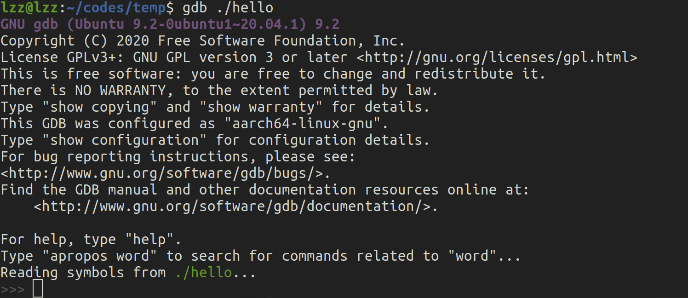
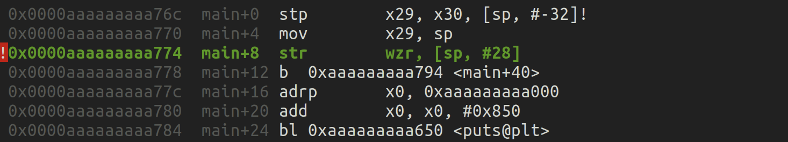

# GDB使用

在安装完 GDB 之后，如果你想开始使用 GDB 进行调试，了解 Makefile 是一个很好的起点。Makefile 是在构建项目时控制编译和链接过程的重要工具，它定义了如何将源代码编译为可执行文件。通过 Makefile，你可以快速完成复杂的编译工作，而不用手动输入一长串编译命令。

## 1. 了解 Makefile 和 GDB 调试

Makefile 是一个脚本文件，通常用于控制 C、C++ 或其他编译型语言的构建过程。它能够自动化编译、链接、清理等任务。GDB 可以用于调试你编译出来的可执行文件，因此理解 Makefile 的工作流程可以帮助你正确生成可调试的目标文件。

### 基本的 Makefile 结构

```makefile
target: dependencies
    command
```

- **target**：目标文件（通常是编译生成的可执行文件）。
- **dependencies**：生成该目标文件所依赖的源文件或其他目标文件。
- **command**：为生成目标文件执行的命令。

### 基本示例

假设我们有一个简单的 C 程序 `hello.c`，它的内容如下：

```c
#include <stdio.h>

int main() {
    printf("Hello, world!\n");
    return 0;
}
```

我们可以写一个最基本的 `Makefile` 来编译这个程序：

```makefile
hello: hello.c
    gcc -g -o hello hello.c
```

- **hello**：这是目标文件，即生成的可执行文件。
- **hello.c**：这是依赖文件，指明生成 `hello` 需要依赖 `hello.c` 源代码文件。
- **gcc -g -o hello hello.c**：这是生成 `hello` 的命令，其中 `-g` 选项表示生成带有调试信息的可执行文件，方便后续的 GDB 调试。

> 请确保你在 `Makefile` 中使用 **Tab** 而不是空格来缩进命令行。

### 编译命令

在终端中输入以下命令执行 Makefile 以编译程序：

```bash
make
```

这会生成一个名为 `hello` 的可执行文件。

### 最基础的 GDB 调试例子

现在，我们有了一个带有调试信息的 `hello` 可执行文件，可以使用 GDB 进行调试。下面是最基础的调试步骤：

- **启动 GDB**：

  ```bash
  gdb ./hello
  ```

- **运行程序**：`run`（或简写 `r`）
  
  在 GDB 中运行可执行文件：
  ```bash
  run
  ```

- **设置断点**：`break`（或简写 `b`）
  
  设置断点的位置，例如在 `main` 函数处设置断点：
  ```bash
  break main
  ```

- **单步执行**：`step`（或简写 `s`）
  
  单步执行代码，进入函数：
  ```bash
  step
  ```

- **下一步**：`next`（或简写 `n`）
  
  单步执行代码，但不进入函数：
  ```bash
  next
  ```

- **查看变量**：`print`
  
  打印变量的值：
  ```bash
  print var_name
  ```

- **继续执行**：`continue`（或简写 `c`）
  
  继续执行程序，直到下一个断点或程序结束：
  ```bash
  continue
  ```

- **退出 GDB**：`quit`（或简写 `q`）

  退出 GDB 调试器：
  ```bash
  quit
  ```


> ###  `riscv64-unknown-elf-gdb` 和 `gdb`的区别
>
> 1. **riscv64-unknown-elf-gdb**：
>    - 专门用于调试 **RISC-V 架构的裸机程序**（即不依赖操作系统的嵌入式系统开发，或类似环境）。
>    - 这个工具通常与嵌入式开发的交叉编译工具链配合使用，调试的是目标平台上的代码（比如 RISC-V 处理器上的代码）。
>    - 调试的程序通常是裸机（`bare-metal`）或者没有完整的操作系统（如实时操作系统 RTOS），通常生成的程序格式为 `ELF` 文件。
>
> 2. **普通的 gdb**：
>    - 用于调试本地的、标准操作系统（如 Linux、macOS 等）上运行的程序。
>    - 这种 `gdb` 调试的是本地平台上的程序，比如在 x86 或 ARM 架构的机器上编译并运行的程序。
>    - 它主要用于调试操作系统下运行的用户态程序，如 C/C++、Go 等编译后的可执行文件。
>
> ### 使用场景
>
> - **riscv64-unknown-elf-gdb**：如果你在做 RISC-V 平台的开发，尤其是开发裸机程序、操作系统内核、固件或者嵌入式系统，那么这个是你要用的调试工具。
>
> - **标准 gdb**：如果你在调试本地计算机上的应用程序，或者使用标准的桌面或服务器环境来开发 C/C++ 程序，那么你应该使用普通的 `gdb`。
>
> - 它们可以共存。两者是不同的工具链，分别服务于不同的架构和开发场景。在同一个系统上同时安装它们是完全可以的。你只需要根据当前调试的目标来选择合适的 `gdb` 版本。
>
> 总结：如果你是做嵌入式开发或者 RISC-V 开发，使用 `riscv64-unknown-elf-gdb`；如果是一般的桌面应用程序开发，使用本地的 `gdb`。
>

## 2. `Hello, world!`✖️10

下面是一个简单的 C 语言程序，它会打印 "Hello, world!" 10 次：

### 代码：`hello.c`

```c
#include <stdio.h>

int main() {
    for (int i = 0; i < 10; i++) {
        printf("Hello, world!\n");
    }
    return 0;
}
```

### 使用 Makefile 编译：

创建一个 `Makefile`，如下所示：

```makefile
hello: hello.c
    gcc -o hello hello.c
```

### 编译和运行步骤：

1. 将代码保存到文件 `hello.c`。
2. 创建 `Makefile`，并确保使用 **Tab** 缩进命令行。
3. 在终端运行 `make` 命令：
   ```bash
   make
   ```

4. 编译完成后，运行生成的可执行文件：
   ```bash
   ./hello
   ```

### 输出结果：

```
Hello, world!
Hello, world!
Hello, world!
Hello, world!
Hello, world!
Hello, world!
Hello, world!
Hello, world!
Hello, world!
Hello, world!
```

这个程序会通过一个简单的 `for` 循环，打印 "Hello, world!" 10 次。

## 3.  GDB 调试界面

下面我们来使用 GDB 调试`Hello, world!`✖️10：

### 启动 GDB：

```bash
gdb ./hello
```



### 设置断点：`break`（或简写 `b`）

设置断点的位置，例如在 `main` 函数处设置断点：

```bash
break main
```


## 4. 运行程序：`run`（或简写 `r`）

在 GDB 中运行可执行文件：

```bash
run
```


### 1. Output/messages (输出/消息)
在这一部分，我们可以看到调试器捕获到的断点信息和程序状态：
```
Breakpoint 1, main () at hello.c:4
4        for (int i = 0; i < 10; i++) {
```
调试器在文件 `hello.c` 的第4行命中了断点，这是 `main` 函数开始的地方。通过命令 `break main`，调试器在进入 `main()` 函数的第一行代码前暂停程序执行。这个命令非常常见，尤其在调试阶段，它允许开发者从程序的主入口函数开始检查并控制执行流程。

第4行包含一个 `for` 循环，循环条件为 `i < 10`，即这个循环会执行10次。调试器在这里暂停，等待用户的进一步指令。

### 2. Assembly (汇编指令)
这一部分展示了与 `main` 函数相关的汇编代码，说明了程序在底层机器语言中的执行方式。

汇编部分展示了程序在 **ARM** 架构下的指令。这里的汇编指令是根据 ARM64 指令集生成的，如果这个程序运行在 x86 或其他架构下，汇编代码将会有所不同。

```
0xaaaaaaaaa774 <+0>:    stp     x29, x30, [sp, #-32]!
0xaaaaaaaaa778 <+4>:    mov     x29, sp
0xaaaaaaaaa77c <+8>:    str     wzr, [sp, #28]
0xaaaaaaaaa780 <+12>:   bl      0xaaaaaaaaa794 <main+40>
0xaaaaaaaaa784 <+16>:   adrp    x0, 0xaaaaaaaaa000
0xaaaaaaaaa788 <+20>:   bl      0xaaaaaaaaa650 <puts@plt>
```
这里的汇编代码是编译器将C代码翻译为机器可执行指令的结果。每一行表示一条指令，其中包括：
- `stp` 指令：保存寄存器的值，通常在进入函数时保存调用者的寄存器状态（x29和x30）。
- `mov` 指令：将 `sp` （栈指针）的值移动到 `x29`，用以设置帧指针。
- `str` 指令：将 `wzr`（零寄存器）的值存储到内存中，可能用于初始化变量。
- `bl` 指令：调用位于 `main+40` 的子函数。
- `adrp` 指令：将地址加载到寄存器中，这里是 `x0`。
- `bl` 指令：调用 `puts` 函数，它通常用于输出字符串。

这些指令显示了函数调用时的常见序列：保存调用者寄存器、设置栈指针、调用其他函数以及返回。

### 3. Breakpoints (断点)
```
[1]    break at 0xaaaaaaaaa774 in hello.c:4 for main hit 1 time
```
这段信息显示在文件 `hello.c` 的第4行（通过命令 `break main`在进入 `main()` 函数的第一行代码前）设置了一个断点，程序已经命中这个断点1次。这表明程序执行到这个位置后暂停下来。

### 4. Registers (寄存器)
```
x0  0xaaaaaaaaa76c    x1  0xfffffffffffb1b10    x2  0xfffffffffffb1b08    x3  0x0000000000000000
x4  0x0000000140404041    x5  0xb41c62f08fcf6c6d    x6  0x0000000000000007    x7  0x0000000000000000
x8  0xaaaaaaaaa7b0    x9  0x0000000000000001    x10 0x0000000000000000    x11 0x0000000000000000
...
x29 0xfffffffffffeec0    x30 0xaaaaaaaaa774    sp  0xfffffffffffeec0    pc  0xaaaaaaaaa774
```
这里列出了当前的寄存器值（在 ARM 架构下），包括通用寄存器（`x0` 到 `x30`）和栈指针（`sp`）、程序计数器（`pc`）。这些寄存器是处理器用来存储数据和指令执行的核心组件：
- `x0` 至 `x7`：常用来存储函数参数或局部变量。
- `x29` 和 `x30`：分别是帧指针（`fp`）和返回地址（`lr`）。
- `sp`：栈指针，指向当前栈顶位置。
- `pc`：程序计数器，指向当前执行的指令地址。

### 5. Source (源代码)
```c
#include <stdio.h>

int main() {
    for (int i = 0; i < 10; i++) {
        printf("Hello, world!\n");
    }
    return 0;
}
```
这是源代码部分，展示了一个简单的C语言程序。程序在 `main()` 函数中使用了一个 `for` 循环，循环条件是 `i < 10`，每次循环执行 `printf("Hello, world!\n");` 打印 "Hello, world!"。执行完循环后，函数返回 `0`，表示程序正常结束。

这段代码的主要功能是打印10次 "Hello, world!"。通过调试器的输出，我们可以看到程序在循环开始处暂停，因为我们在第4行设置了断点。

### 6. Stack (栈)
```
from 0x0000aaaaaaaaa774 in main+8 at hello.c:4
```
这一部分展示了调用栈，当前函数是 `main`，位于地址 `0xaaaaaaaaa774`，并且在执行第4行代码时中断。栈帧的信息可以帮助我们理解程序的执行顺序和函数调用层次。

### 7. Threads (线程)
```
id 352511 name hello from 0x0000aaaaaaaaa774 in main+8 at hello.c:4
```
此部分显示了当前正在运行的线程信息：
- `id`：线程ID，表示正在执行的线程。
- `name`：线程的名称，这里是 `hello`，与程序相关。
- `from`：表示线程暂停的位置，即 `main` 函数中的第4行代码。

### 8. Variables (变量)
```
i = 0
```
这一部分显示当前循环中的变量 `i` 的值为0。这表明 `for` 循环尚未执行，程序刚刚在循环开始时暂停。通过观察变量的值，开发者可以验证程序的逻辑是否按预期运行。

## 5. 运行后的选择

在使用 GDB 调试程序时，当我们在断点处暂停程序后，可以使用不同的命令来控制程序的执行。以下是几种常见的调试命令，它们提供了不同的执行控制方式：

### 1. `s`（`step`） - 逐步执行代码
`step` 命令用于逐行执行代码。如果当前行是一个函数调用，`step` 会进入该函数，并继续逐行调试函数内部的代码。这个命令特别适用于你想要深入了解函数内部逻辑的情况。

### 2. `si`（`stepi`） - 逐步执行汇编指令
`stepi` 命令用于逐条执行汇编指令，而不是按源码逐行执行。它非常适合用于低层次调试，尤其是在检查汇编代码或理解底层执行逻辑时有帮助。

### 3. `n`（`next`） - 下一行代码
`next` 命令与 `step` 类似，但是它不会进入函数内部。如果当前行包含一个函数调用，`next` 会执行整个函数，直到返回到当前函数的下一行。这个命令适用于不关心函数内部细节，而是想要快速跳过函数的情况。

### 4. `c`（`continue`） - 继续运行
`continue` 命令告诉程序继续运行，直到遇到下一个断点或程序正常结束。如果你想暂时跳过调试的细节，并观察程序是否能够完整执行，这是一个常用的命令。

### 5. `finish` - 跳出当前函数
`finish` 命令用于让程序继续运行，直到当前函数执行完毕并返回到调用该函数的地方。这可以帮助你快速退出正在调试的函数，而不需要逐行跟踪其余的代码。

## 6. 使用`si` 逐步执行汇编指令



这段汇编代码对应的是 `main` 函数的开始部分，尤其是在处理 `for` 循环中变量 `i` 的初始化和条件判断。ARM 汇编指令 `str wzr, [sp, #28]` 对应的就是 `int i = 0` 的初始化，而后续的 `ldr w0, [sp, #28]` 和 `cmp w0, #0x9` 则是对 `i` 进行的条件判断与循环控制。如果使用的是其他架构（如 x86），这些汇编代码会有所不同，但逻辑仍然是相同的，即通过栈帧管理和寄存器操作来处理局部变量和循环条件。

### 1. `stp x29, x30, [sp, #-32]!`
这条指令首先做了两件事：
- **保存帧指针（x29）和链接寄存器（x30）到栈中**：`x29` 是帧指针寄存器，`x30` 是链接寄存器（用于存储返回地址）。这一步是为了保存调用者的上下文，以便稍后函数返回时可以恢复。
- **调整栈指针（sp）分配32字节空间**：栈指针 `sp` 向下移动32字节，用于当前函数的局部变量和其他信息的存储。这通常是进入一个新栈帧的标准操作。

### 2. `mov x29, sp`
- **将当前栈指针 `sp` 的值复制到帧指针 `x29`**：这一步的作用是更新 `x29`，标记当前栈帧的起始位置。`x29` 将作为新的帧指针，在整个函数执行期间，帮助管理局部变量和调用者栈帧的访问。

### 3. `str wzr, [sp, #28]`（当前位置，`si`后发生）
- **将 `wzr`（零寄存器）的值存储到栈上的某个偏移位置**：在 ARM 中，`wzr` 是一个常量寄存器，总是等于零。这里将 0 存储在栈指针偏移 `28` 字节的位置。这很可能是初始化局部变量 `int i`，因为在 C 代码的 `for (int i = 0; i < 10; i++)` 中，`i` 初始化为 0。

根据标准 C 代码编译后的行为，`i` 很可能被分配到栈上偏移量 `28` 的位置，这条指令是在初始化 `i` 为 0。

`si`

### 接下来发生的事情

### 4. `bl 0xaaaaaaaaa794 <main+40>`

- **分支并链接**：`bl` 指令将跳转到 `main+40` 处，保存当前的返回地址到 `x30`。在 `main+40`，你给出的代码展示了下一组与 `for` 循环控制有关的汇编指令。

继续`si`，跳转到 `main+40` 处


### 5. `ldr w0, [sp, #28]`
- **从栈中加载 `i` 的值**：这里从栈的 `28` 字节偏移处（也就是之前存储 `i` 的位置）加载值到寄存器 `w0`。此时 `w0` 的值是 0，因为之前将 0 存入了栈中的该位置。

> 在 ARM64 架构中，`w0` 是一个 32 位的通用寄存器，它经常用于存储函数的返回值或者函数参数。在调试过程中，特别是在使用 GDB 的时候，我们可以直接查看寄存器的值，包括 `w0`。
>
> 3. **查看寄存器**：
>    在 GDB 中，可以使用以下命令来查看所有寄存器的值，`info registers`：
>
>    ```bash
>    (gdb) info registers
>    ```
>
>    输出将包含所有通用寄存器的值，包括 `w0`。例如，你可能会看到如下输出：
>    ```bash
>    x0   0x0000000000000001    w0   0x00000001
>    x1   0x0000000000000000    w1   0x00000000
>    x2   0x0000000000000000    w2   0x00000000
>    ```
>
>    其中，`x0` 是 64 位寄存器，而 `w0` 是它的低 32 位部分。`w0` 的值就是寄存器 `w0` 当前存储的 32 位数据。
>
> 4. **单独查看 `w0`**：
>    如果你只想单独查看 `w0` 的值，可以使用以下命令：
>
>    ```bash
>    (gdb) print $w0
>    ```
>
>    GDB 会输出寄存器 `w0` 的当前值，例如：
>    ```bash
>    $1 = 1
>    ```
>
> 5. **单步执行并查看**：
>    如果你想在单步执行指令时查看 `w0` 的值，可以使用 `step` 或 `next` 命令进行单步调试，每执行一步都可以使用 `info registers` 或 `print $w0` 来查看 `w0` 的更新情况。
>

`si`

### 6. `cmp w0, #0x9`

- **比较寄存器 `w0`（`i` 的值）和 9**：这是 `for (int i = 0; i < 10; i++)` 循环的条件部分。这里 `i` 被比较是否小于等于 9（即 `i < 10`）。

`si`

### 7. `b.le 0xaaaaaaaaa77c <main+16>`

- **条件跳转**：如果 `w0`（`i` 的值）小于等于 `9`，则跳转到 `main+16`，也就是循环体部分。如果条件为真，这会跳回到之前执行的部分，循环继续。

### 关联到 C 代码中的 `for (int i = 0; i < 10; i++)`

结合汇编代码与 C 代码，流程如下：
1. 在进入 `main` 函数时，栈帧被设置，局部变量 `i` 被分配到栈的偏移 `28` 字节的位置。
2. `str wzr, [sp, #28]` 将 `i` 初始化为 0。
3. 程序执行循环条件检查，`ldr w0, [sp, #28]` 从栈中加载 `i` 的值，`cmp w0, #0x9` 与 9 进行比较。
4. 如果 `i <= 9`，则通过 `b.le` 跳转回循环体，执行 `printf("Hello, world!\n")` 语句，之后再递增 `i`，继续下一次循环。
5. 当 `i` 超过 9，循环结束，程序跳出 `for` 循环。

## 7. 进入循环

`s`（或者3个`si`）


这段代码表示调用了 `puts` 函数，并且在调用 `puts` 之前对寄存器 `x0` 进行了修改：

```
0x0000aaaaaaaaa77c  main+16 adrp   x0, 0xaaaaaaaaa000
0x0000aaaaaaaaa780  main+20 add    x0, x0, #0x850
0x0000aaaaaaaaa784  main+24 bl     0xaaaaaaaaa650 <puts@plt>
```

1. **`adrp x0, 0xaaaaaaaaa000`** (0x0000aaaaaaaaa77c):
   - 这是 ARM64 中的“Page-relative address”指令，用来加载一个基址（page address）到寄存器 `x0`。在这里，它将地址 `0xaaaaaaaaa000` 的页基址加载到 `x0`。
   
2. **`add x0, x0, #0x850`** (0x0000aaaaaaaaa780):
   - 将 `x0`（基址）加上偏移量 `0x850`。这个操作的目的是构建一个完整的地址，用于后续操作。这种模式在调用外部函数时很常见，比如准备 `puts` 函数的参数。

3. **`bl 0xaaaaaaaaa650 <puts@plt>`** (0x0000aaaaaaaaa784):
   - `bl`（Branch with Link）是 ARM64 中的函数调用指令。在这里，它调用了 `puts@plt`，这是一个外部函数 `puts` 的地址。`x0` 中的值通常会被用来作为函数参数传递给 `puts`。
   - 在这个调用中，`x0` 存储了 `puts` 的参数（通常是一个指向要打印的字符串的地址）。

这里即将进入printf函数。

## 8. 函数调用规则

参见 [xv6](https://lzzs.fun/6.S081-notebook/L05#risc-v%E6%B1%87%E7%BC%96%E4%B8%8E%E5%AF%84%E5%AD%98%E5%99%A8%E4%BD%BF%E7%94%A8) || [CS61C](https://lzzs.fun/CS61C-notebook/L10#register-conventions) || [MIT6.004](https://lzzs.fun/MIT-digital-systems/6.004/L03#%E8%BF%87%E7%A8%8Bprocedures)

`printf` 或者 `puts` 这样的函数调用会使用 `w0` 寄存器（或者更广泛的 `x0` 寄存器）来传递函数参数。在 ARM64 架构中，函数参数通常通过寄存器传递，`w0` 或者 `x0`（根据参数的大小，使用 32 位的 `w0` 或 64 位的 `x0`）是第一个用于传递参数的寄存器。

在 ARM64 架构中，`w0` 和 `x0` 寄存器（分别为 32 位和 64 位寄存器）是第一个用于函数参数传递的寄存器，通常函数调用过程中会修改这些寄存器。实际上，**函数调用的过程中，寄存器 `w0` 或 `x0` 不仅仅是 `printf` 或 `puts` 会修改，几乎所有的函数调用**，只要它需要传递参数或者返回值，都会对这些寄存器进行使用和修改。

### ARM64 函数调用规则（AArch64 ABI）

ARM64 的调用约定（ABI, Application Binary Interface）定义了函数如何传递参数和接收返回值。根据这个约定：

1. **参数传递**：
   - 函数的前 8 个参数通过寄存器 `x0` 到 `x7` 传递。如果是 32 位参数，会用到寄存器的低 32 位，也就是 `w0` 到 `w7`。
   - `w0` 和 `x0` 是第一个用于传递参数的寄存器，因此任何需要第一个参数的函数都会使用 `w0` 或 `x0`。
   
2. **返回值传递**：
   - 函数返回值也是通过 `x0` 或 `w0` 传递的。如果函数有返回值（无论是整数、指针等），该值会存储在 `x0` 或 `w0` 中。所以，当一个函数返回时，你可以在 `x0` 或 `w0` 中找到返回值。
   
3. **函数调用后，`w0` 和 `x0` 的值变化**：
   - 如果函数有返回值，调用完函数后 `x0` 或 `w0` 中会包含返回值。
   - 如果函数没有返回值，`x0` 或 `w0` 的值可能没有明确规定，因此在调用之后可能会被修改，不能再依赖它保存之前的值。

### 更广泛的修改 `w0` 或 `x0` 的情景

以下是一些更常见的情景，展示了在函数调用过程中如何修改 `w0` 或 `x0`：

1. **参数传递时**：
   - 任何需要传递**第一个参数**的函数调用都会使用 `w0` 或 `x0`。无论是标准库函数、用户定义的函数还是系统调用，它们都会将第一个参数存储在 `w0` 或 `x0` 中。
   
   示例：
   ```asm
   mov w0, #10       // 将整数 10 存储到 w0，作为第一个参数传递
   bl my_function    // 调用函数 my_function(w0=10)
   ```

2. **函数返回值**：
   - 如果函数有**返回值**，返回值通常会放在 `w0` 或 `x0` 中。如果函数调用后你检查 `w0`，看到的值通常是函数的返回结果，而不再是之前的循环变量或其他值。

   示例：
   ```asm
   bl my_function    // 调用函数 my_function
   mov x1, x0        // 将返回值（保存在 x0 中）存储到 x1
   ```

3. **系统调用**：
   - 在 ARM64 架构下，系统调用也是通过寄存器传递参数。`x0` 是传递给系统调用的第一个参数的寄存器，同时系统调用的返回值也通过 `x0` 传递。

   示例：
   ```asm
   mov x8, #93       // 系统调用号（例如 exit）
   mov x0, #0        // 将 0 作为系统调用的第一个参数
   svc #0            // 发出系统调用
   ```

4. **库函数调用**：
   - 类似 `printf`、`malloc` 等库函数也会使用 `x0` 或 `w0` 来传递参数。对于这些函数来说，它们会读取 `w0` 中的值，并在其完成时修改 `w0`，以传递返回值。

当前我们依旧处于即将进入printf函数的位置。


**在函数调用之前查看 `w0` 的值**：

```bash
info registers w0
```

或

```
print $w0
```


可以看到当前`i`的值为`0`。

接下来如果使用`si`，你将进入`printf`函数的实现，这里我们选择忽略内部的实现，使用`next`跳转到直接执行完`printf`函数的位置，你也可以尝试`si`和`finish`执行完`printf`函数。

`n`

**在函数返回后查看返回值**：


如果函数返回一个值，`w0` 或 `x0` 中将存储这个值。对于 32 位返回值，使用 `w0`，对于 64 位返回值，使用 `x0`。

## 9. `printf` 函数

`printf` 是 C 标准库中的一个非常常用的函数，它用于格式化输出。它的功能可以概括为：**接受一系列参数，根据指定的格式化字符串，将这些参数转换为对应的字符串，然后输出到标准输出（通常是控制台）上，并返回成功输出的字符数量**。

### `printf` 函数的工作原理概述

1. **函数声明**：
   ```c
   int printf(const char *format, ...);
   ```
   - `const char *format`：格式化字符串，定义了输出内容的结构、顺序和格式。
   - `...`：可变参数，这些是根据 `format` 字符串指定的类型，传递给 `printf` 的数据。
   - 返回值：`printf` 的返回值是**成功打印的字符总数**。

2. **参数的解释**：
   - **格式化字符串**：`printf` 第一个参数是格式化字符串，其中可以包括文字和格式说明符（如 `%d`, `%s`, `%f` 等）。这些说明符告诉 `printf` 如何处理后面的参数。
   - **可变参数**：`printf` 函数是一个“可变参数”函数（variadic function），它可以接受任意数量和类型的参数，但这些参数的数量和类型必须与格式化字符串中的说明符相匹配。

3. **返回值**：
   - `printf` 成功执行后，会返回它实际输出的字符数（包括空格和换行符等）。如果发生错误，`printf` 返回一个负值。

### `printf` 内部工作流程

`printf` 的内部工作可以概括为以下步骤：

1. **解析格式化字符串**：
   `printf` 首先解析它接收到的第一个参数，即格式化字符串。它会从左到右扫描字符串，直到遇到格式说明符（如 `%d`, `%s`, `%f`）。这些格式说明符指示 `printf` 如何格式化后续的参数。

2. **处理可变参数**：
   对于每一个格式说明符，`printf` 会依次从剩余的可变参数列表中获取对应类型的参数。然后，它将这个参数格式化为对应的字符串表示。

   - 如果遇到 `%d`，`printf` 会从参数中获取一个 `int` 类型的值，并将其格式化为十进制数字。
   - 如果遇到 `%s`，`printf` 会从参数中获取一个 `char*` 类型的字符串，并将其直接打印。
   - 如果遇到 `%f`，`printf` 会从参数中获取一个 `float` 或 `double` 类型的浮点数，并将其格式化输出。

3. **格式化输出**：
   `printf` 将解析的内容和从参数中提取的值组合在一起，然后输出到标准输出（通常是控制台）。

4. **返回输出字符数**：
   `printf` 在成功输出所有内容后，会返回打印到标准输出的字符数。这包括所有输出的字符，但不包括最终的 `\0` 终止符。

### `printf` 函数的示例

以下是一个简单的例子，展示 `printf` 的参数如何与格式化字符串结合使用：

```c
int main() {
    printf("Hello, world!\n");
    return 0;
}
```

在这个例子中，`printf` 输出的字符串是 `"Hello, world!\n"`。如果你数一数，这个字符串包含 14 个字符：

- `Hello, world!` 是 13 个字符。
- `\n` 是换行符，算作一个字符。

因此，`printf` 返回的值是 **14**，表示总共输出了 14 个字符。


## 10. 继续循环

`si`


这段汇编代码回到了 ARM64 架构下的`for`循环执行过程，具体是在一个循环体中对变量 `i` 进行加载、加1、比较的操作。对应的 C 代码中的循环部分：

```c
for (int i = 0; i < 10; i++) {
    // do something
}
```

### 1. `ldr w0, [sp, #28]` (地址：`0x0000aaaaaaaaa788`)
- **ldr**（Load Register）：从内存中加载数据到寄存器。
- `w0`：表示 ARM64 的 32 位通用寄存器 `w0`，存储的是变量 `i` 的值。
- `[sp, #28]`：表示从栈指针（`sp`）加上偏移量 28 个字节的位置读取数据，加载到寄存器 `w0` 中。

**解释**：
这里的指令从内存中读取变量 `i`（存储在栈中 `sp + 28` 的位置），并将其加载到 `w0` 寄存器中，供后续操作使用。

### 2. `add w0, w0, #0x1` (地址：`0x0000aaaaaaaaa78c`)
- **add**：加法运算。
- `w0, w0, #0x1`：将寄存器 `w0` 的值加 1，并将结果保存在 `w0` 中。

**解释**：
这里的指令对 `w0`（也就是变量 `i`）的值加 1，更新后的值存储回 `w0`。

### 3. `str w0, [sp, #28]` (地址：`0x0000aaaaaaaaa790`)
- **str**（Store Register）：将寄存器中的值存储到内存中。
- `w0`：这是存储 `i` 变量的新值的寄存器。
- `[sp, #28]`：表示将寄存器 `w0` 中的值存储到栈指针 `sp` 偏移量为 28 的位置。

**解释**：
将更新后的变量 `i`（即 `w0` 中的值）存回栈中的 `sp + 28` 位置。

### 4. `ldr w0, [sp, #28]` (地址：`0x0000aaaaaaaaa794`)（与 main 函数开始时重复）
- **ldr**（Load Register）：从内存中加载数据到寄存器。
- `[sp, #28]`：表示从 `sp` 偏移 28 个字节的位置加载数据到 `w0`。

**解释**：
再次将变量 `i`（存储在 `sp + 28` 的位置）的值加载到寄存器 `w0` 中，准备进行比较。

### 5. `cmp w0, #0x9` (地址：`0x0000aaaaaaaaa798`)
- **cmp**（Compare）：比较两个值，常用于控制流中的分支判断。
- `w0, #0x9`：比较 `w0` 中的值（即变量 `i` 的值）与 9。

**解释**：
这里进行比较，判断变量 `i` 的值是否小于 10（`i < 10`），为后续控制流做准备。如果 `i` 小于 10，则继续循环；否则跳出循环。

### 6. `b.le 0xaaaaaaaaa77c <main+16>`

- **条件跳转**：如果 `w0`（`i` 的值）小于等于 `9`，则跳转到 `main+16`，也就是循环体部分。如果条件为真，这会跳回到之前执行的部分，循环继续。

### 汇总解释：

这段代码展示了一个典型的 `for` 循环核心操作：
1. 从内存中加载循环变量 `i` 的当前值。
2. 将 `i` 加 1。
3. 更新内存中的 `i` 值。
4. 再次加载 `i`，并与 9 进行比较，决定是否继续执行循环。

这些指令就是实现 `for (int i = 0; i < 10; i++)` 的循环控制逻辑。 

## 11. 继续运行到退出

接下来你可以尝试多次`n`，同时观察`i`和寄存器`x0`的值，大概变化像这样`0 14 1 14 2 14 3 14...`，直到循环结束退出。
