# RISC-V Privileged Architecture

本讲座是由Allen Baum在第八届RISC-V研讨会上，于2018年5月7日在西班牙巴塞罗那进行的，讲述了RISC-V特权架构的内容。该架构是RISC-V处理器设计中的关键部分，决定了系统不同操作模式下的安全性、隔离性和性能。此幻灯片的内容重点阐述了特权架构的基本组成部分及其在处理器功能中的作用。

> **原始内容来源**：
>
> *幻灯片标题*：RISC-V Privileged Architecture
>
> *原作者*：Allen Baum  Esperanto Technologies.
>
> *出处*：8 th RISC-V Workshop Barcelona, Spain
>
> *原始发布日期*：2018年5月7日
>
> *版权声明*：该幻灯片及其内容的版权归 Allen Baum 所有。翻译与讲解仅供学习和参考，更多详细信息请参见[原文链接](https://riscv.org/wp-content/uploads/2018/05/riscv-privileged-BCN.v7-2.pdf)。
>
> 这是2018年发布的RISC-V特权架构资料，其中的大部分内容仍然与当前的RISC-V架构相关和有效，特别是在架构的基础概念、特权模式、控制状态寄存器（CSRs）和特权指令方面。然而，随着RISC-V的持续发展和标准的更新，部分技术细节可能已经有所改进或扩展。
>
> 如果你希望深入了解RISC-V在某些特定领域的最新进展，建议参考最新的RISC-V规范，或者查阅RISC-V基金会的最新文档和技术报告。

## 目录

### 为什么需要特权架构？

在处理器架构中，引入特权级别的目的是为了提供更高的系统安全性和资源控制。特权架构确保操作系统和用户程序运行在不同的权限级别，防止普通应用程序访问或修改关键的系统资源。例如，操作系统需要完全访问硬件资源和内存管理功能，而用户程序则只应在受限的环境下运行，以避免误操作或恶意行为影响整个系统的稳定性。特权架构通过分离不同的权限模式，帮助实现系统的可靠性和安全性。

### 配置文件（Profiles）

RISC-V特权架构根据不同的应用场景设置了不同的配置文件（Profiles），以适应多样化的需求。这些配置文件的存在使得RISC-V架构能够在嵌入式系统、服务器、移动设备等不同领域中灵活应用。每个Profile可以包括不同的功能和特权级别，从而满足特定应用的需求。

### 权限级别和模式（Privileges and Modes）

RISC-V特权架构划分了几种不同的权限模式，这些模式对应处理器在不同上下文中的操作需求。常见的模式包括：
- **机器模式（M模式）**：这是RISC-V系统中最高的权限模式，通常由系统固件或低级别管理程序使用，直接控制硬件。
- **监督模式（S模式）**：用于操作系统内核，允许访问部分硬件资源，但受到比机器模式更多的限制。
- **用户模式（U模式）**：最低权限的模式，用户应用程序在此模式下运行，无法直接访问硬件或特权指令。

不同的模式通过硬件层级来隔离，确保每个级别的程序只能访问其权限范围内的资源。

### 特权功能（Privileged Features）

#### 控制和状态寄存器（CSRs）

控制和状态寄存器是RISC-V特权架构中的重要部分，用于管理处理器的操作模式和状态。在特权模式下，CSRs控制包括中断、内存管理、性能计数等各种功能。不同的模式可以访问不同的CSRs，确保系统安全性。例如，用户模式无法修改系统级别的CSRs。

#### 特权指令

RISC-V定义了一系列特权指令，这些指令只能在特定模式下运行，主要用于管理硬件资源和处理系统级别的操作，如中断处理和内存保护。

### 内存寻址（Memory Addressing）

内存寻址机制包括地址翻译和保护功能。RISC-V采用了一种分页机制来实现虚拟内存管理，允许操作系统将物理内存抽象为更灵活的虚拟地址空间。内存保护则确保不同模式下的程序只能访问特定范围的内存，避免越权访问。

#### 地址翻译（Translation）

地址翻译通过页表将虚拟地址映射到物理地址，支持多级页表结构以提高寻址灵活性和效率。这一机制使得RISC-V处理器能够支持大规模内存应用和多任务处理。

#### 内存保护（Protection）

内存保护的核心是防止低权限程序访问或修改高权限内存区域。通过在页表中设置访问权限位，RISC-V能够有效地隔离不同权限模式下的内存访问。

### 异常处理（Trap Handling）

异常处理机制用于处理运行过程中出现的各种异常情况，包括硬件中断和软件异常。RISC-V特权架构对这些异常的处理进行了细致的定义，确保系统能够在发生异常时迅速恢复或进行适当的操作。

#### 异常（Exceptions）

当发生例如非法指令、访问未授权内存等异常情况时，处理器会捕获这些异常并转入相应的处理程序。这些异常处理程序通常运行在高权限模式下，以确保能够正确恢复系统。

#### 中断（Interrupts）

RISC-V支持硬件和软件中断处理。硬件中断通常由外部设备引发，而软件中断则由处理器内部指令触发。中断处理需要快速响应并恢复正常执行，这也是操作系统设计中的一个关键部分。

### 计数器（Counters）

RISC-V架构中的计数器用于记录处理器的时间和性能信息。通过这些计数器，操作系统可以监控系统的运行状态，执行诸如时间片轮转、性能调优等任务。

#### 时间（Time）

时间计数器记录系统运行的时间戳，用于系统时钟、定时器和其他时间相关功能。

#### 性能（Performance）

性能计数器用于测量处理器的性能参数，如指令执行数、缓存命中率等。这些数据有助于优化系统性能，并为开发者提供性能调试信息。

---

## Why a Privileged Architecture?

RISC-V特权架构的设计背后有着明确的目的，主要是为了更好地管理共享资源、保护系统的核心功能，并隔离具体实现的细节。共享资源的管理和保护对于现代计算系统至关重要，尤其是在多核、多任务环境中，特权架构的存在能够确保不同任务之间的安全隔离和资源分配。同时，它还提供了软件与硬件层的通信机制，尤其是在虚拟化支持方面，RISC-V架构通过引入一系列执行环境（Execution Environments）实现不同层次的任务隔离和资源共享。

### 管理共享资源

共享资源包括**内存**、**I/O设备**以及**处理器核心**。在多任务操作系统中，不同任务会争夺这些资源，而没有特权架构的管理会导致系统冲突和崩溃。通过特权架构，系统能够高效地分配这些资源，并在不同任务之间进行适当的隔离与协调。

#### 关键资源管理包括：
- **内存**：虚拟内存映射使得各个任务能够使用独立的地址空间，从而避免直接访问物理内存。
- **I/O设备**：通过虚拟内存映射，系统能够保护设备接口，防止低权限任务直接访问关键I/O资源。
- **处理器核心**：特权架构可以管理处理器核心的分配，确保高权限任务优先运行。

### 保护共享资源

资源保护是特权架构的另一个重要目的。通过使用虚拟内存映射以及访问权限控制，RISC-V能够有效防止任务间的越权访问和资源冲突。

#### 具体的保护手段包括：
- **内存保护**：通过虚拟内存，系统可以为每个任务分配独立的内存空间，防止任务间的非法访问。
- **I/O保护**：与内存一样，I/O访问也被映射到虚拟地址空间，通过特权级别控制，防止低权限模式直接操作硬件设备。
- **访问权限控制**：权限位可以设置在内存映射中，以确保只有特定权限模式能够访问相应的资源。

### 隔离实现细节

在多任务、多用户环境中，隔离不同实现的细节非常重要。特权架构通过捕获未实现的操作并通过软件仿真进行处理，从而能够兼容不同的实现。此外，处理异步事件（如I/O事件、计时器事件、软件中断）也是特权架构的重要任务，确保外部事件能够被及时响应并处理。

#### 具体措施包括：
- **未实现操作的捕获和仿真**：当任务执行一个硬件不支持的操作时，特权架构能够捕获该操作并交由软件进行仿真。
- **外部异步事件处理**：如I/O设备事件、计时器中断、线程间的中断等，特权架构能够管理这些事件的优先级和处理流程。
- **两级地址转换**：为了支持虚拟化，RISC-V引入了两级地址转换机制，特别是在虚拟机管理程序（Hypervisor）模式下，这一机制至关重要。

## RISC-V Privileged Architecture Layers

RISC-V特权架构分为多个层次，每个层次负责不同的执行环境，并通过特定的接口进行通信。这些层次清晰地划分了应用程序、操作系统、虚拟机管理程序之间的权限和功能，确保系统的可扩展性和安全性。

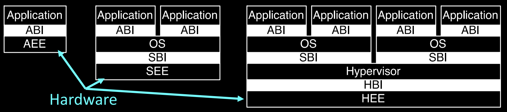

### 主要层次

1. **应用层（Application）**：
   - **应用执行环境（AEE）**：为应用程序提供一个运行环境，通过**应用二进制接口（ABI）**与底层系统进行交互。
   
2. **操作系统层（Operating System）**：
   - **监督执行环境（SEE）**：操作系统运行在监督模式下，管理系统资源，并通过**系统二进制接口（SBI）**与硬件进行通信。
   
3. **虚拟机管理程序层（Hypervisor）**：
   - **虚拟机管理程序执行环境（HEE）**：支持虚拟化，虚拟机管理程序能够通过**虚拟机管理程序二进制接口**（HBI）与操作系统层进行交互，管理虚拟机的执行。

### 层次间的通信

每一层都有其特定的二进制接口，通过这些接口，应用程序、操作系统和虚拟机管理程序能够顺利地进行通信和资源管理。例如，应用程序通过ABI接口调用操作系统的服务，而操作系统通过SBI接口管理底层硬件资源。

#### 通信接口包括：
- **ABI（Application Binary Interface）**：应用程序通过ABI与操作系统交互。
- **SBI（System Binary Interface）**：操作系统通过SBI直接与硬件进行通信。
- **HBI（Hypervisor Binary Interface）**：虚拟机管理程序通过HBI接口管理虚拟化环境中的资源和操作系统。

### 特权层次间的指令通信：ECALL指令

RISC-V引入了**ECALL指令**来实现不同权限层次之间的通信。当应用程序需要访问高权限功能时，它可以发出ECALL指令，这一指令会触发进入监督模式或虚拟机管理模式进行相应处理。这样，系统能够在保护低权限程序不直接访问高权限功能的同时，提供必要的功能调用接口。

### 支持虚拟化

RISC-V的所有ISA层次都设计为支持虚拟化。通过虚拟化，操作系统和应用程序可以在不同的虚拟机中运行，彼此隔离而不会影响底层硬件的安全性和资源分配。虚拟化的实现依赖于特权架构中的多级地址翻译机制和特定的二进制接口。

## Profiles

在RISC-V特权架构中，"Profiles"定义了处理器可以支持的不同配置和特性集，以适应从简单嵌入式系统到复杂的云计算环境不等的应用需求。每个Profile描述了特定的操作模式、信任级别、内存保护方式以及其他特性，这些都是为了优化特定的使用场景而设计的。

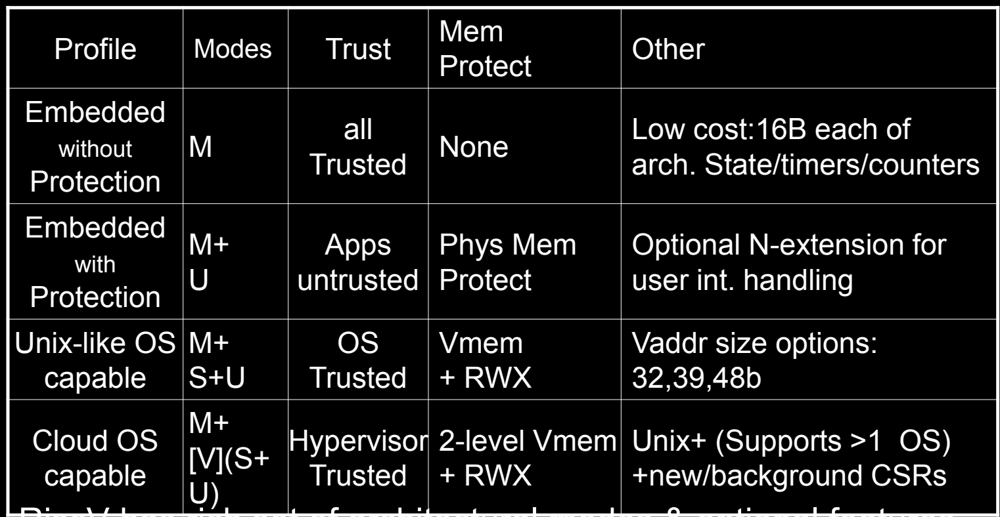

### 主要的RISC-V Profiles

1. **Embedded without Protection**：
   - **模式（Modes）**：M（机器模式）
   - **信任（Trust）**：所有代码均可信
   - **内存保护（Mem Protect）**：无
   - **其他特性（Other）**：成本低廉，拥有16B的架构状态、计时器和计数器

这个Profile适用于需要极低成本和资源使用的简单嵌入式设备，如简单的传感器或控制器。不支持内存保护，意味着所有代码都运行在机器模式下，具有完全的硬件访问权限。

2. **Embedded with Protection**：
   - **模式（Modes）**：M+U（机器模式和用户模式）
   - **信任（Trust）**：应用不可信
   - **内存保护（Mem Protect）**：物理内存保护
   - **其他特性（Other）**：可选的N扩展，用于用户中断处理

这个Profile适用于需要隔离应用程序的更复杂嵌入式系统。通过引入用户模式，提高了系统的安全性，避免了不可信应用直接访问关键硬件资源。

3. **Unix-like OS Capable**：
   - **模式（Modes）**：M+S+U（机器模式、监督模式和用户模式）
   - **信任（Trust）**：操作系统可信
   - **内存保护（Mem Protect）**：虚拟内存和读写执行（RWX）保护
   - **其他特性（Other）**：支持不同的虚拟地址大小（32位、39位、48位）

此Profile旨在支持类Unix的操作系统，提供完整的内存虚拟化支持和多用户环境。操作系统运行在监督模式下，管理用户模式下运行的应用程序。

4. **Cloud OS Capable**：
   - **模式（Modes）**：M+[V](S+U)（机器模式和可选的Hypervisor模式）
   - **信任（Trust）**：Hypervisor可信
   - **内存保护（Mem Protect）**：两级虚拟内存和RWX保护
   - **其他特性（Other）**：支持Unix+，支持多操作系统，新的后台CSR

专为云计算环境设计，支持虚拟化技术，允许在同一硬件上运行多个虚拟机和操作系统。Hypervisor模式提供硬件级别的隔离和资源管理，优化了多租户环境的安全性和性能。

### Profiles的应用

通过这些不同的Profiles，RISC-V能够为广泛的市场和应用提供灵活的解决方案。无论是低成本的嵌入式设备还是高性能的云服务器，RISC-V架构都能通过选择合适的Profile来最大化硬件的效能和适应性。这种灵活性是RISC-V在现代计算领域中逐渐成为一个重要选项的关键因素。

## Privileges and Modes

RISC-V特权架构通过设置多种权限级别和操作模式来确保系统的安全性和功能完整性。这些权限模式为不同类型的任务分配了不同的权限，以确保高权限任务能够安全地管理硬件资源，而低权限任务则受到适当的限制。这种设计不仅提升了系统的安全性，还支持虚拟化、多任务处理等复杂应用。

### RISC-V权限模式（Privilege Modes）

RISC-V定义了一个分层的权限模式结构，分为用户模式、监督模式和机器模式，它们以等级结构从低到高排列：
- **用户模式（User Mode，U-mode）**：
  - 最低权限，通常用于运行用户应用程序。程序在该模式下无法直接访问硬件资源，只能通过操作系统提供的系统调用接口进行有限的操作。
  - **虚拟化支持**：也可在虚拟化环境下运行，虚拟机管理程序可以限制用户模式下的虚拟机行为。
  
- **监督模式（Supervisor Mode，S-mode）**：
  - 中级权限，通常由操作系统内核使用。监督模式允许对硬件资源和内存管理进行更直接的控制，如页表管理和中断处理。
  - **虚拟化支持**：可以在虚拟化环境下运行，支持在Hypervisor管理下的操作系统执行。

- **机器模式（Machine Mode，M-mode）**：
  - 最高权限，通常由固件或低级系统管理程序使用。该模式具有对所有硬件资源的完全访问权限，负责处理最低级别的系统初始化和管理任务，如启动、异常处理和中断控制。
  - **特殊模式**：还有更高的调试模式，但此处不做讨论。调试模式类似于机器模式，但用于硬件调试。

### 支持的模式组合

RISC-V根据应用场景支持以下几种常见的权限模式组合：
- **M模式**（仅机器模式）：适用于简单的嵌入式系统，所有任务都在最高权限下运行，不需要复杂的内存保护。
- **M + U模式**：嵌入式系统中常见的组合，机器模式用于底层管理，而用户模式用于运行普通应用程序，提供了基本的内存保护。
- **M + S + U模式**：适用于类Unix操作系统（如Linux），在这种组合下，操作系统内核运行在监督模式，用户程序运行在用户模式，实现了虚拟内存管理和多用户隔离。
- **M + [V(S + U)]模式**：适用于支持多个操作系统和虚拟化的复杂系统，允许多个操作系统在虚拟机管理程序的监督下并行运行。

### 控制和状态寄存器（Control and Status Registers, CSRs）

每个特权模式都可以访问专门的**控制和状态寄存器**（CSRs），用于管理模式下的操作。CSRs的访问权限根据运行模式而不同，低权限模式无法访问高权限模式的寄存器，以确保系统的安全性和完整性。

- **CSRs的作用**：这些寄存器控制处理器的关键操作，如中断使能、内存管理以及时间计数器等。每个特权模式可以有其专属的CSR集合，以保证隔离。
- **多副本CSRs**：通常，每个模式都有多个CSR副本或视图，确保不同模式下的操作隔离和安全。

通过这种分层的特权模式和CSR访问机制，RISC-V确保了系统从上电到应用程序执行的每个阶段都受到严格的权限控制，同时支持灵活的虚拟化和多操作系统环境。

## Privileged Features: Instructions and CSRs

在RISC-V架构中，特权指令和控制状态寄存器（CSRs）是特权模式下的核心功能。它们允许操作系统和固件有效地管理硬件资源，同时提供安全的多用户和多任务环境。特权指令只能在相应的特权模式（如机器模式或监督模式）下执行，确保系统的控制权不会被低权限的用户模式所滥用。

### 模式专属指令（Mode Specific Instructions）

RISC-V为机器模式（M-mode）和监督模式（S-mode）定义了一系列特权指令，这些指令扩展了基本的用户模式（U-mode）操作，以便在不同的权限模式下更好地控制系统。

- **特权指令**只能在适当的特权模式下执行，低权限模式（如U-mode）无法访问高权限模式的指令。这些指令是为了保证不同模式间的隔离和安全。

### 所有模式下的指令（All Modes）

1. **ECALL**：
   - 生成环境调用异常，触发从当前模式到更高特权模式的系统调用。
   - 例如，当用户模式的应用程序需要操作系统的服务时，它会通过ECALL指令请求监督模式处理系统调用。

2. **EBREAK**：
   - 生成断点异常，通常用于调试。
   - 当程序执行到某个断点时，处理器会捕获断点并进入调试模式。

3. **FENCE.I**：
   - 同步对内存的更新，确保指令的修改在所有后续指令中可见。
   - 这一指令在多核或并发系统中尤为重要，用于确保不同处理器核心之间的内存一致性。

4. **<x>RET**：
   - 从指定模式的异常中返回。
   - **SRET**：用于从监督模式的陷阱或异常中返回。
   - **URET**：用于从用户模式的异常中返回，通常在N扩展（用户模式异常）被支持时使用。

### 监督模式（S-mode）和机器模式（M-mode）下的特定指令

#### S-mode（及M-mode）新增指令

1. **SFENCE.VMA**：
   - 用于同步虚拟内存的更新。
   - 此指令确保对内存页表的更改在所有处理器核心中都被正确识别，防止出现页面翻译错误。

#### M-mode新增指令

1. **WFI**（Wait For Interrupt）：
   - 当前hart进入等待状态，直到有中断需要服务时再恢复运行。
   - 该指令用于节省功耗，通常在低功耗模式下使用，是一个提示性指令，可能被实现为空操作（noop）。

### 特权指令的作用

特权指令的引入是为了增强RISC-V在特权模式下的控制能力。通过ECALL和EBREAK等指令，用户模式的程序可以请求高权限的服务或在调试时打断程序的执行。而诸如SFENCE.VMA和FENCE.I这样的指令则确保了内存管理和同步操作的安全性和一致性。

特权指令确保了不同模式下的隔离和安全性，同时也增强了处理器对多任务、虚拟化和并发场景的支持，使得RISC-V能够灵活适应各种复杂的系统需求。

## Mode Specific CSRs

控制和状态寄存器（Control and Status Registers, CSRs）是RISC-V特权架构中的重要组成部分，它们用于管理处理器的操作模式、硬件资源和系统状态。每个权限模式（用户模式、监督模式、机器模式）都有其特定的CSRs，确保不同权限模式下的任务只能访问与其权限相关的寄存器。

### CSR的地址空间和访问机制

- **独立的地址空间**：CSRs有自己专用的地址空间，直接通过地址访问。这意味着不同的寄存器集在各模式下有不同的编码和访问方式。
  
- **每个硬件线程（hart）都有自己的CSRs**：每个hart（硬件线程）拥有独立的一组CSRs，通常每个模式拥有多达1000个寄存器，总共4K个CSRs（即1000个寄存器乘以4个模式）。

- **专用操作**：CSRs通过特定的操作访问，例如支持**原子交换**或**位设置/清除**的指令。这些操作确保了对CSRs的高效读写。

- **模式敏感**：CSRs只能被运行在相应或更高权限模式下的代码访问。低权限模式（如用户模式）尝试访问高权限模式（如机器模式）的寄存器时，会触发陷阱（trap），从而保护系统安全。

### 可选和只读CSRs

许多CSRs是可选的，或者具有可选字段，其行为依赖于具体实现：
- **访问不存在的CSRs会触发陷阱**：如果某一特权模式的代码尝试访问一个不存在的CSR，处理器会产生异常。
- **只读寄存器的写操作会触发陷阱**：尝试写入只读寄存器时，也会产生异常。不过，如果是只读/读写寄存器中的只读字段，写入操作将被忽略，不会触发异常。
- **可选寄存器的访问**：可选寄存器在没有实现时，会读取为零，并且（如果是读写寄存器）忽略写入操作。

这使得系统的实现具有高度灵活性，不同的处理器可以根据需要实现不同的CSRs集，依赖于具体的架构和应用需求。

## CSR Address Space

在RISC-V架构中，**控制和状态寄存器**（Control and Status Registers，CSRs）是用来管理处理器的操作模式、硬件资源和系统状态的核心组件。不同的特权模式下，处理器会使用不同的CSR集，确保权限隔离。CSR地址空间由多层结构组成，遵循特定的编码规则，用于区分不同的模式和寄存器。

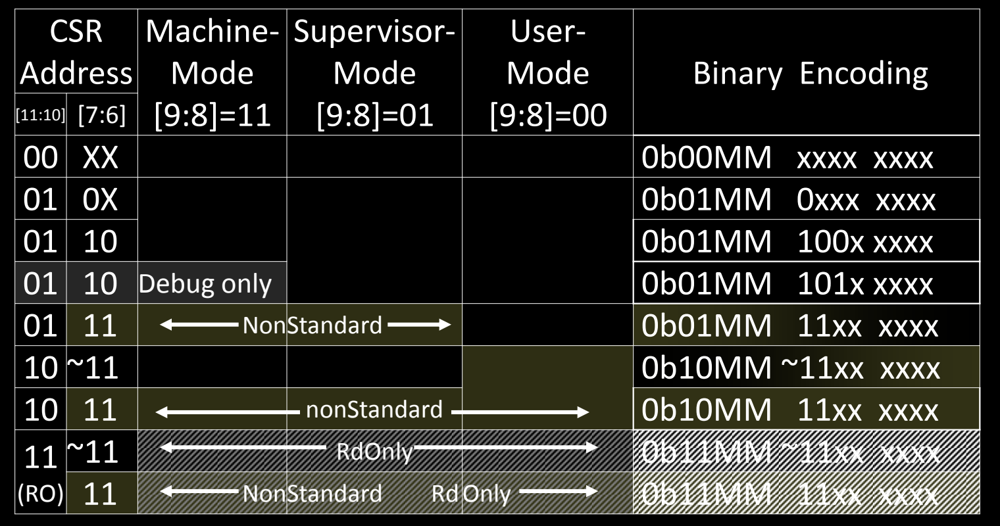

### CSR地址的编码结构

CSR地址是12位的二进制值，用来标识不同的寄存器。具体的编码结构如下：

1. **高两位[11:10]**：用于定义CSR的类型。
2. **中两位[9:8]**：用于区分不同的特权模式：
   - `00`：用户模式（U-mode）专用的CSRs
   - `01`：监督模式（S-mode）专用的CSRs
   - `11`：机器模式（M-mode）专用的CSRs
   - `10`：为虚拟机管理程序（Hypervisor，V-mode）保留，当前版本尚未实现。
3. **其余位[7:6]**：用于标识CSR的具体种类和用途。

通过这种结构，RISC-V的CSR地址可以灵活地支持不同的模式、权限级别和操作需求。

### CSR地址空间划分

CSR地址空间分为多个区域，每个区域对应不同的特权模式。根据特定的二进制编码，CSR地址的用途如下表所示：

| CSR地址  | 机器模式（M-mode）    | 监督模式（S-mode）    | 用户模式（U-mode） | 二进制编码说明                            |
| -------- | --------------------- | --------------------- | ------------------ | ----------------------------------------- |
| `00 XX`  | -                     | -                     | 可访问             | `0b00MM xxxx xxxx` 用户模式专用寄存器     |
| `01 0X`  | -                     | 可访问                | -                  | `0b01MM 0xxx xxxx` 监督模式下的常规寄存器 |
| `01 10`  | 可访问                | -                     | -                  | `0b01MM 100x xxxx` 调试模式专用寄存器     |
| `01 11`  | 非标准（NonStandard） | -                     | -                  | `0b01MM 11xx xxxx` 非标准寄存器           |
| `10 ~11` | -                     | -                     | -                  | `0b10MM ~11xx xxxx` 保留给虚拟化支持的CSR |
| `11 ~11` | 只读（ReadOnly）      | 非标准（NonStandard） | 只读（ReadOnly）   | `0b11MM 11xx xxxx` 机器模式的只读寄存器   |

### 关键编码细节

1. **`0b00MM xxxx xxxx`**：这些CSR主要供用户模式使用，最低权限，通常用于用户程序的控制状态信息，如性能计数器或用户态的软中断控制等。
   
2. **`0b01MM xxxx xxxx`**：这些CSR供监督模式和调试模式使用，权限较高，典型的应用是页表管理、内存访问控制和中断处理等。监督模式的操作系统内核可以使用这些CSR来管理用户进程。

3. **`0b11MM xxxx xxxx`**：这些CSR为机器模式（M-mode）专用，权限最高。通常，这些寄存器用于系统初始化、硬件配置以及固件层面的管理。

4. **`0b10MM xxxx xxxx`**：这一段目前保留给虚拟化支持（Hypervisor mode）。虽然当前版本的RISC-V规范尚未全面实现虚拟化，但这一编码区域为将来虚拟机管理程序的功能预留了空间。将来，虚拟机管理程序会通过这些CSR来管理多虚拟机的操作。

### 特殊类型的CSR

- **只读寄存器（ReadOnly）**：某些寄存器是只读的，用于存储系统状态或硬件信息，这类寄存器在低权限模式下也可以读取，但无法被写入。
  
- **非标准寄存器（NonStandard CSRs）**：有些CSR的地址编码不属于RISC-V标准，通常由处理器厂商或特定实现提供。这类CSR通常是硬件优化或扩展功能的一部分，处理器厂商可以根据需要定义。

- **调试模式专用CSR**：`01 10` 开头的CSR是调试模式下专用的，用于在调试环境中保存系统的状态信息并控制调试操作。这些寄存器只有在调试端口连接时才能访问。

### 错误处理与陷阱机制

- **访问不存在的CSR**：如果代码试图访问不存在的CSR，处理器会触发一个陷阱（trap），即系统会捕获这个错误并执行相应的异常处理程序。
  
- **写入只读CSR**：同样，试图写入只读CSR也会触发陷阱，这种机制确保了系统的稳定性，防止低权限模式中的错误操作破坏关键数据。

- **可选CSR**：某些CSR是可选的，具体实现时可以有选择地支持这些寄存器。如果某个CSR在实现中不存在，处理器在读取时将返回零，并且在写入时忽略操作。

CSR地址空间通过严格的编码规范，确保了不同特权模式下的CSR访问权限划分。机器模式（M-mode）拥有最高权限，能够访问最广泛的CSR集合，而监督模式（S-mode）和用户模式（U-mode）的权限则逐步递减。这种设计保障了系统的安全性和稳定性，同时为未来的扩展（如虚拟化支持）预留了足够的灵活性。

## CSRs and Categories

RISC-V架构中的**控制和状态寄存器**（CSRs）根据其功能被划分为不同的类别，每个类别负责管理处理器的某一方面操作。CSRs为处理器提供了对硬件资源的精细控制和状态监控，涵盖了从异常处理、内存保护到计时器、调试等多个领域。部分CSR在不同的模式（如M-mode、S-mode、U-mode）下会有各自的副本或复制，这样可以保证不同权限级别的隔离性。

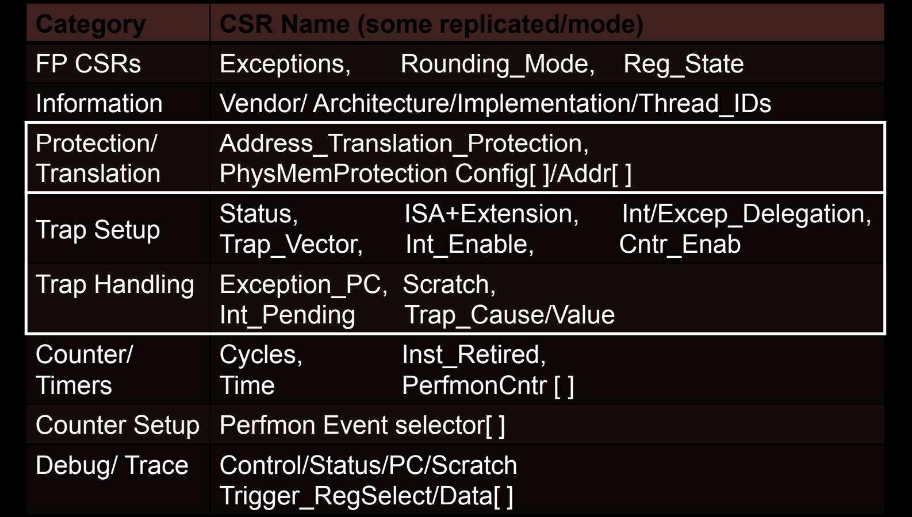

### 主要CSR类别

1. **FP CSRs（浮点运算相关）**
   - 这些寄存器主要用于管理浮点操作和状态。它们负责处理浮点运算的异常、舍入模式以及浮点寄存器的状态。
   - 关键CSR名称：
     - **Exceptions**：用于浮点异常的处理。
     - **Rounding_Mode**：控制浮点运算的舍入模式。
     - **Reg_State**：浮点寄存器的状态保存。

2. **Information（信息寄存器）**
   - 这些CSR保存处理器的厂商信息、架构标识、实现细节以及当前硬件线程的ID。
   - 关键CSR名称：
     - **Vendor/Architecture/Implementation**：用于识别处理器的厂商、架构版本和实现方式。
     - **Thread_IDs**：管理多线程或多核心系统中每个hart（硬件线程）的标识符。

3. **Protection/Translation（保护和地址翻译）**
   - 这些CSR用于虚拟内存的地址翻译和物理内存的保护，特别是在多任务操作系统中，保证不同任务之间的内存隔离。
   - 关键CSR名称：
     - **Address_Translation_Protection**：控制虚拟地址到物理地址的翻译，并应用内存保护。
     - **PhysMemProtection Config[]/Addr[]**：管理物理内存保护的配置和地址。

4. **Trap Setup（陷阱设置）**
   - 这些寄存器用于设置和配置异常（trap）的行为，例如指定异常向量地址或启用特定类型的异常处理。
   - 关键CSR名称：
     - **Status**：保存处理器的当前状态，如当前运行模式、全局中断使能等。
     - **Trap_Vector**：指定异常处理程序的入口地址。
     - **Int_Enable**：启用或禁用中断。
     - **Cntr_Enab**：启用或禁用特定的计数器功能。

5. **Trap Handling（陷阱处理）**
   - 这些CSR用于处理异常事件，包括保存异常发生时的处理器状态和异常的原因。
   - 关键CSR名称：
     - **Exception_PC**：保存异常发生时的程序计数器（PC）值，以便在异常处理完成后返回。
     - **Scratch**：用于异常处理中的临时数据存储。
     - **Int_Pending**：记录当前待处理的中断。
     - **Trap_Cause/Value**：保存异常的原因和相关数据。

6. **Counter/Timers（计数器和计时器）**
   - 这些寄存器用于记录处理器的周期数、时间以及指令执行情况，通常用于性能监控和系统调度。
   - 关键CSR名称：
     - **Cycles**：记录处理器执行的时钟周期数。
     - **Time**：用于记录处理器的运行时间。
     - **Inst_Retired**：记录处理器已执行的指令数。
     - **PerfmonCntr[]**：性能监控计数器，用于跟踪性能指标。

7. **Counter Setup（计数器设置）**
   - 用于配置性能监控事件，选择哪些事件需要计数。
   - 关键CSR名称：
     - **Perfmon Event selector[]**：性能监控事件的选择器。

8. **Debug/Trace（调试与跟踪）**
   - 这些寄存器用于系统的调试和跟踪功能，帮助开发者分析程序执行情况和定位问题。
   - 关键CSR名称：
     - **Control/Status/PC/Scratch**：调试模式下的控制与状态寄存器，用于保存调试过程中的状态。
     - **Trigger_RegSelect/Data[]**：调试触发器寄存器，用于调试时设置条件断点或数据监控。

## Memory Addressing: Translation

在RISC-V架构中，**虚拟内存**是监督模式（S-mode）下的重要功能，它通过页表机制将虚拟地址映射到物理地址，为多进程操作系统提供内存隔离和保护。虚拟内存的引入允许用户模式下的程序拥有各自独立的地址空间，避免直接访问物理内存，从而提升系统的安全性和稳定性。

### S-mode中的虚拟内存页映射

- **最小保护/映射单位是4 KB的页面**：
  - RISC-V的虚拟内存使用固定大小的页面来进行地址映射，通常情况下每个页面大小为4 KB。4 KB是虚拟内存映射的最小单位，也是分页机制的基本单位。

### 多用户进程支持

- **支持多个用户模式进程，分别拥有独立的地址空间**：
  - 通过使用SATP（Supervisor Address Translation and Protection）CSR中的**Addr_Space_ID字段**，RISC-V能够为每个用户模式进程分配独立的地址空间。这使得多个进程可以安全并行运行，而不会互相干扰或影响彼此的数据。

### 页表（Page Tables）的多级结构

RISC-V采用了多级页表机制来实现虚拟地址到物理地址的映射。这种分层结构的页表能够有效管理大量内存，同时支持不同的虚拟地址长度和物理地址长度。

- **页表级数**：
  - **Sv32（32位架构）**：使用2级页表，适用于RISC-V的32位架构（RV32）。
  - **Sv39、Sv48（64位架构）**：分别使用3级或4级页表，适用于RISC-V的64位架构（RV64）。这些页表机制允许处理更大的内存空间。
  - **Sv57、Sv64（保留机制）**：这两个机制保留用于未来可能的更大虚拟地址或物理地址空间（如57位或64位地址空间的处理器）。

### 超大页面（Superpages）

- **页表遍历可以在任意级别停止以创建超级页**：
  - 在RISC-V中，超级页是比4 KB常规页更大的内存页块。通过在不同层级的页表遍历中提前停止，可以实现超级页的映射。
  - 例如：
    - 在**Sv39**架构下，如果页表遍历在第2级停止，可以映射2 MB的超级页。
    - 如果遍历在第1级停止，则可以映射1 GB的超级页。
  - 超级页的存在显著减少了页表项的数量，优化了大数据集或大内存应用的内存管理。

### 硬件页表遍历机制

- **硬件页表遍历语义由特权模式规范（Privileged Mode Spec）定义**：
  - RISC-V硬件负责自动遍历页表以进行地址转换。硬件会按照特权模式规范中定义的方式，逐级遍历页表项来完成虚拟地址到物理地址的映射。
  - 如果硬件无法完成页表遍历，可能会触发陷阱（trap），并进入机器模式（M-mode）以进行软件方式的TLB（Translation Lookaside Buffer）重填。

## RISC-V Page Table Entries (PTEs)

可参见 [Lzzs 6.S081 Notebook: Page Tables](https://lzzs.fun/6.S081-notebook/L04/)

在RISC-V虚拟内存机制中，页表条目（Page Table Entries, PTEs）负责将虚拟地址映射到物理地址，并定义了每个内存页面的权限和状态。每个PTE包含多个字段，这些字段共同决定内存访问的规则、状态和权限。根据虚拟地址的格式（如Sv32、Sv39、Sv48或Sv64），PTE的结构可能有所不同。

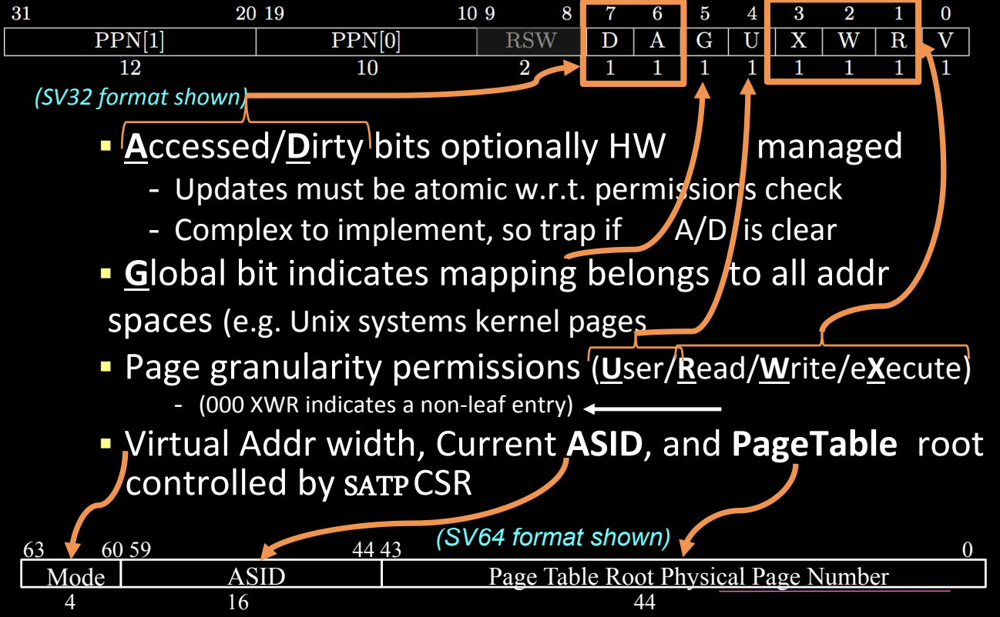

### 页表条目的结构

以下是以**Sv32格式**为例的页表条目（PTE）结构，其字段解释如下：

- **PPN（物理页面号，Physical Page Number）**：用于指定映射的物理页面地址。
  - **PPN[1]** 和 **PPN[0]** 是物理地址的一部分。PPN字段可以根据虚拟地址空间的大小有不同的长度，比如Sv32、Sv39、Sv48和Sv64的长度各不相同。
  - PPN字段在最终的物理地址形成中起关键作用，它决定虚拟地址指向的物理内存块。

- **RSW（保留位，Reserved for Supervisor）**：这些位由操作系统内核自行使用，不会被硬件直接处理。通常用于页表管理和内存分配的额外元数据。

- **D位（Dirty）**：标识页面是否被写入过。
  - 如果页面被修改过，D位会被设置为1，表示该页面已经“脏”，需要同步回主存。
  - 如果没有设置，可能需要陷阱（trap）到软件层进行处理。

- **A位（Accessed）**：标识页面是否被访问过。
  - 当该页面被读取或写入时，A位会被设置为1，用于管理页面的生命周期或优化内存交换策略（如LRU）。
  - 如果A位未设置，也可能触发陷阱处理。

- **G位（Global）**：指示该映射是否在所有地址空间中全局可见。
  - 如果该位设置为1，则此映射对于所有进程都是全局有效的（如Unix系统中的内核页面），在进程切换时不需要刷新TLB。

- **U位（User）**：控制页面是否可被用户模式访问。
  - 如果设置为1，用户模式代码可以访问该页面。
  - 如果为0，则该页面只能被更高权限的模式（如S-mode或M-mode）访问。

- **X位（Execute）**：控制页面是否可被执行。
  - 设置为1时，页面上的内容可以作为指令执行。
  - 如果为0，则不允许执行，防止代码注入或其他安全风险。

- **W位（Write）**：控制页面是否可写。
  - 设置为1时，允许对页面进行写操作；否则，写操作将被禁止。

- **R位（Read）**：控制页面是否可读。
  - 设置为1时，允许读取页面内容；否则，读取操作将被禁止。

- **V位（Valid）**：指示该页表项是否有效。
  - 如果V位为0，则该页表项无效，访问该页面时会触发异常。

### 页粒度的权限设置

- **权限（User/Read/Write/eXecute）**：RISC-V PTE支持按粒度设置页面的用户权限，包括读、写和执行权限。如果某个页表条目未设置任何权限位（即000），则该页表项表示为非叶子节点，指向下一层页表。

### 多地址空间的支持

- **Addr_Space_ID（地址空间ID，ASID）**：用于支持多进程系统。每个进程的地址空间都有独立的ASID字段，存储在**SATP**（Supervisor Address Translation and Protection）CSR中。SATP管理当前虚拟地址的宽度、当前进程的ASID以及页表根地址。

### 多级页表的遍历

根据不同的虚拟地址长度，RISC-V支持不同级数的页表。以Sv64为例，PTE的格式适配64位虚拟地址，在SATP中包括44位的页表根物理地址、16位的ASID和4位的模式字段。

## Memory Fences: More Control

内存屏障（Memory Fences）在多处理器系统中确保不同处理器核之间的内存访问顺序一致性。RISC-V引入了**SFENCE.VMA**指令，用于同步内存结构的更新，特别是页表。

### SFENCE.VMA 指令

- **S-mode下的SFENCE.VMA**：这条指令用于同步虚拟内存数据结构的更新，特别是在修改页表之后，确保新的页表项能够被处理器正确使用。
  - **作用范围**：
    - 可以作用于所有页表级别，或者只影响与特定地址相关的级别。
    - 可以作用于所有地址空间，或者仅影响当前地址空间。

### 页表同步与TLB刷新

- **类似于其他架构的TLB刷新**：在许多处理器架构中，当页表发生变化时，需要刷新TLB（Translation Lookaside Buffer，翻译后备缓冲区），以避免旧的映射被继续使用。RISC-V通过**SFENCE.VMA**实现这一功能。

### 确保指令顺序

- **确保存储操作有序**：SFENCE.VMA可以确保所有先前的存储操作在后续的隐式内存访问前完成，防止出现内存顺序紊乱的情况。

### 影响范围

- **仅影响本地hart（硬件线程）**：SFENCE.VMA指令只影响发出指令的当前hart。如果需要与其他hart同步，通常通过IPI（Inter-Processor Interrupt）进行通知。

> **SFENCE.VMA** 和 **FENCE.I** 都是RISC-V架构中用于处理内存同步和一致性的指令，但它们的作用和使用场景有所不同。让我们详细对比它们的功能与用途，并解释为什么在操作系统（如xv6）中会用到**FENCE.I**作为内存屏障。
>
> ### 1. **SFENCE.VMA**：虚拟内存的同步
>
> - **全称**：Supervisor Fence Virtual Memory Address
> - **作用**：用于同步虚拟内存的页表更新。具体来说，当修改页表（例如创建新的页面映射或释放旧页面）后，需要通过**SFENCE.VMA**指令来确保这些修改对处理器的地址翻译单元（如TLB，Translation Lookaside Buffer）可见。
> - **使用场景**：
>   - 当操作系统更新页表或修改虚拟内存结构时，必须确保这些更新被所有内存操作正确识别。在不执行**SFENCE.VMA**的情况下，TLB可能仍然保留旧的虚拟地址到物理地址的映射，导致系统使用过时的数据。
>   - **SFENCE.VMA**通常由内核代码调用，用于清除当前硬件线程（hart）中与虚拟地址相关的TLB条目，确保地址翻译映射的正确性。
>   
> - **示例**：如果操作系统为进程分配了新的内存页面或者进行了页表的切换（例如，切换到一个新的进程地址空间），**SFENCE.VMA**指令会确保处理器清除缓存的旧地址映射，并使用新的页表。
>
> ### 2. **FENCE.I**：指令缓存的同步
>
> - **全称**：Fence Instruction
> - **作用**：**FENCE.I**用于同步指令缓存（I-cache）与内存。当在内存中修改了代码（例如动态加载新代码或自修改代码的场景），**FENCE.I**指令确保指令缓存中的旧指令被清除，并强制处理器从内存中重新加载最新的指令。
> - **使用场景**：
>   - 当内存中存储的指令被修改后，指令缓存和内存之间可能会不一致。为了确保处理器执行最新修改的指令，必须使用**FENCE.I**，清除缓存并刷新指令流。
>   - **FENCE.I** 通常用于内存中的代码被动态修改的场景。例如，操作系统在某个位置加载了一段新的代码，这时就需要使用**FENCE.I**来保证处理器看到的是最新的代码。
>
> - **示例**：在操作系统xv6中，使用**FENCE.I**指令作为内存屏障，确保处理器在加载新指令后执行正确的指令流。特别是当进程从用户模式切换到内核模式，或者当处理器加载新的用户态代码后，使用**FENCE.I**可以避免执行缓存中的旧指令。
>
> ### **两者的主要区别**：
>
> | 功能/特性    | **SFENCE.VMA**                                        | **FENCE.I**                                  |
> | ------------ | ----------------------------------------------------- | -------------------------------------------- |
> | **目的**     | 用于同步页表更新，清除TLB中的旧虚拟地址到物理地址映射 | 用于同步指令缓存，确保指令缓存与内存的一致性 |
> | **影响范围** | 虚拟内存（页表和TLB）                                 | 指令缓存                                     |
> | **使用场景** | 当页表更新或地址空间切换时使用                        | 当内存中的指令被修改或动态加载代码时使用     |
> | **触发对象** | 内存地址映射的变化（如进程切换、页表修改）            | 内存中代码修改或动态生成代码的场景           |
> | **影响对象** | 影响当前hart的虚拟地址空间翻译                        | 影响当前hart的指令缓存                       |
>
> ### 为什么xv6使用**FENCE.I**?
>
> 在操作系统（如xv6）中，通常有一些场景需要动态修改内存中的指令，或者加载新的程序代码到内存中。此时，为了确保处理器执行的是内存中的最新代码，而不是已经缓存的旧指令，必须使用**FENCE.I**来刷新指令缓存，保证代码的正确性。例如，当xv6从内核模式切换到用户模式，或者从磁盘加载新的程序时，**FENCE.I**确保处理器执行的指令是最新加载的。
>
> **SFENCE.VMA** 则更多用于处理虚拟地址映射的变化。如果xv6进行页面映射的更改，或切换到新的地址空间，它则会用到**SFENCE.VMA**。

## Memory Addressing: Protection

RISC-V特权架构中的**虚拟内存保护**机制通过设置每个页面的权限来保证系统的安全性和稳定性。虚拟内存的保护不仅包括传统的读、写、执行（RWX）权限，还引入了针对不同特权模式的访问控制，从而确保内核与用户进程之间的隔离。

### 页面权限（RWX）

- **标准的RWX权限**：每个虚拟内存页面可以配置读（R）、写（W）、执行（X）权限组合。这样做确保了特定页面的访问权限明确，可以精细控制哪些页面可以被读取、写入或执行。
  - **支持执行权限单独设置（X-only pages）**：可以将页面设为只允许执行（X-only），这对于一些存储代码但不需要写入的页面很有用。
  - **写和非读（W和非R）的组合被保留**：在当前架构中，不允许页面被设置为可写但不可读。这种组合通常没有实际应用，并且可能导致安全漏洞，因此在设计中被保留未使用。

### 监督模式（S-mode）的内存访问限制

- **默认情况下，S-mode不能访问用户模式（U-mode）的页面**：
  - 这种设计有助于检测操作系统或驱动程序中的潜在错误，并确保用户进程与内核的隔离。
  - 如果S-mode需要读取用户内存（例如处理系统调用时），可以通过设置**sStatus寄存器中的"Supervisor Access to User Memory"（SUM）位**来暂时允许S-mode访问用户内存。
    - **SUM位**的设置过程是暂时的，S-mode读取用户内存后，应立即关闭此权限，确保安全性。
  - **S-mode无法从U-mode页面执行代码**，即使SUM位被设置为1。这种设计防止了潜在的权限升级攻击。

### 执行页面的保护

- **S-mode默认不能读取只执行（execute-only）页面**：
  - 执行权限和读取权限是独立设置的，S-mode无法读取仅设置了执行权限的页面。这样可以防止未经授权的内核代码试图读取用户模式中的代码页面内容。
  - 如果必须读取执行页面（例如非法指令陷阱处理程序需要读取指令内容），可以通过设置**sStatus寄存器中的“Make eXecutable Readable”（MXR）位**来覆盖默认行为。

### 虚拟内存的启用与禁用

- **S-mode可以启用或禁用虚拟内存（VM）**：通过控制SATP（Supervisor Address Translation and Protection）寄存器中的模式字段，S-mode可以选择启用或禁用虚拟内存管理（例如在嵌入式系统或裸机环境中可能不需要虚拟内存）。
- **选择页表的深度**：S-mode还可以通过SATP寄存器选择页表的深度，以适应不同的地址空间需求。例如，使用Sv32、Sv39或Sv48的多级页表结构来管理不同大小的虚拟地址空间。

## RISC-V Physical Memory Protection Unit (PMP)

物理内存保护单元（PMP）是RISC-V架构中的一个可选特性，用于在硬件级别对物理内存进行访问控制，特别是在处理器的监督模式（S-mode）或用户模式（U-mode）下，这对于未受信任的操作系统和进程至关重要。PMP的主要作用是通过定义物理内存的权限，来限制访问，并防止未经授权的代码操作敏感的内存区域。

### PMP的功能和特性

1. **可选的新特性（v1.10）**：
   - PMP是从RISC-V的v1.10版本引入的，作为一个可选的特性，允许系统在硬件层面上控制对物理内存的访问。

2. **默认无权限**：
   - 在启用PMP的情况下，默认情况下，监督模式（S-mode）和用户模式（U-mode）对物理内存没有任何权限。PMP通过明确授予读、写、执行（RWX）权限来决定哪些内存区域可以被访问。

3. **R/W/X权限配置**：
   - PMP允许为多达16个PMP区域设置读、写、执行权限，每个区域可以设置不同的权限组合。
   - 这些区域是以自然对齐的2^N字节（N>=2）为单位的连续内存块，PMP使用这些内存块来定义特定的内存访问规则。
   - 也可以通过相邻的PMP寄存器组合来形成基址/边界（base/bounds）的区域，以灵活设置更复杂的内存访问规则。

4. **PMP可以被锁定**：
   - PMP区域一旦被配置，可以通过设置为“锁定”，即使是机器模式（M-mode）也无法更改，除非系统进行复位（reset）。
   - 锁定机制确保了在某些关键应用场景下，重要的内存访问权限不会被意外或恶意修改。

5. **虚拟内存与PMP的优先级**：
   - 当虚拟内存（VM）启用时，虚拟内存的页表和缺页处理会在PMP检查之前发生。这意味着如果虚拟地址映射失败或者发生缺页错误，PMP检查不会继续。
   - 这种机制对于不受信任的监督模式（S-mode）特别有用，PMP可以作为额外的保护层。

### 使用场景

- **未受信任的S-mode**：在安全敏感的场景下，PMP可以防止不受信任的操作系统（或S-mode应用）访问物理内存中的关键资源，例如固件、特权数据等。
- **嵌入式系统和安全关键系统**：PMP在没有复杂虚拟内存机制的情况下，仍然提供了对物理内存的保护，特别适用于嵌入式系统、物联网设备等。

## Physical Memory Attributes (PMA)

物理内存属性（PMA）是RISC-V体系结构中用于管理物理地址空间的访问属性的硬件特性。这些属性是**平台和实现特定的**，这意味着它们由具体的硬件平台决定，而不是RISC-V架构标准中的固定部分。PMA定义了内存访问的各种行为，如访问宽度、对齐限制、可缓存性等。

### PMA的功能和特性

1. **平台和实现相关**：
   - PMA的配置因具体平台而异。不同平台可能有不同的总线事务类型和内存访问限制。例如，在某些嵌入式系统中，特定的内存地址可能映射到外设，而在另一些平台上则可能是系统内存。

2. **映射到总线事务类型或错误**：
   - PMA会将内存访问映射到特定的总线事务类型（例如内存读取、内存写入、设备访问等），或者返回一个错误，指示该访问是不被允许的。
   
3. **专用硬件控制**：
   - PMA由专用硬件单元管理，该硬件负责将特定的物理地址范围映射到相应的访问属性。以下是一些常见的物理内存属性：
     - **访问宽度**：支持的访问宽度可以是1/2/4/8/16/64字节等，决定每次内存访问的最小/最大数据块大小。
     - **对齐限制**：可能要求内存访问不能跨越特定字节边界（例如2^N字节对齐）。
     - **幂等性（Idempotency）**：指在启用推测执行时，允许对某些地址进行重复访问，而不会改变其结果。
     - **内存访问顺序**：强顺序或弱顺序控制（Strong/Weak Ordering），用于确保不同通道的内存操作顺序一致性。
     - **缓存行为（Cacheability）**：决定特定的内存区域是否可以被缓存（包括写穿、写合并等缓存策略）。
     - **优先级**：当多个请求同时访问内存时，可以根据优先级控制冲突时的处理顺序。
     - **原子性**：定义是否允许特定类型的原子操作，如交换、逻辑操作、加法等。
     - **允许的访问模式**：定义不同的访问模式，如M-mode、S-mode、U-mode、调试模式等是否可以访问特定内存区域。

4. **部分属性可配置**：
   - 虽然PMA的部分行为是由硬件固定的，但有些属性可以通过软件配置。这使得系统在运行时可以根据需求调整内存的访问行为。

### 使用场景

- **内存映射设备**：PMA非常适用于嵌入式系统和SoC架构，其中一部分内存空间被映射为外设的寄存器，通过PMA可以为这些地址设置不同的访问权限和行为。
- **缓存控制**：PMA允许为不同的内存区域指定缓存策略，特别是在多核处理器或需要处理外部设备的情况下，决定哪些数据应该缓存以及缓存的策略（如写回、写穿等）是非常重要的。
- **系统优化与安全**：通过设置访问顺序、优先级和对齐要求，PMA可以提升系统性能，并且通过严格的访问控制可以增强安全性。

## Trap Handling: Exceptions and Interrupts

**可参见 Lzzs 6.S081 Notebook: [Page Faults](https://lzzs.fun/6.S081-notebook/L08)、[Interrupts](https://lzzs.fun/6.S081-notebook/L09)**

在RISC-V架构中，陷阱（Trap）机制用于处理两类重要的事件：**异常（Exceptions）** 和 **中断（Interrupts）**。这两类事件的发生方式和处理机制稍有不同，但它们的处理流程在硬件层面是相似的。

### 异常（Exceptions）与中断（Interrupts）的区别

1. **异常（Exceptions）**：
   - 异常是**同步事件**，它们由具体指令的执行引发。通常，异常是在指令执行过程中检测到错误（如非法操作码、除零错误、内存访问违规等）时触发的。
   - **示例**：当程序试图执行一条未定义的指令时，处理器会触发一个异常并进入异常处理程序。

2. **中断（Interrupts）**：
   - 中断是**异步事件**，它们与当前执行的指令无关。中断通常由外部设备（如I/O设备、定时器）或者来自其他处理器核心的信号引发。
   - **示例**：当定时器超时时，系统会触发一个中断，处理器暂停当前执行的指令并处理定时器中断。

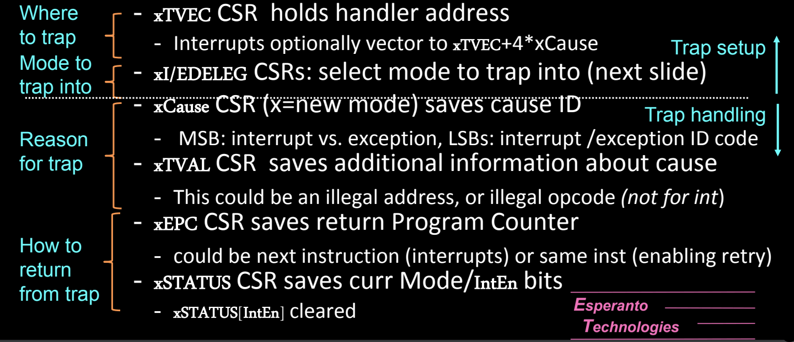

### 统一的陷阱处理流程

尽管异常和中断的触发机制不同，它们在RISC-V中通过类似的陷阱机制来处理。

- **陷阱处理的基本流程**：
  1. **xTVEC CSR**：保存陷阱处理程序的入口地址。无论是异常还是中断，处理器都会根据xTVEC的值跳转到相应的处理程序。
     - 中断可以根据xCause的值选择一个可选的偏移量，通过`xTVEC + 4 * xCause`来跳转到不同的处理程序。
  
  2. **xI/DELEG CSR**：用于选择陷阱处理的模式。这个寄存器决定了发生的异常或中断应该陷入哪个特权模式。例如，操作系统可以配置某些中断直接由用户模式处理，而无需进入内核模式。
  
  3. **xCause CSR**：保存引发陷阱的原因。
     - 高位（MSB）用于区分这是中断还是异常。
     - 低位（LSB）保存具体的中断或异常编号，标识是什么原因引发的陷阱。
  
  4. **xTVAL CSR**：保存额外的关于陷阱的信息，例如非法地址或非法操作码的值。对于某些异常（如非法内存访问），xTVAL可以保存发生错误的虚拟地址。
  
  5. **xEPC CSR**：保存导致陷阱的指令的程序计数器（PC）值。陷阱处理程序完成后，处理器将从xEPC中存储的PC地址继续执行，可能是中断处理后的下一条指令，或者重试之前的指令（异常处理）。
  
  6. **xSTATUS CSR**：保存处理器的当前状态，包括当前模式（用户、监督或机器模式）以及中断使能位。处理器在进入陷阱处理程序时会自动保存这些状态，以便在处理完成后正确返回。
     - 当陷阱处理完成时，`xSTATUS[IntEn]`位会被清除，确保处理器在恢复时不会发生竞态条件。

### 更详细的陷阱处理机制

1. **陷阱处理的位置（Where to trap）**：
   - 处理器会根据**xTVEC CSR**的值找到陷阱处理程序的入口地址。处理器可能跳转到一个固定的处理程序地址，也可能根据不同的原因（xCause）偏移跳转到不同的处理程序。

2. **陷阱的处理模式（Mode to trap into）**：
   - 不同的中断或异常可以配置为陷入不同的特权模式（如U-mode、S-mode、M-mode）。这些模式的选择由**xI/DELEG**寄存器决定，操作系统可以根据需要配置哪些陷阱直接进入用户模式处理，哪些需要更高权限的模式来处理。

3. **陷阱原因（Reason for trap）**：
   - 处理器会在**xCause CSR**中保存引发陷阱的具体原因。这一原因可能是中断（如外部设备中断）或者异常（如非法指令）。xCause还用于区分不同的中断或异常源，以便跳转到不同的处理程序。

4. **返回机制（How to return from trap）**：
   - 在陷阱处理完成后，处理器会从**xEPC CSR**保存的程序计数器继续执行之前被中断的程序。xEPC保存的是引发陷阱的指令地址，而处理器可以通过恢复**xSTATUS CSR**的状态确保正确的执行模式和中断状态恢复。

### 异常与中断的处理细节

- **异常的处理**：通常是由于指令执行过程中产生的同步错误。处理器会将异常处理程序的入口保存在xTVEC中，并在处理完后根据xEPC返回到同一指令或执行下一条指令。
  
- **中断的处理**：由于中断是异步事件，处理器可以在处理完中断后从xEPC中保存的地址继续执行后续指令。常见的中断包括定时器中断、外设中断或多处理器间的中断（如IPI）。

## Trap Setup: Interrupt/Exception Handler Delegation

在RISC-V架构中，陷阱（Trap）通常默认发送到机器模式（M-mode），但为了提高处理效率，某些中断和异常可以被委派到较低的特权模式（如S-mode或U-mode）进行处理。陷阱委派机制允许操作系统根据需求减少开销，同时确保系统的安全性和特权隔离。

### 委派机制（Delegation Mechanism）

1. **默认发送到M-mode**：
   - 在RISC-V架构中，所有的中断和异常默认都会被处理器发送到最高权限的M-mode。这是因为M-mode拥有对系统的完全控制，负责处理所有的低级硬件事件。

2. **委派到低权限模式**：
   - 虽然陷阱默认被发送到M-mode，但可以通过设置委派寄存器将某些中断和异常委派到较低的特权模式（如S-mode或U-mode）。
   - 不能将陷阱委派到比触发陷阱的模式权限更低的模式。例如，M-mode的异常可以委派到S-mode，但不能委派到U-mode（除非没有S-mode）。

3. **委派寄存器**：
   - **mideleg** 和 **medeleg**：这些寄存器控制从M-mode到S-mode的中断和异常的委派。如果没有S-mode（如在嵌入式系统中），可以将陷阱直接委派到U-mode。
   - **sideleg** 和 **sedeleg**：在存在S-mode的情况下，这些寄存器用于将中断和异常委派给U-mode，前提是系统启用了N扩展。

4. **中断的启用**：
   - 中断的委派只有在对应的启用位（如**mie**或**sie**）被设置时才会发生。启用位用于控制中断是否允许处理。
   - **注意**：异常总是被启用并处理，无需像中断那样设置启用位。

5. **陷入模式的选择**：
   - 委派发生时，中断或异常将被发送到下一级权限模式（M→S，或者S→U）。这可以减轻M-mode的负担，允许低权限模式处理与其相关的事件，例如用户程序引发的异常可以直接在U-mode处理，而不需要进入S-mode。

6. **中断设置CSR位**：
   - 当中断或异常发生时，相应的位会在**xE/IP CSR**（如**mip**、**sip**）中被设置，指示当前的中断/异常状态。

## Trap Handling: Interrupt/Exception Causes

在RISC-V中，每个中断和异常的原因都存储在**xCause CSR**中，该寄存器会指示当前发生的中断或异常的类型，便于操作系统采取相应的处理。

### **xCause CSR** 及其功能

1. **原因指示**：
   - **xCause CSR** 保存了中断或异常发生的具体原因。通过该寄存器，操作系统可以知道是哪种类型的事件引发了陷阱，并根据事件类型选择合适的处理方式。
   - 最高位（MSB）用于区分是中断（1）还是异常（0），而低位（LSB）则保存了具体的中断或异常代码。

2. **xE/IP CSR** 中的位设置：
   - 当一个中断或异常被触发时，对应的位会在**xE/IP CSR**（如**mip**、**sip**）中设置。这个寄存器记录了当前系统中待处理的中断或异常事件，并为系统提供了事件的优先级队列。

3. **同时发生的中断/异常的优先级**：
   - RISC-V为同时发生的多个中断和异常设置了优先级规则：
     - **中断优先于异常**：当中断和异常同时发生时，处理器优先处理中断。
     - **M-mode > S-mode > U-mode**：机器模式的中断和异常优先级最高，其次是监督模式，最后是用户模式。
     - **Pending[N] > Pending[M] if N > M**：较高优先级的中断（如外部中断）优先于较低优先级的中断。

4. **特殊情况：定时器和软件中断**：
   - 在某些特定情况下（如定时器中断和软件中断），优先级可能会被交换，以确保系统的定时和内部同步机制不被外部设备的中断打断。

### 中断与异常的原因代码（Trap Code）

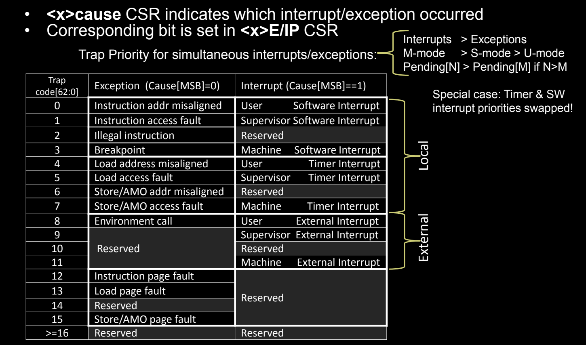

| Trap Code | 异常（Cause[MSB] == 0） | 中断（Cause[MSB] == 1） |
| --------- | ----------------------- | ----------------------- |
| 0         | 指令地址未对齐          | 用户软件中断            |
| 1         | 指令访问故障            | 监督软件中断            |
| 2         | 非法指令                | 保留                    |
| 3         | 断点                    | 机器软件中断            |
| 4         | 加载地址未对齐          | 用户定时器中断          |
| 5         | 加载访问故障            | 监督定时器中断          |
| 6         | 存储/AMO地址未对齐      | 保留                    |
| 7         | 存储/AMO访问故障        | 机器定时器中断          |
| 8         | 环境调用（用户模式）    | 用户外部中断            |
| 9         | 保留                    | 监督外部中断            |
| 10        | 保留                    | 保留                    |
| 11        | 环境调用（机器模式）    | 机器外部中断            |
| 12        | 指令页错误              | 保留                    |
| 13        | 加载页错误              | 保留                    |
| 14        | 存储/AMO页错误          | 保留                    |
| >= 16     | 保留                    | 保留                    |

## Interrupt

## Platform-Level Interrupt Overview

[xv6](https://lzzs.fun/6.S081-notebook/L09#%E5%B9%B3%E5%8F%B0%E7%BA%A7%E4%B8%AD%E6%96%AD%E6%8E%A7%E5%88%B6%E5%99%A8plic)

在RISC-V架构中，中断系统分为**全局中断**（Global Interrupts）和**本地中断**（Local Interrupts）。这些中断管理的核心是平台级中断控制器（**PLIC**），它负责处理和调度外部设备发出的中断信号，并将其分发给系统中的各个硬件线程（harts）。本地中断则直接在每个hart内处理，与定时器和软件中断紧密相关。

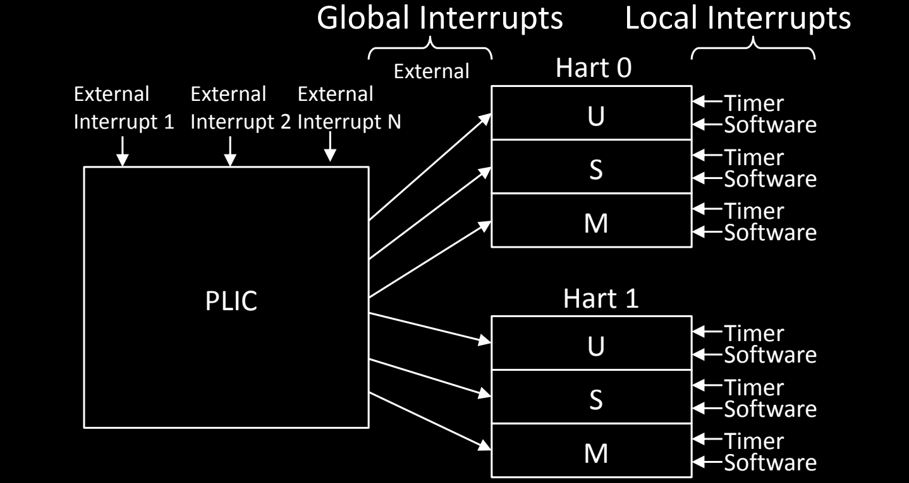

### 全局中断（Global Interrupts）

- **外部中断（External Interrupts）**：
  - 全局中断由平台上的外部设备发起，例如外部I/O设备、网络接口或存储设备。这些中断通过**PLIC**传递给每个hart。
  - **PLIC**（Platform-Level Interrupt Controller）是RISC-V系统中处理外部中断的核心模块。它接收来自多个外部设备的中断请求，根据中断的优先级和配置决定哪个hart来处理中断。
  - 通过PLIC，每个外部中断被分配给不同的hart（硬件线程），这些中断可以在不同的特权模式（U-mode、S-mode、M-mode）下进行处理。

- **PLIC的工作机制**：
  - **中断分发**：PLIC接收到外部设备的中断信号后，根据中断的优先级和目标hart，将中断传递到合适的hart。
  - **优先级处理**：每个外部中断可以被分配不同的优先级，PLIC会根据优先级的高低决定哪个中断优先处理。
  - **中断路由**：PLIC负责将外部中断路由到指定的hart和特权模式（U、S、M）。

### 本地中断（Local Interrupts）

本地中断是与每个hart直接相关的中断，通常涉及到定时器和软件中断。这类中断只影响对应的hart，并不需要通过PLIC进行分发。

- **定时器中断（Timer Interrupts）**：
  - 定时器中断是由处理器内部的定时器触发的，用于操作系统的时钟管理或任务调度。这些定时器中断直接分发到对应的hart，不经过PLIC。
  - 每个hart都有自己独立的定时器，这意味着多个hart可以同时处理各自的定时器中断。

- **软件中断（Software Interrupts）**：
  - 软件中断通常用于多hart（多核）系统中，hart之间的通信。操作系统可以触发软件中断来通知其他hart执行特定的任务（如任务切换、进程调度等）。
  - 软件中断通过操作系统触发，作用于指定的hart，并由其直接处理。

### 每个hart的中断处理

每个hart（硬件线程）有自己独立的中断处理机制，并且可以根据特权模式（M-mode、S-mode、U-mode）处理不同级别的中断。每个模式都有自己对应的定时器中断和软件中断。

- **M-mode中断处理**：M-mode拥有最高优先级的中断处理权力，负责管理最底层的硬件和外部设备的中断。
- **S-mode中断处理**：S-mode通常用于操作系统内核，用来处理用户进程的调度、虚拟内存管理和设备管理。
- **U-mode中断处理**：U-mode的中断通常由用户态程序触发，用于软件中断或用户应用程序的定时器管理。

## RISC-V Interrupt Source Categories

RISC-V的中断源分为两大类：**全局（外部）中断**和**本地中断**。每种中断类型在处理方式和目标硬件上有所不同，并通过特定的机制来分发和处理。

### 全局（外部）中断

- **路由到hart**：全局中断通常来自平台上的外部设备，这些中断由**平台级中断控制器（PLIC）**负责管理。PLIC根据每个hart的中断阈值和优先级，决定将中断路由到哪个hart进行处理。
- **确定中断源**：中断源可以通过读取PLIC的MMIO（内存映射I/O）CSR来确定。PLIC负责接收多个外部设备的中断，并根据配置的优先级处理它们。

### 本地中断

- **本地中断与单个hart相关**：本地中断直接连接到每个hart，独立于其他harts。它们不通过PLIC，而是由每个hart自己处理。RISC-V定义了两种标准的本地中断类型：
  1. **软件中断**：通常用于hart之间的通信，或由操作系统触发，用于多核系统中的任务调度。
  2. **定时器中断**：由定时器触发，用于时间管理或操作系统的时钟调度。
  
- **通过xCause CSR确定中断原因**：本地中断的原因可以直接从**xCause CSR**中读取。每个hart在接收到本地中断后，可以通过这个寄存器查看具体的中断类型，并进行相应的处理。

### 任意中断可用于任意模式（M/S/U）

- **中断可指向任何特权模式**：无论是全局中断还是本地中断，都可以根据需要分发到任何特权模式（M-mode、S-mode、U-mode）。例如，某些中断可以直接由用户态程序处理，而不需要进入内核模式。
- **同时发生中断时优先级决定处理顺序**：当同时发生多个中断时，系统会根据特权模式和中断优先级来决定处理顺序。处理器会首先处理优先级更高的中断。

## External Interrupts

外部中断是由系统中的外部设备触发的中断，例如I/O设备、外设或其他硬件模块。这些中断通过PLIC进行管理和分发。

### 外部中断的工作机制

1. **PLIC管理外部中断输入**：
   - **平台级中断控制器（PLIC）**接收外部设备的中断请求，并将这些中断分发到合适的hart。PLIC根据hart的中断阈值、中断启用状态以及中断优先级来决定哪些hart处理中断。
   
2. **多hart的中断目标**：
   - PLIC可以将同一个外部中断同时发送到多个hart。在这种情况下，多个hart需要通过仲裁机制来决定哪个hart处理该中断。
   - **仲裁机制**：例如，多个hart可以竞争读取映射到PLIC的MMIO寄存器，第一个读取到中断源的hart将负责处理该中断。

3. **PLIC的特权模式标签**：
   - PLIC可以根据中断的来源和配置，为每个中断输出标记一个特权模式（M/S/U），这允许不同的特权模式处理不同的中断。例如，某些低优先级的外部设备中断可以由用户模式（U-mode）处理，而高优先级中断则交由机器模式（M-mode）处理。

4. **清除外部中断**：
   - 外部中断通过MMIO映射的LD（加载）/ST（存储）操作发送到PLIC后，可以通过写入相应的寄存器来清除中断。处理完中断后，操作系统或硬件会通过这种方式通知PLIC，表示中断已完成处理。

5. **软件注入中断**：
   - 软件可以直接通过设置**SEIP**和**UEIP**中断位来支持PLIC虚拟化。这允许通过软件控制来模拟外部中断，通常用于操作系统的虚拟化环境中，在这种情况下，软件层面可以直接注入中断信号而无需实际硬件设备的中断触发。

## Software Interrupts

软件中断是RISC-V架构中**hart之间相互中断**的机制，通常用于**多核处理器**中的核间中断（IPI，Inter-Processor Interrupts）。这种机制允许一个hart触发另一个hart的中断，以实现核间的同步或调度。

### 软件中断的工作机制

1. **hart间通信**：
   - 软件中断用于hart之间的相互通信。例如，一个hart可以通过发送软件中断来通知另一个hart执行任务或处理事件。这种中断不依赖于外部设备，而是纯粹在处理器内部进行的通信机制。

2. **设置SIP位**：
   - 设置某个hart的**SIP（Supervisor Interrupt Pending）**寄存器位来触发软件中断。这通常通过**MMIO写操作**实现，即通过内存映射I/O写入来设置目标hart的SIP位，通知它有软件中断需要处理。
   - 如果当前模式（current mode）权限足够（如S-mode或M-mode），hart也可以自行设置其SIP位。

3. **操作系统中的应用**：
   - 操作系统或应用程序通常通过**ABI/SBI调用**来触发hart之间的中断。这些调用可以确保中断请求在虚拟化环境下能够正确传递到目标虚拟hart。
   - 当目标hart处于非活动状态（例如未调度或暂停），中断请求可能会被推迟，直到目标hart再次被调度运行。
   - 在虚拟化环境中，M-mode软件（如监控器或虚拟机管理程序）负责使用**MSIP（Machine Software Interrupt Pending）**寄存器来虚拟化软件中断，确保中断能够在虚拟hart中正确传播。

## Timer Interrupts

定时器中断是RISC-V系统中的关键机制，用于管理**实时任务调度**、操作系统时钟和其他基于时间的操作。定时器中断由**硬件定时器**触发，并通过MMIO（内存映射I/O）进行管理。

### 定时器中断的工作机制

1. **单个M-mode 64位硬件定时器**：
   - RISC-V系统中通常有一个**64位的实时硬件定时器**，该定时器为整个系统提供统一的时间基准。这个定时器是所有hart共享的，并不属于特定的hart。
   - 该定时器以固定的速率计数，独立于处理器的时钟速率和功耗管理。

2. **每个hart的时间比较器**：
   - 每个hart都有自己的**时间比较器（Time Comparator）**，即**mtimecmp**寄存器。该寄存器存储一个时间阈值，当定时器的值（**mtime**寄存器）达到该阈值时，触发hart的定时器中断。
   - 当**mtime ≥ mtimecmp**时，目标hart的**MTIP（Machine Timer Interrupt Pending）**位被设置，表示该hart的定时器中断需要处理。

3. **定时器和比较器通过MMIO管理**：
   - 定时器和时间比较器并不是通过CSR（控制状态寄存器）来控制的，而是通过MMIO地址空间进行读写操作。这意味着操作系统可以通过内存映射的方式与定时器和比较器交互。

4. **M-mode负责虚拟化定时器中断**：
   - M-mode（机器模式）负责将硬件定时器虚拟化，以支持S-mode和U-mode下的定时器中断。
   - 当较低权限的模式（如U-mode）读取定时器相关的CSR时，操作系统会捕获并通过M-mode进行处理。这样可以确保系统中所有hart能够共享同一个硬件定时器，并且在虚拟化环境中，虚拟机能够使用独立的虚拟定时器。

5. **STIP和UTIP的处理**：
   - **STIP（Supervisor Timer Interrupt Pending）**和**UTIP（User Timer Interrupt Pending）**是CSR中的定时器中断位，分别用于监督模式和用户模式下的定时器中断管理。
   - 这些定时器中断通过操作系统（SBI/ABI调用）进行设置，M-mode负责写入和清除这些中断位，确保定时器中断能够及时处理。

## Counters: Time and Performance

RISC-V体系结构支持多种计时器和计数器，这些工具主要用于性能监控、调试和时间管理。大多数计时器和计数器在RISC-V中都作为控制和状态寄存器（CSRs）来实现，主要通过特权模式下的访问进行管理。

### Timers and Counters

RISC-V架构提供了多个计时器和计数器，用于不同场景的时间管理和性能监控。这些计数器大多数是**64位**的，在RV32架构下被分成两个32位的寄存器来读取。

1. **实时时钟（Real-Time Clock, Time）**：
   - 实时时钟通过特定的CSR记录系统当前的时间。这个计时器的行为在**定时器中断**部分已经解释过了。
   - 当U-mode（用户模式）或S-mode（监督模式）读取这个CSR时，系统会发生陷阱（trap）进入M-mode，M-mode通过MMIO进行相应的读操作。

2. **指令退休计数器（Instructions Retired, InstRet Counter）**：
   - **InstRet** 计数器记录处理器执行的指令数，通常用于性能分析和调试。U-mode可以只读（RO），M-mode则可以读写（RW）。
   - 操作系统或监控器可以通过伪指令`RDINSTRET`读取该计数器，用于测量执行的指令数量。

3. **周期计数器（Cycles, Cycle Counter）**：
   - **Cycle** 计数器用于记录处理器自启动以来经过的时钟周期数。和InstRet一样，U-mode可以只读，M-mode可以读写。
   - 伪指令`RDCYCLE`允许操作系统或应用程序读取该计数器，以测量程序执行所消耗的时钟周期。

4. **硬件性能监视器（Hardware Performance Monitors, HPMCounters）**：
   - RISC-V提供了多达30个硬件性能监视器（**mhpmcounters**），用于监控各种硬件事件，如缓存命中、分支预测失败等。
   - 每个硬件性能监视器都有一个对应的事件选择寄存器（**HPMEvent**），用来选择该计数器需要监控的硬件事件。用户或系统可以根据需要，设置这些计数器来分析不同的硬件行为。

### Timer/Counter Protections

由于计时器和计数器可以用于性能分析和测量，未经限制的访问可能会导致安全性问题，例如侧信道攻击。因此，RISC-V架构提供了对计时器和计数器的保护机制，防止不必要或不安全的访问。

1. **计时器的安全隐患**：
   - **可访问的计时器和计数器可能导致问题**，包括：
     - **可重复性不足**：如果计时器或计数器的访问不可控，可能导致调试结果的不一致性。
     - **侧信道攻击**：例如**Meltdown**和**Spectre**等攻击可以利用计时器和计数器信息来推断系统内部的状态。因此，限制这些工具的访问权限至关重要。

2. **CounterEn寄存器（xCounterEn CSRs）**：
   - 通过**CounterEn**寄存器，RISC-V系统可以控制不同模式下对计时器和计数器的访问权限。
   - **每个计数器有一个对应的控制位**：该控制位决定了是否允许某个模式（如M-mode、S-mode或U-mode）访问特定的计时器或计数器。
     - 计时器（Time）、周期计数器（Cycle）、指令退休计数器（InstRet）以及硬件性能监视器（HPMCounters）都受到此机制的保护。
   - 如果在某个模式下访问了被禁止的计时器或计数器，处理器将触发陷阱，以确保非法访问不会发生。
   
3. **可硬连线为0的控制位**：
   - 某些计数器的控制位可以在硬件上被设置为永远为0，确保在任何模式下都无法访问这些计数器。这为系统提供了一个额外的安全保护层，防止计数器被恶意使用。

# Some Additions

## `<x>Status CSR` 寄存器详解

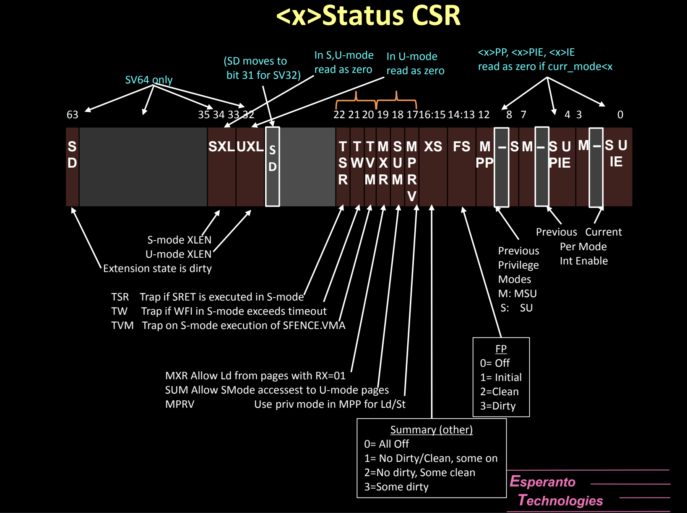

RISC-V架构中的`<x>Status CSR`（控制和状态寄存器）是一个关键的寄存器，用于管理处理器的运行状态。不同的特权模式（如M-mode、S-mode、U-mode）都有各自的`<x>Status`寄存器，例如M-mode使用`mstatus`，S-mode使用`sstatus`，U-mode使用`ustatus`。这个寄存器的不同位控制着处理器的特权模式切换、异常处理、中断启用等行为。

### 寄存器位定义

该寄存器的每个位都有特定的功能，从低位到高位的主要字段如下：

### 1. **中断控制位**（Bits 0-3, 7-11）
   - **IE（Interrupt Enable，位0）**：控制当前模式下的全局中断使能。如果该位被设置为1，则当前模式允许中断；否则，当前模式下中断被禁用。
   - **PIE（Previous Interrupt Enable，位4）**：在中断发生前记录的中断使能状态。当中断返回时，这个位的值会恢复到`IE`位中，确保处理器在中断返回时能够恢复中断前的中断使能状态。
   - **SIE、UIE**：分别为监督模式和用户模式的中断启用控制位，类似于M-mode的`IE`位功能。
   - **SPIE、UPIE**：记录S-mode和U-mode下的上一次中断使能状态，处理机制类似于M-mode。

### 2. **特权模式切换字段**（Bits 11-12, 13-14）
   - **MPP（位11-12）**：记录M-mode之前的特权模式，用于异常处理返回时恢复正确的模式。可能的值包括：
     - 00: U-mode
     - 01: S-mode
     - 11: M-mode
   - **SPP（位8）**：在S-mode下，记录之前的特权模式。当从S-mode返回时，根据该位的值决定返回U-mode还是S-mode。

### 3. **特权模式中断相关字段**（Bits 15-16）
   - **XS（位15-16）**：表示扩展状态的清洁度，主要用于浮点扩展或其他处理器扩展：
     - 00: 无状态
     - 01: 有扩展，但初始状态
     - 10: 清洁状态
     - 11: 脏状态（已被使用）

   - **FS（位13-14）**：表示浮点寄存器的状态和是否被使用：
     - 00: 浮点单元未启用
     - 01: 浮点单元被初始化，但未使用
     - 10: 浮点单元已清洁，但可能使用过
     - 11: 浮点单元已脏，正在使用

### 4. **Supervisor模式控制位**（Bits 18-21）
   - **SUM（位18）**：当此位被设置为1时，S-mode允许访问U-mode的页面。当设置为0时，S-mode无法访问U-mode页面。这有助于保护用户态的内存不被内核意外访问。
   - **MXR（位19）**：允许S-mode加载执行权限为只读的页面。这个位为某些加载代码段提供了灵活性。
   - **TVM（位20）**：当设置为1时，S-mode无法修改虚拟内存页表（如`SFENCE.VMA`指令将陷阱到M-mode）。该位用于限制S-mode对虚拟内存的直接访问。
   - **TW（位21）**：当设置为1时，S-mode的`WFI`指令会触发陷阱，避免内核等待可能导致的延迟。

### 5. **S-mode扩展位**（Bits 32-35, 63）
   - **SXL、UXL（位32-35）**：控制S-mode和U-mode的XLEN（操作位宽，如32位、64位）。这允许处理器在S-mode或U-mode下选择适当的位宽。
   - **SD（位63）**：表示扩展状态是否被修改，如果设置为1，说明浮点、扩展状态寄存器（如FS、XS等）已经被使用并且是“脏”的。

### 6. **其他字段**
   - **TSR（位22）**：如果设置为1，`SRET`指令在S-mode执行时会陷阱到M-mode。此字段用于控制S-mode返回机制。
   - **TW（位21）**：当设置为1时，`WFI`指令在S-mode下会触发陷阱，防止S-mode中执行`WFI`导致的长时间等待。
   - **MPRV（位17）**：当设置为1时，处理器在M-mode下使用当前的特权模式进行加载/存储操作。

### 特别注意：
- **清除/设置位**：一些寄存器位在不同模式下读回0值。例如，当在U-mode下读取特定的S-mode或M-mode相关字段时，这些位会被读取为0。
- **高位的SD字段**：此字段会标记浮点或其他扩展状态是否已被使用（"脏"），并且影响处理器对这些扩展状态的保存与恢复操作。

## RISC-V的控制和状态寄存器（CSRs）、特权模式和选项

RISC-V架构通过**控制和状态寄存器（CSRs）**来管理处理器的运行状态、特权模式之间的切换，以及各种硬件资源的使用。不同的CSRs有特定的访问权限，只有在适当的特权模式下才能读写。以下是常见的CSRs分类及其在各特权模式（M-mode、S-mode、U-mode）中的可用性和作用。

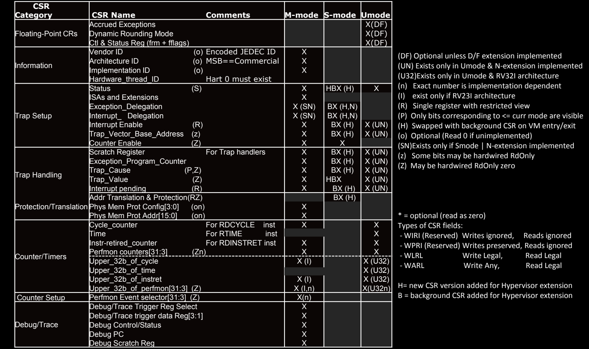

### 1. **浮点控制寄存器（Floating-Point CRs）**
   - 这些寄存器用于浮点单元（FPU）的控制和状态存储，适用于实现了浮点扩展的系统。
   - **Accrued Exceptions**、**Dynamic Rounding Mode** 和 **Control & Status**寄存器均在M-mode、S-mode和U-mode中可用，默认（DF）情况下可以访问。
   - 这些寄存器通常与浮点运算密切相关，控制浮点计算时的舍入模式、异常等。

### 2. **信息类寄存器（Information）**
   - 包含处理器的供应商、架构ID、硬件实现信息、以及硬件线程ID等。
   - **Vendor ID**、**Architecture ID**、**Implementation ID**、**Hardware Thread ID** 等信息寄存器通常只能在M-mode中读取。它们提供了有关处理器的硬件规格信息，帮助操作系统识别平台。
   - **Hardware Thread ID** 对于hart 0 是必须存在的，其他harts可能根据实现而定。

### 3. **陷阱设置寄存器（Trap Setup）**
   - 这些寄存器用于设置和管理异常或中断的处理。
   - **Status CSR**：记录当前处理器状态，可在所有特权模式下访问，但访问权限和可见字段根据特权模式有所不同。
   - **Exception Delegation**、**Interrupt Delegation**：用于将异常和中断委派给较低权限的模式（例如，将M-mode的陷阱委派给S-mode），这些寄存器通常仅在M-mode下使用。
   - **Interrupt Enable** 和 **Trap Vector Base Address**：分别控制中断使能和陷阱向量的基地址。在M-mode、S-mode中都可访问，但某些位可能是只读的。
   - **Counter Enable**：决定是否允许较低模式访问计数器（如时间计数器、周期计数器）。

### 4. **陷阱处理寄存器（Trap Handling）**
   - 用于处理异常和中断，保存相关信息，以便在陷阱发生时进行正确的处理。
   - **Scratch Register**：用于存储处理器在陷阱处理过程中的临时信息，各模式均可访问，但访问权限不同。
   - **Exception Program Counter（EPC）**：存储触发异常或中断的指令地址。
   - **Trap Cause**：标识异常或中断的原因。
   - **Trap Value** 和 **Interrupt Pending**：存储陷阱相关的其他信息，包括中断挂起状态。
   - 这些寄存器在M-mode和S-mode下可用，在U-mode下通常只读（RO）。

### 5. **内存保护和地址翻译（Protection/Translation）**
   - 包括物理内存保护（PMP）和虚拟内存地址翻译功能，主要用于管理处理器访问内存时的权限和映射。
   - **Physical Memory Protection Config** 和 **Physical Memory Protection Address**：用于配置物理内存的保护策略，防止未经授权的访问。主要在M-mode中配置。
   - 这些寄存器通常在虚拟内存启用时启用，并允许对特定内存区域进行保护设置。

### 6. **计数器/定时器（Counters/Timers）**
   - 这些寄存器用于记录处理器的周期、指令计数和时间，主要用于性能分析和系统调度。
   - **Cycle Counter** 和 **Time Counter**：分别记录处理器运行的时钟周期和系统时间，M-mode可读写，U-mode通常只读。
   - **Instruction Retired Counter**：记录处理器执行的指令数，伪指令`RDINSTRET`可用来读取。
   - **Performance Counters（HPM Counters）**：用于监控特定的硬件性能事件，具体的性能事件通过对应的**HPMEvent**寄存器进行选择。M-mode可访问多个性能计数器，而U-mode的访问可能受限。

### 7. **调试/追踪寄存器（Debug/Trace）**
   - 这些寄存器主要用于调试目的，帮助开发者捕获处理器的运行状态并追踪问题。
   - 包括**Debug Trigger Register**、**Debug Control/Status Register**、**Debug Program Counter**等，用于配置和记录调试器的触发条件和状态。
   - 这些寄存器大多只能在M-mode中访问，因为它们与硬件的调试功能紧密相关。

### CSR字段类型
不同的CSR字段有不同的访问权限和使用规则，常见的字段类型包括：

- **WIRI**（Write-Ignored, Read-Ignored）：写入和读取都被忽略。
- **WPRI**（Write-Preserved, Read-Ignored）：写入后值保留，但读取时忽略。
- **WLRL**（Write Legal, Read Legal）：合法的读写操作。
- **WARL**（Write Any, Read Legal）：写入任意值，但读取时返回合法值。

### 访问模式和选项总结

- **M-mode**：拥有最高权限，能够访问和修改所有CSRs。
- **S-mode**：可以访问许多与异常处理、内存管理和计时器相关的寄存器，但某些功能受限于M-mode的设置。
- **U-mode**：权限最少，通常只能读取特定寄存器，用于应用程序级别的性能监控或时间管理。

这张表提供了一个全面的概览，帮助理解哪些寄存器在不同的特权模式下可用，以及它们的访问权限如何受到限制。这种设计确保了RISC-V在不同特权模式下的安全性，同时提供了灵活的系统配置选项。

## Interrupt/Exception Handler Delegation

在RISC-V架构中，中断和异常的处理通常默认在最高特权级别的**M-mode**（机器模式）进行。但为了提升系统的效率，部分中断和异常可以**委派**到较低特权模式，如**S-mode**（监督模式）或**U-mode**（用户模式），这就是中断/异常处理委派的机制。委派的机制通过特定的控制和状态寄存器（CSRs）来实现，如`mideleg`和`medeleg`等。

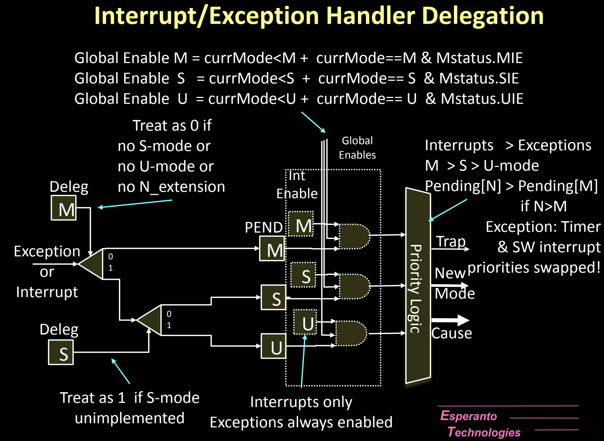

### 1. **全局中断使能（Global Interrupt Enable）**

全局中断使能位根据当前的特权模式（M-mode、S-mode、U-mode）启用或禁用相应模式的中断处理。

- **M-mode中断使能**：
  - 全局中断使能条件为 `currMode < M`，即当前模式的权限低于M-mode。
  - 当前模式为M-mode时，`Mstatus.MIE`位决定是否启用M-mode的中断处理。如果`MIE`被设置为1，则允许M-mode中断；否则，M-mode中断被禁用。

- **S-mode中断使能**：
  - 全局中断使能条件为 `currMode < S`，即当前模式的权限低于S-mode。
  - 当前模式为S-mode时，`Mstatus.SIE`位决定是否启用S-mode的中断处理。同样，如果`SIE`被设置为1，则S-mode中断被启用。

- **U-mode中断使能**：
  - 全局中断使能条件为 `currMode < U`，即当前模式的权限低于U-mode。
  - 在U-mode下，`Mstatus.UIE`控制是否启用U-mode的中断处理。U-mode是权限最低的模式，通常用于用户应用程序的中断处理。

### 2. **委派机制**

委派机制允许将某些中断和异常委派给较低特权的模式处理，减少高特权模式（如M-mode）的处理负担。

- **mideleg和medeleg寄存器**：用于将M-mode的中断和异常分别委派给S-mode。
  - **mideleg**：决定哪些中断可以委派给S-mode处理。如果对应位被设置为1，则该中断由S-mode处理；否则由M-mode处理。
  - **medeleg**：决定哪些异常可以委派给S-mode处理。如果对应位被设置为1，则该异常由S-mode处理；否则由M-mode处理。

- **sideleg寄存器**：如果S-mode被实现并启用，S-mode也可以进一步将中断委派给U-mode处理。

### 3. **中断与异常的优先级**

RISC-V通过优先级逻辑决定当多个中断或异常同时发生时的处理顺序。优先级从高到低依次为：

- **中断 > 异常**：中断的优先级高于异常，系统会优先处理中断。
- **M-mode > S-mode > U-mode**：高特权模式的中断和异常优先处理。例如，M-mode的中断优先级高于S-mode和U-mode的中断。
- **Pending[N] > Pending[M] 如果 N > M**：如果中断优先级N大于M，则优先处理中断N。这种机制确保了重要的中断能够优先被响应。

### 4. **特殊优先级情况**

对于定时器和软件中断，在某些特殊情况下，优先级可能会被交换。例如：

- **定时器中断和软件中断的优先级被交换**：通常情况下，硬件会根据系统需求调整定时器中断和软件中断的优先级，以确保系统的定时和同步机制不被其他中断影响。

### 5. **Trap处理流程**

- 当一个中断或异常发生时，系统首先判断是否启用了中断（由`Int Enable`位决定）。
- 系统根据优先级逻辑确定处理的模式，并生成相应的**Trap**，将控制权交给指定模式的中断或异常处理程序。
- 处理器将陷入新的模式（M-mode、S-mode或U-mode），并在**Cause寄存器**中记录引发Trap的原因。

## Interrupt Pending/Enable CSRs (`<x>ip, <x>ie`)

在RISC-V架构中，**中断挂起（Pending）寄存器**和**中断使能（Enable）寄存器**管理着每个硬件线程（hart）的中断状态和中断启用情况。这些寄存器分别是`<x>ip`和`<x>ie`，其中`<x>`代表特定的特权模式，例如`m`（M-mode，机器模式）、`s`（S-mode，监督模式）和`u`（U-mode，用户模式）。这些寄存器与每个hart关联，用于管理不同来源的中断，包括外部中断、定时器中断和软件中断。

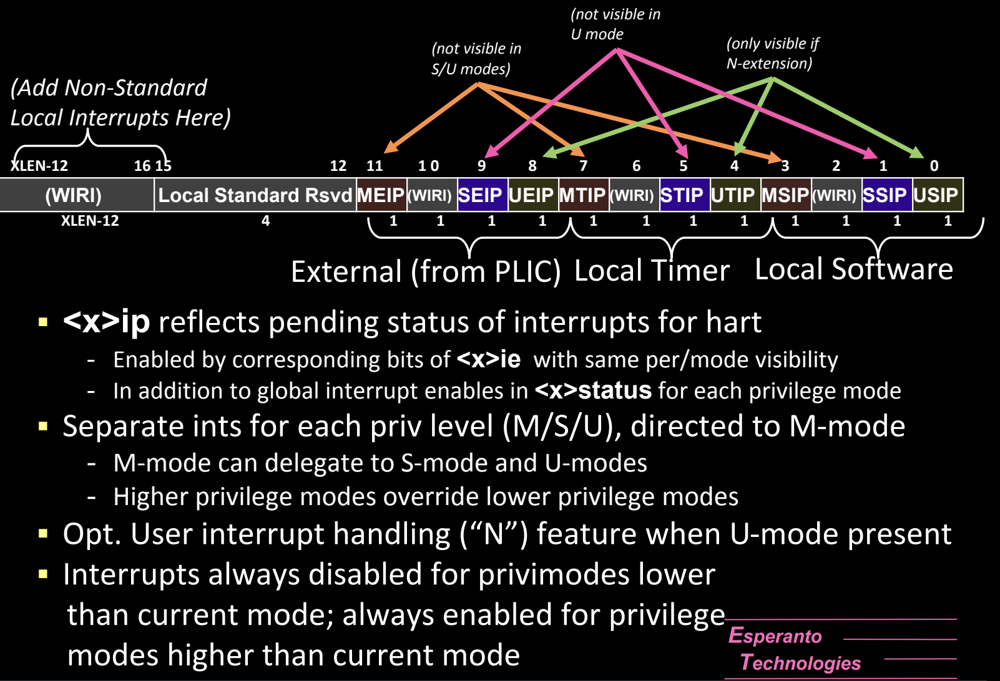

### 1. **`<x>ip`寄存器**
   - **功能**：`<x>ip`寄存器反映了当前hart的中断挂起状态（Pending）。该寄存器的每一位对应不同类型的中断来源，当中断发生且尚未被处理时，相关位将被置为1。
   - **中断源**：
     - **MEIP（位11）**：外部中断，来自PLIC（Platform-Level Interrupt Controller），通过PLIC路由到相应的hart。
     - **SEIP（位9）**：监督模式的外部中断。
     - **UEIP（位8）**：用户模式的外部中断。
     - **MTIP（位7）**：机器模式定时器中断，表示定时器中断挂起。
     - **STIP（位5）**：监督模式定时器中断。
     - **UTIP（位4）**：用户模式定时器中断。
     - **MSIP（位3）**：机器模式软件中断，通常用于hart间通信。
     - **SSIP（位1）**：监督模式软件中断。
     - **USIP（位0）**：用户模式软件中断。
   - **可见性**：特定的中断源可能在某些特权模式下不可见。例如，U-mode中无法看到`MEIP`和`MTIP`位。

### 2. **`<x>ie`寄存器**
   - **功能**：`<x>ie`寄存器用于启用或禁用各类中断。与`<x>ip`对应，`<x>ie`的每一位控制是否允许相关类型的中断被处理。当相应的`<x>ie`位为1时，中断被允许；为0时，中断被屏蔽。
   - **中断使能**：`<x>ie`寄存器控制每个特权模式下中断的启用状态，类似于`<x>status`中的全局中断使能位，但`<x>ie`的作用更为精细化，允许为特定类型的中断单独启用或禁用。
   - **多级中断管理**：M-mode可以管理和启用S-mode和U-mode的中断，S-mode则可以管理U-mode的中断。这种层级化的中断使能机制保证了中断的处理优先级。

### 3. **中断的处理和委派**
   - **中断的特权级别区分**：RISC-V为每个特权级别提供独立的中断挂起和使能寄存器。例如，M-mode处理与机器模式相关的中断，而S-mode和U-mode处理各自的中断。M-mode可以选择将部分中断委派给S-mode或U-mode进行处理。
   - **委派机制**：M-mode可以通过`mideleg`寄存器将某些中断委派给S-mode处理，S-mode也可以进一步将中断委派给U-mode。通常，较高优先级的模式可以控制较低优先级模式的中断处理。

### 4. **用户模式中断处理（`N`扩展）**
   - 如果实现了N扩展（用户模式中断处理功能），则U-mode可以直接处理某些类型的中断，而无需通过S-mode或M-mode。这种情况下，用户模式的中断处理更加高效，减少了特权模式切换带来的开销。

### 5. **中断优先级与处理顺序**
   - **中断优先级**：RISC-V体系结构规定了中断的优先级，高优先级的中断将优先于低优先级中断。通常，M-mode的中断优先级最高，其次是S-mode和U-mode。
   - **优先处理的中断类型**：定时器中断、外部中断和软件中断的优先级可以根据系统需求进行调整。例如，定时器中断和软件中断在某些情况下可能交换优先级。

### 6. **挂起中断的全局管理**
   - **全局使能条件**：中断的处理依赖于多个条件，首先需要通过`<x>status`中的全局中断使能位（如`MIE`、`SIE`、`UIE`）启用，然后通过`<x>ie`启用具体类型的中断。只有在全局使能和具体中断类型使能均为1的情况下，中断才会被处理。
   - **中断禁用**：当当前特权模式低于中断的优先级时，中断将自动禁用。例如，U-mode无法处理M-mode的中断；中断优先级较高的模式将优先处理中断。

## PLIC (Platform-Level Interrupt Controller) Block Diagram 详解

RISC-V架构中的**平台级中断控制器（PLIC）**是用于处理**外部中断**的关键组件，它负责将来自多个外部设备的中断请求路由到适当的hart（硬件线程）。PLIC可以管理大量的外部中断，并根据中断的优先级、使能状态以及目标hart的配置，选择合适的中断处理顺序。

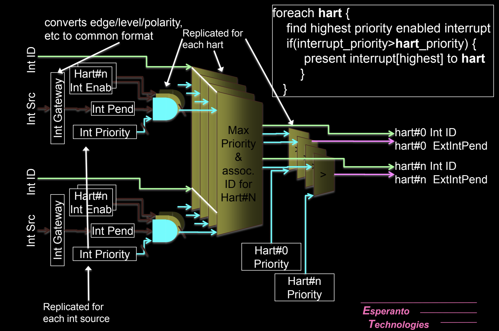

### 1. **PLIC的主要功能**
PLIC的主要功能是根据每个hart的配置，确定最高优先级的挂起中断，并将其传递给目标hart进行处理。每个hart可以通过PLIC控制其中断的处理优先级和使能状态。

### 2. **中断输入转换（Int Gateway）**
每个外部中断源都会通过**Int Gateway**模块，进行边沿触发、极性和电平的标准化处理。此模块将不同外设设备发出的中断信号转换成一个标准格式，以便PLIC进行后续处理。

### 3. **中断挂起和优先级管理**
- **中断挂起寄存器（Int Pend）**：每个中断源都有一个挂起寄存器，用来记录该中断是否处于挂起状态。挂起状态意味着该中断请求已经被发出但尚未被处理。
- **中断优先级寄存器（Int Priority）**：每个中断源还有一个优先级寄存器，用来设置该中断的优先级。优先级数值越大，表示该中断的重要性越高。PLIC根据这些优先级来决定哪些中断应该优先处理。

### 4. **中断使能寄存器（Int Enable）**
每个hart可以为各自相关的外部中断配置其**中断使能寄存器（Int Enab）**。如果某个中断源的使能位被设置为1，则该中断被允许触发处理；否则，即使中断请求挂起，PLIC也不会将其发送到hart进行处理。

### 5. **优先级比较与中断分配**
PLIC为每个hart维护一个当前优先级，并且会根据该hart的**最大优先级设置**决定处理哪一个中断：

- **Max Priority & Associated ID**：PLIC会为每个hart查找最高优先级的挂起中断。如果某个挂起中断的优先级高于当前hart正在处理的中断优先级，则PLIC将此中断信息传递给hart。
- **比较过程**：在每个hart的中断队列中，PLIC通过优先级比较器（`>`符号表示）查找最高优先级的中断请求，并根据优先级分配给hart处理。

### 6. **中断处理流程（for each hart）**
PLIC为每个hart执行以下操作：
- **查找最高优先级的已启用中断**：遍历每个外部中断源，找到其优先级高于当前hart中断优先级的中断源。
- **将最高优先级的中断发送到hart**：如果找到的中断优先级比hart当前处理的中断高，则PLIC将该中断的ID和挂起状态发送到目标hart，hart将开始处理该中断。

### 7. **每个hart的独立配置**
PLIC的结构针对每个hart独立复制一套中断管理逻辑，确保多个hart能够并行处理不同的中断请求。每个hart都有自己的优先级和中断挂起状态，PLIC会根据每个hart的配置进行中断分配。

### 8. **Hart Priority 和中断处理**
- 每个hart都有自己的当前处理中断的优先级，如果有新的中断请求且其优先级高于当前优先级，PLIC将会中断当前处理中断，将新的更高优先级的中断传递给hart进行处理。

## Hypervisor Mode

RISC-V引入了**虚拟机管理程序模式（Hypervisor Mode）**，以支持虚拟化功能，允许多个操作系统或“客户机”在同一个物理硬件上独立运行。RISC-V的Hypervisor模式主要运行在**S-mode**（监督模式）下，并通过一系列控制和状态寄存器（CSRs）来管理客户机操作系统的虚拟化资源和权限。

### 1. **硬件支持虚拟化**
- **Type-2 Hypervisor**：RISC-V的虚拟化功能类似于**Type-2虚拟机管理程序**，如KVM（Kernel-based Virtual Machine）。Type-2虚拟机管理程序运行在S-mode之上，由操作系统控制，管理多个客户机的虚拟机。
- **Type-1 Hypervisor**：RISC-V也可以支持Type-1虚拟化，这种类型的虚拟机管理程序直接运行在硬件上，不依赖于操作系统。

### 2. **Hypervisor运行于S-mode**
- 虚拟机管理程序（Hypervisor）通常运行在S-mode下，它负责分配物理资源给虚拟机，并管理虚拟机的生命周期和状态。客户机操作系统（Guest OS）则运行在虚拟化后的**V-mode**下，分别对应虚拟化的S-mode和U-mode。

### 3. **客户机运行在虚拟化的S-mode和U-mode**
- **虚拟化模式（V-mode）**：客户机操作系统可以运行在虚拟化的**V-S-mode**和**V-U-mode**，这些模式与真实的S-mode和U-mode类似，但由Hypervisor管理。
- **两级页表遍历（2-level Page Table Walk）**：客户机操作系统的虚拟内存管理使用两级页表。第一层页表由Hypervisor管理，第二层由客户机管理。这种设计确保了客户机的内存管理受到Hypervisor的严格控制，防止客户机直接访问未经授权的内存区域。

### 4. **操作的限制与陷阱**
某些操作在虚拟化环境中可以被限制或引发陷阱，以便由Hypervisor来处理：

- **`WFI`指令**：当客户机运行的`WFI`（等待中断）指令等待时间超过设定的阈值时，该指令可能会触发陷阱，由Hypervisor处理。
- **`SRET`、`SFENCE.VMA`、`SATP`和计数器访问**：这些指令和寄存器的访问可以被Hypervisor禁止或设置为陷阱。当客户机试图访问这些资源时，Hypervisor会介入并进行适当的处理。
- **强制使用监督模式的特权级别进行地址转换**：Hypervisor可以强制使用S-mode的权限级别进行地址转换，确保客户机无法超越其权限范围访问内存。

### 5. **STATUS CSR中的附加位**
- 在虚拟化模式下，STATUS CSR（控制和状态寄存器）添加了额外的位以支持虚拟化功能：
  - **Previous Virtualization Mode**：用于记录之前的虚拟化模式，便于异常处理时的状态恢复。
  - **Translation Fault Level**：用于标识地址转换过程中出现的错误级别，帮助Hypervisor诊断虚拟内存管理问题。

### 6. **控制位的解释变化**
在虚拟化模式下，一些控制位的解释方式发生了变化：
- **SPRV**、**SPV**和**SPP**：这些控制位用于指示当前的特权模式和状态，虚拟化模式下的解释可能与非虚拟化模式有所不同。

### 7. **虚拟化模式（Vmode）的CSR切换与选择**
在虚拟化环境中，特权模式的切换可能会引发CSR（控制和状态寄存器）的切换和选择，RISC-V提供了一套专门用于虚拟化的CSR，包括：

- **`hstatus`**：用于管理虚拟化状态。
- **`hedeleg`和`hideleg`**：用于委派异常和中断给虚拟化的S-mode或U-mode处理。
- **`htval`**：记录虚拟机相关的地址转换错误信息。
  

同时，以下CSR会在虚拟化模式切换时交换：
- **`sstatus`、`sie`、`sip`**：监督模式的状态、中断使能和中断挂起寄存器。
- **`stvec`、`sscratch`、`scause`**：分别为陷阱向量、临时存储和异常原因寄存器。
- **`sepc`、`stval`、`satp`**：分别为异常程序计数器、异常值寄存器和地址转换寄存器。

