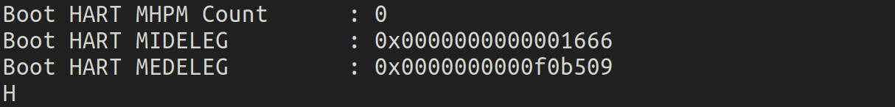
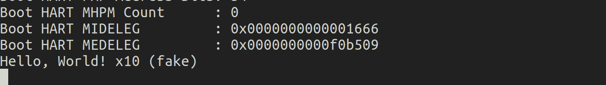

# riscv64-unknown-elf-gdb和QEMU

接下来我们将结合使用 `riscv64-unknown-elf-gdb` 和 QEMU 来调试 RISC-V 的程序。QEMU 是一个开源的模拟器，它可以用来模拟不同架构的硬件环境，而 `riscv64-unknown-elf-gdb` 则是专门为 RISC-V 目标编译的 GDB 调试器。回顾[`riscv64-unknown-elf-gdb` 和 `gdb`的区别](https://lzzs.fun/rCore-notebook/0-GDB-use.html#riscv64-unknown-elf-gdb-和-gdb的区别)。

## 一、尝试 `Hello, world!\n`✖️10

将上节的`hello.c`复制到一个新的文件夹，我们来尝试使用 `riscv64-unknown-elf-gdb` 和 QEMU 在 RISC-V 架构下调试它。

### 1. 编译 RISC-V 程序

首先将`hello.c`程序为 RISC-V 架构编译。可以使用如下的 `gcc` 命令来编译你的程序：

```bash
riscv64-unknown-elf-gcc -g -o hello hello.c
```

- `-g` 选项会确保编译后的程序包含调试信息，方便 GDB 使用。
- `hello.c` 是你的源代码文件，`hello` 是编译生成的目标文件（RISC-V 架构的可执行文件）。

### 2. 使用 QEMU 运行 RISC-V 程序

接下来，我们使用 QEMU 来模拟 RISC-V 环境并运行刚刚编译的 `hello` 程序。命令如下：

```bash
qemu-system-riscv64 -machine virt -nographic -kernel hello.elf -s -S
```

- **`-machine virt`**：选择 QEMU 中的虚拟 RISC-V 机器。
- **`-nographic`**：表示不使用图形界面，所有输出通过当前终端处理。
- **`-kernel hello`**：指定要加载并运行的 RISC-V 程序。
- **`-s`**：启用调试模式，会在端口 1234 上开启一个 GDB 服务器。
- **`-S`**：告诉 QEMU 在启动后暂停 CPU，这样我们可以连接 GDB 进行调试，而不会立即运行程序。

此时，QEMU 会启动，但它会处于暂停状态，等待 GDB 连接。

### 3. 使用 `riscv64-unknown-elf-gdb` 连接 QEMU

现在，我们使用 GDB 连接到 QEMU 并调试程序。首先启动 `riscv64-unknown-elf-gdb`：

```bash
riscv64-unknown-elf-gdb hello.elf
```

- `hello.elf` 是之前编译的可执行文件，GDB 会加载它的调试信息。

然后在 GDB 中输入以下命令，连接到 QEMU 的调试服务器：

```bash
(gdb) target remote localhost:1234
```

- 这里的 `localhost:1234` 是 QEMU 默认开启的调试端口。

### 4. 设置断点和调试

现在，你已经成功连接到了 QEMU 模拟的 RISC-V 环境，可以开始调试了。

> ### 报错1：等一下？我的第一步编译就出错了
>
> 

## 二、RISC-V 裸机编程

在RISC-V裸机编程（bare-metal programming）中，将无法再使用 `stdio.h` 这样的标准C库头文件，主要原因是裸机编程与操作系统环境的差异。以下是详细的解释：

### 1. **裸机编程与操作系统的区别**

在操作系统（如 Linux、Windows 等）上，C 标准库（包括 `stdio.h`）依赖操作系统提供的功能和服务来执行输入输出等操作。例如，`printf` 函数依赖于操作系统提供的系统调用（system call），将数据发送到标准输出设备（如屏幕或终端）。操作系统会管理这些资源和设备，提供文件系统、内存管理、硬件抽象等功能。

而裸机编程中，程序直接运行在硬件上，没有操作系统的帮助，也没有提供类似的系统调用接口。因此，诸如 `stdio.h` 头文件中定义的标准输入输出函数（如 `printf`、`scanf`）都无法工作，因为它们依赖于操作系统来管理硬件资源。

### 2. **`stdio.h` 的功能依赖**

`stdio.h` 提供的功能主要用于标准输入输出流的操作，包括文件的读取写入和格式化输出。这些功能在操作系统环境下是通过一系列系统调用（例如 POSIX 标准中的 `write()`、`read()`）实现的。而在裸机环境中：

- **没有文件系统**：裸机程序没有操作系统提供的文件系统来管理文件，因此标准输入输出流无法找到目标文件或设备。
- **没有设备驱动程序**：操作系统负责管理设备（如显示器、键盘、网络接口等）并提供驱动程序。裸机程序则必须直接操作硬件寄存器与外设通信，而标准库无法提供这样的功能。
  
例如，在操作系统上使用 `printf` 输出信息时，实际执行的是系统调用，操作系统会将格式化的字符串写入标准输出设备。而在裸机程序中，没有系统调用，因此 `printf` 无法正常工作。

### 3. **替代方案：SBI 调用或直接访问硬件**

在裸机环境中，可以通过以下方式来实现与外界的交互：

#### 1) **SBI（Supervisor Binary Interface）调用**

   在 RISC-V 裸机编程中，通常依赖 `SBI`（Supervisor Binary Interface）提供的接口来执行某些基本的硬件操作。`SBI` 是 RISC-V 中一个运行在特权模式下的小型运行环境，提供了裸机程序和硬件之间的抽象接口。例如，使用 `ecall` 指令与 SBI 通信，可以执行控制台输出、关机、时间中断等操作。

类似下面的 `sbi_call()` 函数，通过 `SBI_CONSOLE_PUTCHAR` 实现字符输出，而不是使用 `stdio.h` 的 `printf`。

   ```c
   #define SBI_CONSOLE_PUTCHAR 0x1
   
   static inline void sbi_call(uint64_t sbi_num, uint64_t arg0) {
       register uint64_t a0 asm ("a0") = arg0;
       register uint64_t a7 asm ("a7") = sbi_num;
       asm volatile ("ecall" : "+r"(a0) : "r"(a7) : "memory");
   }
   
   void print_char(char c) {
       sbi_call(SBI_CONSOLE_PUTCHAR, c);
   }
   ```

#### 2) **直接访问硬件**

   在裸机环境中，常常需要直接操作硬件设备，比如直接写入硬件寄存器来控制串口输出。以 UART（通用异步收发传输器）为例，裸机程序可以通过直接访问串口的寄存器，实现字符的输出和输入，而不需要依赖 `stdio.h`。

### 4. **RISC-V 裸机编程中的常见输入输出方式**

1. **UART 串口输出**：裸机程序可以通过访问 UART 寄存器，发送数据到终端设备。对于很多裸机程序来说，UART 是最常见的调试输出手段。

2. **SBI 调用**：RISC-V 提供了 SBI 规范，在裸机程序中，可以通过 `ecall` 指令与 SBI 交互，完成输出字符到控制台的功能，如上面的代码中通过 `SBI_CONSOLE_PUTCHAR` 实现字符输出。

### 5. 在裸机环境中使用 Rust 和 `core` 库

在 **Rust 裸机编程** 中，由于没有操作系统的支持，标准库 (`std`) 同样是不能使用的。因为标准库依赖操作系统提供的功能（如文件系统、网络等）。但是，**`core` 库** 是可以使用的，因为它是 `no_std` 环境中的基础库，不依赖操作系统的功能。

`core` 库提供了许多基础功能，比如基础的数据类型、数学运算、内存操作等，但不包括 I/O、线程、文件操作等。这样就允许在没有操作系统的裸机环境下编写 Rust 代码。更多内容见下一节。

## 三、不使用标准库的 Hello World C 代码

现在我们需要将 `Hello, world!\n`✖️10 替换为一个不使用标准库的 Hello World C 代码。

下面是一个不带标准库的 "Hello, World" C 程序，适用于 `riscv64-unknown-elf-gdb` 和 QEMU 模拟的 RISC-V 环境。我们将使用 RISC-V 的 SBI（Supervisor Binary Interface）来进行字符输出。

### 不使用标准库的 Hello World C 代码（适用于 RISC-V 裸机编程）

```c
// hello.c

// 定义标准整数类型（手动定义）
typedef unsigned long long uint64_t;
typedef unsigned int uint32_t;
typedef unsigned char uint8_t;

#define SBI_CONSOLE_PUTCHAR 0x1

static inline void sbi_call(uint64_t sbi_num, uint64_t arg0, uint64_t arg1, uint64_t arg2) {
    register uint64_t a0 asm ("a0") = arg0;
    register uint64_t a1 asm ("a1") = arg1;
    register uint64_t a2 asm ("a2") = arg2;
    register uint64_t a7 asm ("a7") = sbi_num;
    asm volatile ("ecall"
                  : "+r"(a0)
                  : "r"(a1), "r"(a2), "r"(a7)
                  : "memory");
}

void print_char(char c) {
    sbi_call(SBI_CONSOLE_PUTCHAR, c, 0, 0);
}

void print_string(const char* str) {
    while (*str) {
        print_char(*str++);
    }
}

int main() {
    print_string("Hello, World! x10 (fake)\n");
    while (1) {} // 无限循环，防止程序退出
    return 0;
}
```

### 代码说明

1. **手动定义固定宽度整数类型**：由于 `stdint.h` 无法使用，我们手动定义了常见的固定宽度整数类型，比如 `uint64_t`、`uint32_t` 和 `uint8_t`。
   - `typedef unsigned long long uint64_t;`：定义 64 位无符号整数。
   - `typedef unsigned int uint32_t;`：定义 32 位无符号整数。
   - `typedef unsigned char uint8_t;`：定义 8 位无符号整数。
2. **SBI 调用**：我们使用 RISC-V 的 SBI（Supervisor Binary Interface）来向控制台输出字符。SBI 是一种操作系统与底层硬件通信的接口，类似于 x86 架构的 BIOS 中断。
   - `SBI_CONSOLE_PUTCHAR`：SBI 提供了控制台输出字符的接口，这个接口编号是 0x1。
3. **`sbi_call` 函数**：使用内联汇编指令 `ecall` 实现的 SBI 调用，用于与硬件交互。
4. **`print_char` 函数**：调用 `sbi_call` 向控制台输出单个字符。
5. **`print_string` 函数**：循环调用 `print_char` 来输出字符串。
6. **`main` 函数**：程序的入口，调用 `print_string` 输出 "Hello, World! x10 (fake)"，之后进入无限循环，防止程序退出。

> ### 详细代码说明
>
> ### 1. **定义标准整数类型**
>
> ```c
> typedef unsigned long long uint64_t;
> typedef unsigned int uint32_t;
> typedef unsigned char uint8_t;
> ```
>
> 这三行代码定义了标准的无符号整数类型：
>
> - `uint64_t` 是无符号 64 位整数（`unsigned long long`）。
> - `uint32_t` 是无符号 32 位整数（`unsigned int`）。
> - `uint8_t` 是无符号 8 位整数（`unsigned char`）。
>
> 这些类型通常在裸机编程中用于确保明确的位宽，因为不同平台上 `int` 和 `long` 的位宽可能有所不同。
>
> 代码内容只使用了`uint64_t`，为了增加代码的健壮性和可移植性，手动定义了额外的整数类型（32 位和 8 位），即便它们在这段代码中没有直接用到。
>
> ### 2. **SBI Console Putchar 定义**
>
> ```c
> #define SBI_CONSOLE_PUTCHAR 0x1
> ```
>
> 这是一个宏定义，用于指定 `SBI` 调用的编号。`SBI_CONSOLE_PUTCHAR` 的值为 `0x1`，它是 RISC-V `SBI` 调用接口中的一个标识符，用于向控制台输出一个字符。
>
> `SBI`（Supervisor Binary Interface）是 RISC-V 的一个标准接口，允许裸机程序（运行在机器模式或超级模式的程序）通过 `ecall` 指令与底层固件（如 OpenSBI）交互。`SBI_CONSOLE_PUTCHAR` 是 `SBI` 的一部分，专门用于字符输出。
>
> ### 3. **SBI 调用实现**
>
> ```c
> static inline void sbi_call(uint64_t sbi_num, uint64_t arg0, uint64_t arg1, uint64_t arg2) {
>     register uint64_t a0 asm ("a0") = arg0;
>     register uint64_t a1 asm ("a1") = arg1;
>     register uint64_t a2 asm ("a2") = arg2;
>     register uint64_t a7 asm ("a7") = sbi_num;
>     asm volatile ("ecall"
>                   : "+r"(a0)
>                   : "r"(a1), "r"(a2), "r"(a7)
>                   : "memory");
> }
> ```
>
> 解释：
>
> 1. **函数定义**：`sbi_call` 是一个内联函数（`inline` 函数），表示编译器在调用该函数时不会产生实际的函数调用，而是将函数体嵌入到调用该函数的位置，从而避免函数调用的开销。该函数通过汇编指令 `ecall` 来执行 `SBI` 调用。
>
> 2. **寄存器绑定**：
>    - `register uint64_t a0 asm ("a0") = arg0;` 通过 `asm ("a0")` 将 C 语言中的变量 `arg0` 绑定到 RISC-V 的 `a0` 寄存器。
>    - 同理，`a1`、`a2` 分别绑定到 RISC-V 的 `a1` 和 `a2` 寄存器，`a7` 寄存器绑定到 `sbi_num`，即 `SBI` 调用编号。
>
> 3. **汇编指令 `ecall`**：
>    - `ecall` 是 RISC-V 中的一个特权指令，用于在机器模式（M-mode）或超级模式（S-mode）下执行系统调用（类似于 x86 架构中的 `syscall` 指令）。此指令触发陷入系统的特权模式，通过 `SBI` 与底层固件交互。
>    - `asm volatile` 声明告诉编译器不要优化掉这个汇编块，并且要确保其副作用会被执行。
>
> 4. **输入输出约束**：
>    - `"+r"(a0)` 表示 `a0` 寄存器会在调用前后都被使用，并且在调用过程中可能被修改（"read-write"）。
>    - `"r"(a1), "r"(a2), "r"(a7)` 表示 `a1`、`a2` 和 `a7` 作为输入寄存器，指令只会读取这些寄存器的值。
>    - `"memory"` 表示该汇编指令会对内存有影响，防止编译器对内存操作进行重排。
>
> > 在 RISC-V 的 `SBI` 调用中，有时可能需要传递多个参数。在这里可以只传递一个字符数据，即 `arg1` 和 `arg2` 是不必要的，直接使用两个参数即可。
> >
> > 提供额外的 `arg1` 和 `arg2` 参数，是为了更通用的用途。尽管在 `print_char` 中不需要这些参数，但这使得 `sbi_call` 更加通用，可以在其他场景中使用更多的寄存器传递额外信息。
> >
> > **使用两个参数的版本**
> >
> > ```c
> > static inline void sbi_call(uint64_t sbi_num, uint64_t arg0) {
> >     register uint64_t a0 asm ("a0") = arg0;
> >     register uint64_t a7 asm ("a7") = sbi_num;
> >     asm volatile ("ecall"
> >                   : "+r"(a0)
> >                   : "r"(a7)
> >                   : "memory");
> > }
> > ```
> >
> >
>
> 总结：
>
> 该函数通过 `ecall` 发起系统调用，并使用 `a0` 到 `a7` 寄存器传递参数。`a0` 是返回值寄存器，而 `a7` 用于传递 `SBI` 编号，`a1` 和 `a2` 用于传递额外的参数。
>
> ### 4. **输出字符**
>
> ```c
> void print_char(char c) {
>     sbi_call(SBI_CONSOLE_PUTCHAR, c, 0, 0);
> }
> ```
>
> 解释：
>
> `print_char` 函数用于输出一个字符。它调用了 `sbi_call` 函数，将 `SBI_CONSOLE_PUTCHAR` 作为 `sbi_num`，并将字符 `c` 作为第一个参数（通过 `a0` 寄存器传递）。`arg1` 和 `arg2` 被设置为 0，因为字符输出不需要额外的参数。
>
> ### 5. **输出字符串**
>
> ```c
> void print_string(const char* str) {
>     while (*str) {
>         print_char(*str++);
>     }
> }
> ```
>
> 解释：
>
> `print_string` 函数用于输出一个字符串。它通过指针 `str` 遍历字符串的每个字符，调用 `print_char` 输出每个字符，直到遇到字符串末尾的空字符（`'\0'`）。每次输出一个字符后，`str++` 使指针指向下一个字符。
>
> ### 6. **主函数**
>
> ```c
> int main() {
>     print_string("Hello, World! x10 (fake)\n");
>     while (1) {} // 无限循环，防止程序退出
>     return 0;
> }
> ```
>
> 解释：
>
> 1. **字符串输出**：`main` 函数中调用了 `print_string`，输出字符串 `"Hello, World! x10 (fake)\n"` 到控制台。
>
> 2. **无限循环**：`while (1) {}` 是一个空的无限循环，用于防止程序在输出完成后退出。这是因为在裸机环境中，没有操作系统管理程序的退出行为。如果没有这个循环，程序会继续执行到未定义的内存区域，可能导致未定义行为甚至崩溃。
>

将`hello.c`内容替换为以上不使用标准库的 Hello World C 代码，再次尝试编译：

```bash
riscv64-unknown-elf-gcc -g -o hello hello.c
```

> ### 报错2：还是报错：找不到`crt0.o`、`-lc` 和 `-lgcc`
>
> 

## 四、不使用默认的启动代码

`crt0.o`、`-lc` 和 `-lgcc` 是编译和链接过程中的重要组成部分，通常在操作系统环境下使用。在裸机编程环境中，编译器报错找不到这些文件或库，原因还是裸机编程的环境与操作系统支持的环境截然不同。

### 1. **`crt0.o`（C Runtime Object File）**

`crt0.o` 是 C 语言运行时库（C runtime）的**启动代码**（C runtime startup code）。它是一个对象文件，通常在链接阶段被包含进程序，用于为 C 语言程序的运行做准备。它的主要职责是：

- 设置程序的入口点（通常是 `_start`）。
- 初始化全局和静态变量。
- 调用 `main` 函数。
- 程序退出时执行清理操作。

#### 在操作系统中的角色

在操作系统（如 Linux）上，`crt0.o` 会做如下工作：

- 设置栈指针。
- 初始化 `.bss` 和 `.data` 段。
- 调用操作系统提供的动态链接器，加载共享库。
- 最后调用 `main` 函数。

#### 在裸机编程中的问题

在裸机编程中，没有操作系统和动态链接器，也不需要操作系统提供的初始化工作。因此，裸机程序通常自行编写启动代码，手动设置栈指针、初始化 `.bss` 和 `.data` 段等工作。这就是为什么在裸机环境下不需要 `crt0.o`，并且会报错找不到它。你需要**提供自己专门的启动文件（通常是汇编代码）**来替代 `crt0.o` 的功能，比如一个 `start.s` 文件。

### 2. **`-lc`（C Standard Library）**

`-lc` 是指链接**标准 C 库**（`libc`）。C 标准库提供了许多基本的功能，比如：

- 输入输出（`printf`、`scanf` 等）。
- 字符串处理（`strlen`、`strcpy` 等）。
- 数学运算（`sin`、`cos` 等）。

#### 在操作系统中的角色

在有操作系统支持的环境中，C 标准库依赖操作系统提供的系统调用来实现许多功能。例如，`printf` 函数通过系统调用将字符串输出到控制台，而文件操作、内存分配等功能也都依赖操作系统的支持。

#### 在裸机编程中的问题

裸机编程没有操作系统，因此也没有文件系统、终端或控制台等资源供标准 C 库调用。例如，裸机程序无法调用 `printf`，因为没有操作系统提供的输入输出设备支持。所以在裸机编程中，标准 C 库是无用的，链接 `-lc` 会导致错误。

为了解决这个问题，裸机编程通常需要自己编写或者使用特定的库来替代部分 `libc` 的功能，比如通过访问硬件寄存器或使用 `SBI` 来实现字符输出。你不能直接使用操作系统依赖的 `libc`，而是需要为裸机环境定制输出、内存管理等基本功能。

### 3. **`-lgcc`（GCC Low-Level Runtime Library）**

`-lgcc` 是 GCC 编译器的运行时支持库。它包含了一些 GCC 编译器生成代码时所需要的底层函数。例如，它提供了整数除法、浮点运算等基本功能，这些功能在硬件没有直接支持时需要通过软件实现。

#### 在操作系统中的角色

在操作系统环境下，`-lgcc` 负责提供一些基本的低级函数，但通常与标准 C 库和操作系统密切结合。例如，如果编译器生成的代码需要除法操作而目标处理器不支持直接的硬件除法指令，`-lgcc` 中的函数将为其提供支持。

#### 在裸机编程中的问题

在裸机编程环境中，如果尝试链接 `-lgcc` 而没有提供必要的底层支持库或编译器的完整配置，可能会遇到链接器错误。虽然 `-lgcc` 作为底层库通常可以用于裸机环境，但其功能必须与裸机的需求相匹配。如果编译器配置不完整或者工具链不支持裸机环境，可能导致找不到 `-lgcc`，从而报错。

裸机程序通常不依赖于完整的 GCC 运行时支持库，尤其是在编译器已经生成适合裸机的代码时。你可以手动实现一些关键的低级功能，例如通过直接使用硬件指令来进行除法或者浮点数运算，而不是依赖 `-lgcc` 提供的这些函数。

### 总的来说

- 裸机程序必须手动提供**启动代码**和运行时支持。这意味着程序员需要实现类似 `crt0.o` 的功能（如栈指针设置、全局变量初始化等），而不是依赖 C 运行时环境。
- 裸机程序通常不会使用完整的 C 标准库，而是使用特定的库或者直接操作硬件来实现必要的功能。

### 启动代码（Startup Code）的作用

1. **硬件初始化**：在没有操作系统的情况下，必须手动初始化硬件资源，例如设置堆栈指针（`sp`），初始化 `.bss` 段（存储未初始化的全局和静态变量），设置时钟等硬件外设。
2. **程序入口设置**：启动代码提供了程序的入口点，通常是 `_start`，它是裸机程序的执行起点。启动代码会调用 `main` 函数，使 C 代码能够开始执行。
3. **防止程序异常返回**：在裸机程序中，没有操作系统来接管程序退出后的行为。启动代码通常在 `main` 函数结束后进入无限循环，避免程序运行到未定义区域。

下面，为了在裸机环境下成功编译，必须告诉链接器不要使用默认的 C 运行时启动文件（`crt0.o`）和标准库（`libc`）。你可以通过以下步骤解决这个问题：

### 修改编译命令

你需要通过 `-nostartfiles` 和 `-nostdlib` 告诉编译器不要链接标准启动文件和库。

使用如下的命令编译：

```bash
riscv64-unknown-elf-gcc -g -nostartfiles -nostdlib -o hello.elf hello.c
```

- `-nostartfiles`：不使用默认的 C 运行时启动文件（如 `crt0.o`）。
- `-nostdlib`：不链接标准库（如 `libc` 和 `libgloss`）。

### 手动指定启动文件

在裸机编程中，你需要**手动提供启动代码**（`startup`），通常这被称为启动汇编文件 `crt0.s` 或类似文件，负责设置堆栈指针、清理 bss 段等。你可以编写一个简单的启动代码来解决这个问题。

这里是一个简单的裸机 RISC-V 启动文件 `start.s`：

```assembly
# start.s
.globl _start
_start:
    # 设置堆栈指针 (sp)
    la sp, _stack_top

    # 跳转到 main 函数
    call main

    # 无限循环，防止返回
    1: j 1b
```

这个文件设置了堆栈指针并跳转到 `main` 函数。

> ### 这个汇编代码（`start.s`）讲解
>
> ### 1. **`.globl _start`**
>
> ```assembly
> .globl _start
> ```
>
> - **作用**：这是一个汇编伪指令，定义符号 `_start` 为全局符号，使其可以在链接器阶段被其他文件（如链接器脚本或编译器）引用。全局符号的作用是告诉链接器，程序的入口点在这个标签 `_start`。
>
> - **程序入口**：在裸机编程中，程序不会像在操作系统环境中那样自动找到 `main` 函数作为入口。取而代之的是程序从 `_start` 标签开始执行。链接器脚本中的 `ENTRY(_start)` 就指定程序从这个标签开始执行。
>
> ### 2. **`_start:`**
>
> ```assembly
> _start:
> ```
>
> - **标签**：这是一个汇编标签，表示代码执行的起始位置。这里的 `_start` 就是程序的入口点，程序执行从这里开始。通过链接器脚本将 `_start` 设置为程序入口，机器在复位后或上电启动后会从这里开始执行指令。
>
> ### 3. **设置堆栈指针（`la sp, _stack_top`）**
>
> ```assembly
> la sp, _stack_top
> ```
>
> - **解释**：`la` 是 `load address` 的缩写，它的作用是将 `_stack_top` 的地址加载到 `sp` 寄存器中。`sp` 寄存器是 RISC-V 架构中存放堆栈指针（stack pointer）的寄存器。
>
> - **作用**：程序运行时，堆栈（stack）用于存储函数调用时的返回地址、局部变量、保存寄存器状态等。`sp` 寄存器指向堆栈的栈顶。这里将 `_stack_top` 的地址设置为栈顶地址，表示从该地址开始向下增长存储数据。
>
>   堆栈通常向低地址方向增长，因此 `_stack_top` 设置为某个高地址位置，以确保堆栈有足够的空间来存储数据。
>
> - **裸机编程中的作用**：在操作系统中，堆栈指针通常由操作系统设置，但在裸机编程中，开发者必须手动设置堆栈指针。在没有操作系统的环境中，这一行代码确保函数调用和局部变量可以正常使用堆栈。
>
> ### 4. **跳转到 `main` 函数**
>
> ```assembly
> call main
> ```
>
> - **解释**：`call` 是 RISC-V 的调用指令，它的作用是跳转到指定函数的地址并保存当前的返回地址。
>
> - **作用**：这里通过 `call main` 跳转到 C 语言中定义的 `main` 函数。此时，C 语言代码的执行开始，`main` 函数通常包含程序的主要逻辑。
>
> - **`call` 指令细节**：
>   - 跳转到 `main` 函数。
>   - 将当前指令地址（即 `_start` 位置）保存到 `ra` 寄存器（返回地址寄存器），以便 `main` 函数执行完成后能够返回。
>
> - **裸机编程中的返回问题**：在操作系统环境中，`main` 函数返回后，系统会自动清理程序并退出。但在裸机编程中，没有操作系统管理返回点。如果 `main` 函数执行完毕，裸机程序无法返回到有效的地址（因为没有操作系统接管程序），这会导致未定义的行为。因此，通常在启动代码中会防止程序返回。
>
> ### 5. **无限循环（`1: j 1b`）**
>
> ```assembly
> 1: j 1b
> ```
>
> - **解释**：
>   - `1:` 是一个标签，用于标识代码中的位置。
>   - `j 1b` 是一个跳转指令，`1b` 表示向上跳转到标签 `1`，即再次跳转到 `1:` 的位置，形成一个无限循环。
>
> - **作用**：这一行代码确保程序在 `main` 函数返回后不会继续执行到未知区域。如果没有这行代码，程序可能会继续运行到未定义的内存区域，引发错误或系统崩溃。
>
> - **裸机程序中的必要性**：裸机程序通常没有明确的退出机制。为了防止程序返回到没有定义的地址区域，常常使用一个无限循环来保证程序停留在安全的已知位置，而不会继续执行未定义的指令。通过这个无限循环，程序会保持执行状态，直到硬件系统被复位或重启。
>

### 重新编译

在当前目录下添加`start.s`启动文件后，将启动文件与程序一起编译：

```bash
riscv64-unknown-elf-gcc -g -nostartfiles -nostdlib -o hello.elf start.s hello.c
```

> ### 报错3：又报错了 你是不是故意的 😠
>
> 

## 五、使用链接脚本

上面的错误提示说明了一个很明显的问题，我们之前在启动文件 `start.s`中使用的 `_stack_top` 这个符号没有定义。`_stack_top` 通常是用来表示堆栈顶的地址，而这个地址需要在链接脚本中定义或在程序中指定。

### 链接脚本（Linker Script）的作用

1. **内存布局控制**：链接脚本负责将程序的各个部分（代码段、数据段、堆栈等）分配到正确的内存地址。裸机程序无法依赖操作系统分配内存，所以必须通过链接脚本手动指定程序的内存布局。
2. **定义程序入口**：链接脚本告诉编译器和链接器程序的入口点，例如 `_start`。这样编译器能够正确识别启动代码的位置。
3. **控制段的布局**：链接脚本控制 `.text`（代码段）、`.data`（初始化数据段）、`.bss`（未初始化数据段）等段在内存中的位置，确保它们不互相重叠并且正确对齐，以便裸机程序正常运行。

> ### 启动代码、链接脚本与编译器和链接器
>
> 启动代码、链接脚本与编译器和链接器紧密关联，它们在程序的编译、链接以及执行过程中各自承担不同的职责，共同确保裸机程序可以正确运行。
>
> ### 1. **编译器的角色**
>
> 编译器（如 `gcc`、`clang`）的主要任务是将高级语言（如 C、C++）代码编译成汇编代码或机器码。这个过程中，编译器只负责将单个源文件翻译成目标文件（`.o` 文件），但编译器并不知道程序的入口点、内存布局等系统级信息。编译器的作用可以分为以下几步：
>
> - **编译 C 代码**：将 C 文件（如 `main.c`）转换成目标文件（`.o` 文件），这个文件只包含机器码，并未包含程序如何加载和执行的信息。
> - **引入汇编代码**：编译器也可以将汇编文件（如 `start.s`）编译为目标文件，这个文件通常包含程序的启动逻辑，如设置堆栈指针、调用 `main` 函数等。
>
> ### 2. **启动代码与编译器的关系**
>
> 启动代码（通常是汇编文件，如 `start.s`）告诉编译器程序从哪里开始执行，如何初始化环境。它作为一个源文件由编译器处理，将其转换为目标文件。
>
> 启动代码与编译器的关系：
>
> - 启动代码提供程序的入口点，例如 `_start`。这个入口点是编译器需要知道的，用于将机器指令汇编成目标文件。
> - 启动代码中设置的堆栈指针（`sp`）、全局变量初始化等都是程序开始执行时的必要步骤，编译器生成的目标文件依赖于这些初始化操作。
>
> ### 3. **链接器的角色**
>
> 链接器（如 `ld`）的任务是将多个目标文件（编译器生成的 `.o` 文件）合并成一个最终的可执行文件（如 `.elf` 文件），并解决所有符号引用。链接器的职责包括：
>
> - **符号解析**：链接器将不同目标文件中的符号（如函数名、变量名）进行解析和匹配，确保函数调用和数据访问都指向正确的地址。
> - **内存布局控制**：链接器根据链接脚本提供的指令，将代码段、数据段等放置到正确的内存地址。
>
> ### 4. **链接脚本与链接器的关系**
>
> 链接脚本（如 `linker.ld`）为链接器提供程序的内存布局信息，它指定了程序各个段（`.text`、`.data`、`.bss` 等）在内存中的具体位置，以及程序入口点。
>
> 链接脚本与链接器的关系：
>
> - **内存布局控制**：链接脚本告诉链接器如何将程序的各个部分（如代码段、数据段）映射到目标机器的物理内存地址。例如，指定 `.text` 段从内存的 `0x10000` 开始。
> - **入口点设置**：链接脚本通常指定程序的入口点，例如 `ENTRY(_start)`，告诉链接器在生成最终的可执行文件时，将程序从 `_start` 开始执行。
> - **符号定义**：链接脚本可以定义一些特殊符号，如栈顶（`_stack_top`）的位置，供启动代码和链接器使用，确保正确的运行时环境。
>
> ### 5. **启动代码、链接脚本与编译器和链接器的整体关系**
>
> 1. **编译器阶段**：
>    - 编译器将 C 代码和汇编代码分别编译成目标文件（`.o` 文件），其中启动代码的汇编文件提供了程序的入口点（`_start`）以及堆栈指针的初始化。
>    - 编译器生成的目标文件中并没有绝对的地址，它只包含相对地址和未解析的符号（如 `main` 函数的地址）。
>
> 2. **链接器阶段**：
>    - 链接器接收多个目标文件（如 `start.o` 和 `main.o`），根据链接脚本中的指令，将代码段、数据段等放置到合适的内存位置，并解析所有未定义的符号。
>    - 链接脚本告诉链接器程序的入口点、各个段的布局（如 `.text`、`.data`、`.bss` 等），并设置堆栈位置等特殊符号。
>    - 链接器最后生成一个可执行文件（如 `hello.elf`），这个文件包含了裸机程序的完整布局和所有已解析的符号。
>
> 3. **程序运行时**：
>    - 程序从启动代码（`_start`）开始执行，启动代码根据链接脚本定义的堆栈顶地址（`_stack_top`）设置堆栈指针，然后跳转到 `main` 函数。
>    - 在没有操作系统的环境下，启动代码还负责初始化全局变量（如 `.data` 段）、清零 `.bss` 段等。
>

### 使用链接脚本

在裸机环境下，堆栈和其他内存区域的地址通常是在链接脚本（`linker script`）中定义的。为了解决错误，你可以编写一个简单的链接脚本，手动定义堆栈顶的地址。

1. **编写一个简单的链接脚本**，如 `linker.ld`：

```ld
/* linker.ld */
OUTPUT_ARCH(riscv)
ENTRY(_start)   /* 设置入口点为 _start */

SECTIONS
{
    . = 0x80000000; /* 指定代码起始地址，假设放在 0x80000000 处 */

    .text : {
        *(.text)   /* 将所有 .text 段放在 .text 区 */
    }

    .rodata : {
        *(.rodata) /* 将只读数据段放在 .rodata 区 */
    }

    .data : {
        *(.data)   /* 将 .data 段放在 .data 区 */
    }

    .bss : {
        *(.bss)    /* 将 .bss 段放在 .bss 区 */
    }

    _stack_top = 0x80010000;  /* 定义堆栈顶的地址 */
}
```

这里将堆栈顶定义为 0x80010000（这个地址可以根据你的需求调整）。

### 在汇编文件中定义 `_stack_top`

我们需要在启动代码中，添加 `_stack_top`的地址：

```assembly
s
```

添加链接脚本`linker.ld`和修改启动代码`start.s`后，重新编译：

```bash
riscv64-unknown-elf-gcc -g -nostartfiles -nostdlib -T linker.ld -o hello.elf start.s hello.c
```

> 不用说肯定还得报错😊，甚至紧跟着两个报错
>
> 另外提前说一下，如果 QEMU 卡住了，你可以通过【 Ctrl + A，然后按 X 】退出。

## 六、修复报错，启动QEMU

### 报错4


这个问题通过添加使用 `-mcmodel=medany`选项解决。

> 这个问题不用深究，未来的 rust 裸机编程没有这个问题。
>
> 如果你想了解更多，参见[The RISC-V Code Models](https://www.sifive.com/blog/all-aboard-part-4-risc-v-code-models) / [RISC-V Options](https://gcc.gnu.org/onlinedocs/gcc-10.1.0/gcc/RISC-V-Options.html)。
>
> 简单来说，RISC-V 有不同的代码模型（Code Model）来决定如何处理内存地址的范围：
>
> 1. **`medlow`（默认）**：
>    - 假设所有全局数据和代码的地址都在低于 2GB 的范围内，通常是从基地址 0 开始。
>    - 这种模型只适用于小型程序，因为它限制了可访问的内存范围。
> 2. **`medany`**：
>    - 允许全局数据和代码放置在内存中的**任意位置**（中高位置），不局限于低 2GB 地址空间。
>    - 这个模型使用了更多的指令来确保数据和代码的地址可以被访问，而不受限制。

重新编译：

```bash
riscv64-unknown-elf-gcc -g -nostartfiles -nostdlib -T linker.ld -mcmodel=medany -o hello.elf start.s hello.c
```

成功了！


接下来是，[使用 QEMU 来模拟 RISC-V 环境并运行刚刚编译的 `hello` 程序](#2-使用-qemu-运行-risc-v-程序)。命令如下：

```bash
qemu-system-riscv64 -machine virt -nographic -kernel hello.elf -s -S
```

- **`-machine virt`**：选择 QEMU 中的虚拟 RISC-V 机器。
- **`-nographic`**：表示不使用图形界面，所有输出通过当前终端处理。
- **`-kernel hello`**：指定要加载并运行的 RISC-V 程序。
- **`-s`**：启用调试模式，会在端口 1234 上开启一个 GDB 服务器。
- **`-S`**：告诉 QEMU 在启动后暂停 CPU，这样我们可以连接 GDB 进行调试，而不会立即运行程序。

不出意外的话，QEMU 会启动，但处于暂停状态，等待 GDB 连接。

出意外的话。。

### 报错5


从错误信息来看， `hello.elf` 程序和 QEMU 默认加载的 OpenSBI 固件的地址发生了冲突。OpenSBI 固件被加载到 `0x80000000` 地址空间，而 `hello.elf` 程序的代码段也从 `0x80000000` 开始，这导致了地址重叠问题。

### 解决方案

#### 1. **使用 `-bios none` 禁用 OpenSBI 固件**

如果当前的程序不需要依赖 OpenSBI 提供的服务（例如打印字符等），可以通过`-bios none`禁用 QEMU 默认加载的 OpenSBI 固件来避免冲突：

```bash
qemu-system-riscv64 -machine virt -nographic -bios none -kernel hello.elf -s -S
```

这个命令会让 QEMU 不加载任何 BIOS 或 OpenSBI 固件，而直接运行你自己的 `hello.elf` 程序。

#### 2. **更改程序加载地址**

显然我们还需要 OpenSBI 的功能，那么可以将 `hello.elf` 程序加载到不同的内存地址，避免和 OpenSBI 地址重叠。默认情况下，OpenSBI 固件从 `0x80000000` 地址加载，我们可以在 `linker.ld` 文件中设置不同的加载地址。例如，你可以把加载地址设置为 `0x80200000` 或者更高：

```ld
/* linker.ld */
OUTPUT_ARCH(riscv)
ENTRY(_start)

SECTIONS
{
    . = 0x80200000;  /* 将代码段起始地址设置为 0x80200000，避免和 OpenSBI 地址冲突 */

    .text : {
        *(.text)     /* 将所有的 .text 段放在 .text 区 */
    }

    .rodata : {
        *(.rodata)   /* 将只读数据放在 .rodata 区 */
    }

    .data : {
        *(.data)     /* 将 .data 段放在 .data 区 */
    }

    .bss : {
        *(.bss)      /* 将 .bss 段放在 .bss 区 */
    }

    _stack_top = 0x80400000;  /* 定义堆栈顶的地址为更高的地址 */
}
```

这样，程序就会被加载到 `0x80200000` 以避免与 OpenSBI 地址重叠。

#### 3. **指定 OpenSBI 固件**

你也可以使用 `-bios` 选项指定一个 OpenSBI 固件，并让 QEMU加载你的程序和 OpenSBI。比如你下载了一个 OpenSBI 固件 `opensbi.elf`，可以使用以下命令运行：

```bash
qemu-system-riscv64 -machine virt -nographic -bios /path/to/opensbi.elf -kernel hello.elf -s -S
```

这个以后再说。

总之我们选择了让程序为 OpenSBI 让路，把加载地址设置为 `0x80200000`，同时`start.s` 文件中的栈指针设置也应该根据新的加载地址进行调整。

### 更新后的 `start.s` 文件

```
.globl _start
_start:
    # 设置堆栈指针 (sp)，将其设置在 0x80400000 位置（比代码地址更高）
    la sp, _stack_top

    # 跳转到 main 函数
    call main

    # 无限循环，避免程序退出
1:  j 1b

.globl _stack_top
_stack_top:
    .word 0x80400000  # 将栈顶设置在 0x80400000 位置（高于代码加载区域）
```

更新完文件后再次运行QEMU：

```bash
qemu-system-riscv64 -machine virt -nographic -kernel hello.elf -s -S
```


> 怎么没反应啊，不会还有bug吧？

当你看到只剩下闪动的光标，别担心，恭喜你已经完成了QEMU的启动🎉，正如前面参数介绍的那样：

- **`-machine virt`**：选择 QEMU 中的虚拟 RISC-V 机器。
- **`-nographic`**：表示不使用图形界面，所有输出通过当前终端处理。
- **`-kernel hello`**：指定要加载并运行的 RISC-V 程序。
- **`-s`**：启用调试模式，会在端口 1234 上开启一个 GDB 服务器。
- **`-S`**：告诉 QEMU 在启动后暂停 CPU，这样我们可以连接 GDB 进行调试，而不会立即运行程序。

QEMU 已经启动，但处于暂停状态，正在等待 GDB 连接。

## 七、连接 GDB 进行调试

接下来的步骤是连接 GDB 进行调试。

### 简要步骤

1. **打开一个新的终端**：在新终端中，确保你的程序已经编译并准备好运行。

2. **启动 GDB**：使用 GDB 加载你的程序。例如，如果你的程序名为 `hello`，输入以下命令：

   ```bash
   riscv64-unknown-elf-gdb hello.elf
   ```

   

3. **连接到 QEMU**：在 GDB 提示符下，输入以下命令连接到 QEMU 的 GDB 服务器（连接成功后就和上一节类似啦）：

   ```gdb
   target remote :1234
   ```

   

4. **设置断点（可选）**：如果你想在程序的某个位置停止执行，可以设置断点，例如：

   ```gdb
   break main
   ```

5. **开始执行程序**：输入以下命令开始程序的执行（到断点）：

   ```gdb
   continue
   ```

6. **调试程序**：在程序运行时，你可以使用 GDB 的各种命令来查看寄存器状态、内存内容等。

7. **退出 GDB**：完成调试后，可以使用以下命令退出 GDB：

   ```gdb
   quit
   ```

### 调试细节步骤

连接成功后`break main`在 main 函数入口处设置断点，


`c`开始程序执行到断点。


当前屏幕展示了两个窗口，分别是调试窗口（左侧）和 QEMU 界面（右侧）。

### **左侧 - GDB 调试界面**

- **调试工具**：这是你使用 `riscv64-unknown-elf-gdb` 启动的调试会话。你已成功连接到运行在 QEMU 上的 RISC-V 模拟器。
- **断点信息**：
  - 在 main 函数入口处设置了一个断点，这一行调用了 `print_string("Hello, World! x10 (fake)\n");`。
  - 当前 GDB 已经在这个断点停住，命中了一次，即程序执行到这一行时被暂停。
- **汇编指令窗口**：
  - 显示了当前程序执行位置周围的 RISC-V 汇编指令。
  - 可以看到 GDB 解释的指令，如 `addi`、`auipc`、`jal` 等，这些是编译后的程序的实际指令，正在被 QEMU 模拟器执行。
- **寄存器信息**：
  - 当前寄存器的状态已经显示在调试界面的左下角部分。
  - 可以看到 `sp`、`ra`、`a0` 等寄存器的当前值，表明程序的执行状态。
- **源码窗口**：
  - 可以看到 C 源码的当前执行位置，`print_string("Hello, World! x10 (fake)\n");` 正在等待被执行。
  - 下方有一个无限循环 `while(1)`，目的是防止程序退出，让程序一直运行。

### **右侧 - QEMU 界面**

- **QEMU 启动输出**：
  - QEMU 模拟器已经启动，并加载了 OpenSBI（Supervisor Binary Interface），用于在 QEMU 虚拟机上管理硬件抽象。
  - 右侧窗口显示的是 OpenSBI 启动时的输出信息：
    - OpenSBI 的版本为 `0.3`。
    - 平台名称为 `riscv-virtio,qemu`，即 QEMU 使用的 RISC-V 虚拟平台。
    - 列出了平台的各种设备信息，例如定时器、IPT（中断控制）设备和 UART 控制台设备。
- **暂停状态**：
  - 由于 QEMU 启动时使用了 `-S` 参数，模拟器启动后暂停了 CPU 的执行。当前，QEMU 处于等待状态，没有执行加载的程序。
  - 一旦你在 GDB 中发出 `continue`（或 `c`）命令，QEMU 会继续执行程序。

`s`进入`print_string`


`n`运行下一条代码，这里我们依旧忽略`print_char`调用`sbi_call`以及后续一系列的内部的实现，继续`n`跳转到第一次执行完`print_char`函数的位置。

观察QEMU发生了什么：



继续：

{ 

`n`进入下一个循环（或者回车自动继续执行上一条指令）

`n`完成下一次打印

}

直到：



下一步是进入无限循环。


结束。通过【 Ctrl + A，然后按 X 】退出QEMU，通过`q`退出QEMU。

> 终于算是暂时结束了 [/躺平]
>
> 下一节开始转向 RUST！

---

> 等等等等，好像把 Makefile 忘了？
