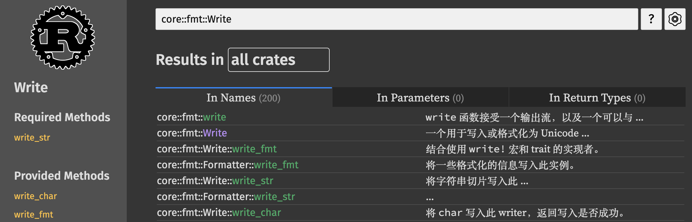
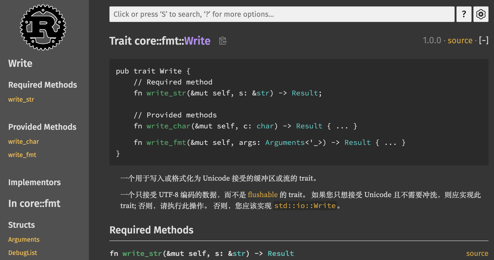
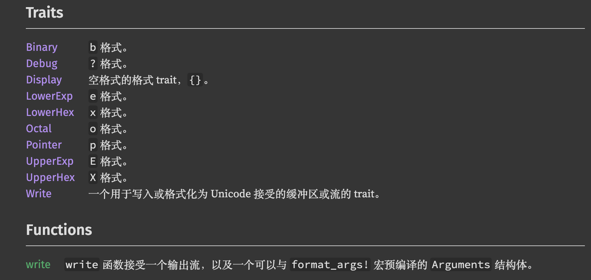

# hello_world.rs

在操作系统开发的过程中，用户态程序是与内核交互的关键桥梁。一个简单的用户态程序可以通过调用系统调用，与操作系统内核进行通讯、执行文件操作、管理进程和输入输出等任务。在本章中，我们将以一个经典的 **"Hello, World!"** 程序作为切入点，探讨用户态程序的结构与实现方式，并逐步分析它如何通过系统调用与内核进行交互。

这个 **`hello_world.rs`** 程序展示了一个用户态应用如何在不依赖标准库的环境下，使用 **Rust** 的基本功能输出到控制台。通过深入分析这个简单的程序，我们将揭示从 **`println!`** 宏到底层的输出实现，了解 **用户态** 和 **内核态** 的交互原理。

接下来，我们将首先讲解 `hello_world.rs` 程序的基本结构，然后逐步深入分析控制台输出的实现方式，并探索 **rCore** 中如何使用 **Rust** 的特性来实现安全、高效的系统调用机制。

## "Hello, World!"

```rust
// user/src/bin/hello_world.rs

#![no_std]
#![no_main]

#[macro_use]
extern crate user_lib;

#[no_mangle]
pub fn main() -> i32 {
    println!("Hello world from user mode program!");
    0
}

// user/src/console.rs
impl Write for Stdout {
    fn write_str(&mut self, s: &str) -> fmt::Result {
        write(STDOUT, s.as_bytes());
        Ok(())
    }
}

// user/src/console.rs
use core::fmt::{self, Write};

const STDIN: usize = 0;
const STDOUT: usize = 1;

use super::{read, write};

struct Stdout;

impl Write for Stdout {
    fn write_str(&mut self, s: &str) -> fmt::Result {
        write(STDOUT, s.as_bytes());
        Ok(())
    }
}

pub fn print(args: fmt::Arguments) {
    Stdout.write_fmt(args).unwrap();
}

#[macro_export]
macro_rules! print {
    ($fmt: literal $(, $($arg: tt)+)?) => {
        $crate::console::print(format_args!($fmt $(, $($arg)+)?));
    }
}

#[macro_export]
macro_rules! println {
    ($fmt: literal $(, $($arg: tt)+)?) => {
        $crate::console::print(format_args!(concat!($fmt, "\n") $(, $($arg)+)?));
    }
}

pub fn getchar() -> u8 {
    let mut c = [0u8; 1];
    read(STDIN, &mut c);
    c[0]
}
```

### 用户程序：`hello_world.rs`

```rust
#![no_std]
#![no_main]

#[macro_use]
extern crate user_lib;

#[no_mangle]
pub fn main() -> i32 {
    println!("Hello world from user mode program!");
    0
}
```

- **`#![no_std]`**：
  - 这个指令告诉编译器**不使用标准库 (`std`)**。在 **rCore** 中，由于这是一个操作系统运行在裸机上，没有完整的标准库支持，因此需要使用 `no_std` 环境。
  - 取而代之的是 **`core` 库**，它提供了语言本身的基础功能（例如基础类型、内存操作等），但没有诸如文件系统或 I/O 等高级功能。

- **`#![no_main]`**：
  - 由于操作系统的用户程序不需要 `std` 库中的标准 `main` 函数签名，使用 `#![no_main]` 来禁用标准的入口点。相反，用户自己定义一个 `main` 函数作为入口。

- **`#[macro_use]`**：
  - 这指令引入了 `user_lib` 中的宏定义，允许在当前文件中使用该库定义的宏（如 `println!`）。

- **`extern crate user_lib;`**：
  - 明确导入外部库 `user_lib`，这是 **rCore** 的用户态库，提供了与系统交互的基础设施，包括系统调用、打印等操作。

- **`#[no_mangle]`**：
  - 这是一个属性，防止编译器对函数名进行名称混淆（mangling）。`main` 函数作为入口函数必须保持原始名称，以便系统能正确调用。

- **`println!` 宏**：
  - 这是用户态打印宏，用于打印 "Hello world from user mode program!"。
  - `println!` 是宏，它将字符串打印到标准输出 (`stdout`)。

### 控制台输入输出：`console.rs`

```rust
use core::fmt::{self, Write};

const STDIN: usize = 0;
const STDOUT: usize = 1;

use super::{read, write};

struct Stdout;
...
```

- **`core::fmt::Write`**：
  - `Write` 是一个 `core::fmt` 模块中的 trait，用于处理格式化输出。通过**实现 `Write` trait**，可以自定义如何将数据写入输出（例如标准输出）。
  
- **`STDIN` 和 `STDOUT`**：
  - 这是两个**常量**，`STDIN` 和 `STDOUT` 分别对应标准输入和标准输出的**文件描述符**编号。它们用于系统调用中的读写操作。

- **`struct Stdout`**：
  - `Stdout` 是一个空结构体，用于表示标准输出设备。

### 实现 `Write` trait

```rust
impl Write for Stdout {
    fn write_str(&mut self, s: &str) -> fmt::Result {
        write(STDOUT, s.as_bytes());
        Ok(())
    }
}
```

- **`impl Write for Stdout`**：
  - 这里实现了 `Write` trait 的 `write_str` 方法，用于将字符串输出到标准输出。
  - 通过实现 `Write` trait，`Stdout` 结构体可以用于格式化输出，类似于 C 语言中的 `printf`。

- **`write_str` 方法**：
  - 接收一个字符串 `s: &str`，将其转化为字节数组（`as_bytes()`）后，通过 `write(STDOUT, s.as_bytes())` 系统调用将数据写入标准输出。
  - `fmt::Result` 是返回类型，表示格式化操作是否成功。在这里，总是返回 `Ok(())` 表示成功。

### 打印函数与宏：`print!` 和 `println!`

```rust
pub fn print(args: fmt::Arguments) {
    Stdout.write_fmt(args).unwrap();
}

#[macro_export]
macro_rules! print {
    ($fmt: literal $(, $($arg: tt)+)?) => {
        $crate::console::print(format_args!($fmt $(, $($arg)+)?));
    }
}

#[macro_export]
macro_rules! println {
    ($fmt: literal $(, $($arg: tt)+)?) => {
        $crate::console::print(format_args!(concat!($fmt, "\n") $(, $($arg)+)?));
    }
}
```

- **`print(args: fmt::Arguments)`**：
  - 这是一个接收 `fmt::Arguments` 的函数，`fmt::Arguments` 是用于格式化输出的数据结构，通常通过 `format_args!` 宏生成。函数调用 `Stdout.write_fmt(args)` 执行格式化输出，将数据写入 `Stdout`。

- **`print!` 和 `println!` 宏**：
  - 这两个宏分别对应打印和带换行符的打印（类似于 `printf` 和 `puts`）。
  - `println!` 使用了 `concat!` 宏将字符串内容与换行符 `\n` 拼接，确保打印后自动换行。
  - `format_args!`宏会生成 `fmt::Arguments` 类型的对象，用于格式化输出。它将字符串和任何附加的参数转换成一种可以用于输出的可变参数类型，支持 `Write` trait 的实现。
  - 这些宏的作用是简化格式化输出，用户可以像在常规环境中那样使用 `print!` 和 `println!`。

#### 宏展开示例

```rust
println!("Hello, world!");
```

展开后：

```rust
$crate::console::print(format_args!(concat!("Hello, world!", "\n")));
```

这会将 `"Hello, world!\n"` 作为参数传递给 `console::print` 函数。

### 系统调用的封装

在用户态程序中，`write` 和 `read` 函数都是系统调用，它们负责与内核通信，将数据写入或从标准输入读取数据。在这里，通过调用这些封装的系统调用函数实现输入输出功能。

## `write` 系统调用回顾

`write()` 函数定义在用户态库中，负责将数据通过系统调用发送到内核：

```rust
pub fn write(fd: usize, buf: &[u8]) -> isize {
    sys_write(fd, buf)
}
```

`sys_write` 封装了对内核的系统调用，实际上发起了将数据从用户态发送到内核态的请求：

```rust
pub fn sys_write(fd: usize, buffer: &[u8]) -> isize {
    syscall(SYSCALL_WRITE, [fd, buffer.as_ptr() as usize, buffer.len()])
}
```

当 `sys_write` 被调用时，操作系统的内核会处理这个系统调用，并将数据写入到对应的设备（在本例中是标准输出）。

简化的内核流程如下：

1. 内核接收系统调用 `SYSCALL_WRITE` 及其参数。
2. 内核检查文件描述符 `fd` 是否有效（例如 `1` 对应 `STDOUT`）。
3. 内核将用户传入的缓冲区地址和长度转换为内核可访问的地址空间。
4. 内核将字节数据写入标准输出设备（例如屏幕、终端等）。
5. 如果写入成功，内核返回写入的字节数；如果失败，返回负数表示错误。

### 流程总结

1. 用户调用 `println!("Hello, world!")`，该宏展开后生成对 `print()` 函数的调用，并将格式化的 `fmt::Arguments` 传递给 `print`。
2. `print` 函数调用 `Stdout.write_fmt(args)`，将格式化的数据传递给标准输出。
3. `Stdout.write_fmt(args)` 调用 `write_str()`，将字符串转换为字节数组并通过 `write(STDOUT, s.as_bytes())` 系统调用发起写请求。
4. `write(fd, buf)` 通过 `sys_write(fd, buf)` 将数据发送给内核，内核将数据写入标准输出设备（如终端、屏幕等）。
5. 数据成功输出后，内核返回写入的字节数，用户态函数处理该返回值。

整个流程的核心在于：

- **`println!` 宏展开** ->
- **`print` 调用** ->
- **`Stdout.write_fmt()` 处理格式化输出** ->
- **`sys_write()` 系统调用** ->
- **内核处理标准输出**。

通过这种方式，**rCore** 用户态程序实现了将数据从用户态打印到标准输出的完整流程。

# `Write` trait

`Stdout` 结构体实现了 `Write` trait，并且 `write_fmt()` 依赖 `write_str()` 来实际执行写操作。

## `write_str`

```rust
impl Write for Stdout {
    fn write_str(&mut self, s: &str) -> fmt::Result {
        write(STDOUT, s.as_bytes());
        Ok(())
    }
}
```

- **`Write` trait**：`Write` trait 定义了如何将格式化后的数据写入某种输出设备。`write_str()` 是 `Write` trait 的方法之一，专门用于写入字符串。
- **`write_str(&mut self, s: &str)`**：
  - 这个函数接收一个不可变的字符串切片 `&str`，然后将字符串内容转换为字节数组 `s.as_bytes()`，再通过 `write` 函数将字节数组写入标准输出。
  - `STDOUT` 是标准输出文件描述符，通常为 `1`。调用 `write(STDOUT, s.as_bytes())`，这实际发起了对系统调用 `write` 的请求，将数据发送到标准输出设备。

## Required Methods:  `write_str`, Provided Methods: `write_fmt`

在 Rust 中，`write_fmt` 和 `write_str` 是通过实现 `Write` trait 关联起来的。`write_fmt` 是一个定义在 `core::fmt::Write` trait 中的高层次方法，用于格式化输出，而 `write_str` 是 `Write` trait 的一个低层方法，专门用来处理字符串的写入。

要了解它们之间的关系，我们需要理解 **`core::fmt::Write` trait** 是如何工作的。让我们详细说明这两个函数是如何通过 `Write` trait 关联起来的。

Rust 的官方文档会列出所有方法，并在描述中明确说明哪些是**必须实现**(Required Methods)的，哪些是有**默认实现**(Provided Methods)的。例如，[搜索 **`core::fmt::Write`**](https://rustwiki.org/zh-CN/core/fmt/trait.Write.html?search=core%3A%3Afmt%3A%3AWrite) ，



查看它的[说明部分](https://rustwiki.org/zh-CN/core/fmt/trait.Write.html)。



```rust
pub trait Write {
    // Required method
    fn write_str(&mut self, s: &str) -> Result;

    // Provided methods
    fn write_char(&mut self, c: char) -> Result { ... }
    fn write_fmt(&mut self, args: Arguments<'_>) -> Result { ... }
}
```

**文档明确区分了 "Required method"（必需实现的方法）和 "Provided methods"（有默认实现的方法）**。在 Rust 的文档中，这种方式非常有用，帮助我们快速了解哪些方法是必须要实现的，哪些可以依赖于默认实现。

这里隐藏了默认实现的代码，你可以点击右侧的 [source](https://rustwiki.org/zh-CN/src/core/fmt/mod.rs.html#105-194) 按钮查看源代码。

```rust
pub trait Write {
    ...
    fn write_str(&mut self, s: &str) -> Result;

    ...
    fn write_char(&mut self, c: char) -> Result {
        self.write_str(c.encode_utf8(&mut [0; 4]))
    }

    ...
    fn write_fmt(mut self: &mut Self, args: Arguments<'_>) -> Result {
        write(&mut self, args)
    }
}
```

这是 **`Write`** trait 的一部分，它定义了在 Rust 中处理格式化输出的行为。我们会逐步分析这个代码片段中每个方法的作用和工作原理。

### **`write_str` 方法**

```rust
fn write_str(&mut self, s: &str) -> Result;
```

- **`write_str`** 是 **`Write` trait** 中唯一的**必须**实现的方法。它的任务是将传入的字符串 `s` 写入输出设备（如文件、标准输出、缓冲区等）。
- **`&mut self`**：表示该方法会对实现 `Write` trait 的目标进行可变引用。目标可能是一个缓冲区或其他输出流。
- **`s: &str`**：这是传入的字符串，它是一个不可变的字符串切片（`&str`）。
- **`Result`**：返回值是一个标准的 `Result` 类型，通常用于表示操作是否成功。`Ok(())` 表示成功，`Err` 表示发生错误。

任何实现了 `Write` trait 的类型，都需要提供 **`write_str`** 的具体实现，它是输出行为的基础。

### **`write_char` 方法**

```rust
fn write_char(&mut self, c: char) -> Result {
    self.write_str(c.encode_utf8(&mut [0; 4]))
}
```

- **`write_char`** 是 `Write` trait 的一个**默认实现**，它的任务是将单个字符 `c` 写入目标。
- **字符编码**：由于在计算机系统中，字符（`char`）通常需要编码为字节序列才能被写入，因此 `write_char` 方法使用 **`c.encode_utf8()`** 将字符 `c` 编码为 UTF-8 字符串。
  - **`c.encode_utf8(&mut [0; 4])`**：这是将字符 `c` 编码为 UTF-8 的方法。由于 UTF-8 编码一个字符最多需要 4 个字节，因此这里使用一个长度为 4 的数组作为缓冲区，来存储编码后的字节。
- **`self.write_str`**：将编码后的字符串通过 `write_str` 方法写入输出目标。
- **默认实现**：如果类型没有显式实现 `write_char`，它会使用这个默认的实现。

### **`write_fmt` 方法**

```rust
fn write_fmt(mut self: &mut Self, args: Arguments<'_>) -> Result {
    write(&mut self, args)
}
```

- **`write_fmt`** 是 `Write` trait 的另一个**默认实现**，用于处理格式化输出。它接受一个 **`fmt::Arguments`** 类型的参数 `args`，这是由 **`format_args!`** 宏生成的格式化数据。
- **`Arguments<'_>`**：这是一个专门用于格式化输出的类型，封装了格式化字符串和格式化参数（如 `println!` 或 `format!`）。
- **`write_fmt` 的工作**：
  - **`write` 函数**：实际完成输出工作的函数是 `fmt::write`，它会将 `args` 中的格式化内容解析并通过 `self.write_str` 写入输出目标。
  - **`mut self: &mut Self`**：表示 `write_fmt` 方法会对目标进行可变引用。

`write_fmt` 提供了一个高层次的接口，用于处理复杂的格式化输出，如 `println!` 或 `format!`。如果类型实现了 `write_str`，`write_fmt` 可以通过这个默认实现直接使用。

## `write` 函数: `fmt::write`

```rust
pub fn write(output: &mut dyn Write, args: Arguments<'_>) -> Result {
    let mut formatter = Formatter::new(output);
    let mut idx = 0;

    match args.fmt {
        None => {
            // 我们可以对所有参数使用默认格式设置参数。
            for (i, arg) in args.args.iter().enumerate() {
                // SAFETY: args.args 和 args.pieces 来自同一个参数，保证索引总是在限定范围内。
                //
                let piece = unsafe { args.pieces.get_unchecked(i) };
                if !piece.is_empty() {
                    formatter.buf.write_str(*piece)?;
                }
                arg.fmt(&mut formatter)?;
                idx += 1;
            }
        }
        Some(fmt) => {
            // 每个规范都有一个对应的参数，该参数后有一个字符串。
            //
            for (i, arg) in fmt.iter().enumerate() {
                // SAFETY: fmt 和 args.pieces 来自同一个 参数，保证索引总是在限定范围内。
                //
                let piece = unsafe { args.pieces.get_unchecked(i) };
                if !piece.is_empty() {
                    formatter.buf.write_str(*piece)?;
                }
                // SAFETY: arg 和 args.args 来自相同的参数，从而确保索引始终在范围之内。
                //
                unsafe { run(&mut formatter, arg, args.args) }?;
                idx += 1;
            }
        }
    }

    // 只能剩下一个尾随的字符串切片。
    if let Some(piece) = args.pieces.get(idx) {
        formatter.buf.write_str(*piece)?;
    }

    Ok(())
}
```

刚才的源码中也包含`write` 函数，你也可以在 [`Module core::fmt`](https://rustwiki.org/zh-CN/core/fmt/index.html#) 看到 [Functions](https://rustwiki.org/zh-CN/core/fmt/index.html#functions) 中包含 [write](https://rustwiki.org/zh-CN/core/fmt/fn.write.html)，即`fmt::write`。



这个 `write` 函数是 Rust 中 `core::fmt` 模块的重要部分，它用于将格式化的输出写入到实现了 `Write` trait 的目标。该函数是格式化输出（如 `println!` 或 `format!`）的底层实现之一，依赖于 `Arguments` 结构体，`Arguments` 由宏如 `format_args!` 预编译生成，包含了格式化输出所需的信息。

<details>
  <summary>`write` 函数暂不做要求</summary>

### 1. **核心功能**

`write` 函数接受两个参数：

- **`output: &mut dyn Write`**：一个实现了 `Write` trait 的动态输出流。例如，它可以是一个 `String`、文件或者标准输出。
- **`args: Arguments`**：包含格式化的参数，由宏 `format_args!` 生成，描述了需要格式化的字符串和插值的变量。

`write` 函数的工作是：

1. 遍历 `args`，获取格式化的字符串片段和相应的参数。
2. 对每个片段应用相应的格式规则，将结果写入到 `output` 中。
3. 最后，将剩余的字符串部分（如果有）写入输出流。

### 2. **结构和工作原理**

以下是 `write` 函数的结构和具体功能的分解。

#### 2.1 `Arguments` 结构体

`Arguments` 是 `fmt` 模块中的核心结构体，它包含了：

- **`pieces`**：这是字符串片段数组，表示格式化字符串的静态部分。例如 `"Hello {}!"` 中的 `"Hello "` 和 `"!"` 都属于 `pieces`。
- **`args`**：这是插值参数数组，表示 `{}` 中需要插入的参数（例如 `"world"`）。它存储每个被格式化的数据项。
- **`fmt`**：可选的格式化规则，用于指定每个参数如何格式化（例如是否使用十进制、是否填充空格等）。

#### 2.2 `formatter`

`write` 函数创建了一个 `Formatter` 实例来处理实际的输出写入：

```rust
let mut formatter = Formatter::new(output);
```

`Formatter` 是 Rust 的一个内部结构，用于封装 `Write` 对象并提供与格式化相关的各种功能。它会根据传递的 `Arguments` 和对应的格式规则，调用 `Write` 实现的 `write_str` 方法。

#### 2.3 遍历格式化片段和参数

函数会遍历 `args.pieces`（静态字符串部分）和 `args.args`（插值参数），并依次将它们写入 `formatter`。

- **格式化无自定义规则的情况**：
   如果没有自定义格式规则（`args.fmt == None`），它直接遍历每个字符串片段和插值参数，并调用参数的 `fmt` 方法来格式化它们：

   ```rust
   for (i, arg) in args.args.iter().enumerate() {
       let piece = unsafe { args.pieces.get_unchecked(i) };
       if !piece.is_empty() {
           formatter.buf.write_str(*piece)?;
       }
       arg.fmt(&mut formatter)?;
       idx += 1;
   }
   ```

   这个代码块执行的步骤：
   1. 使用 `get_unchecked`（不安全地）访问 `pieces` 数组中的字符串片段。
   2. 如果片段非空，调用 `write_str` 方法将其写入 `formatter`。
   3. 对每个参数调用 `fmt` 方法，这会格式化参数并将其写入到输出中。

- **格式化带有自定义规则的情况**：
   如果存在格式化规则（`args.fmt`），则使用这些规则对插值参数进行格式化：

   ```rust
   for (i, arg) in fmt.iter().enumerate() {
       let piece = unsafe { args.pieces.get_unchecked(i) };
       if !piece.is_empty() {
           formatter.buf.write_str(*piece)?;
       }
       unsafe { run(&mut formatter, arg, args.args) }?;
       idx += 1;
   }
   ```

   这部分逻辑基本与上面类似，但在对参数进行格式化时，调用了 `run` 函数来执行格式化规则。

#### 2.4 处理尾随字符串片段

在遍历完 `args.args` 后，可能还有一个尾随的字符串片段没有写入，例如：

```rust
Hello {}!
```

在处理完 `{}` 的参数后，剩余的 `!` 需要被写入输出。`write` 函数会检查是否还有剩余片段，并调用 `write_str` 将其写入：

```rust
if let Some(piece) = args.pieces.get(idx) {
    formatter.buf.write_str(*piece)?;
}
```

#### 2.5 错误处理

整个过程中的每个写入操作都使用 `?` 操作符进行错误传播。如果写入过程中发生错误（例如缓冲区满或输出设备出现问题），`write` 会提前返回一个 `Err(fmt::Error)`，并终止输出。

### 3. **`write!` 宏**

文档中还提到，使用 `write!` 宏可能更加方便。`write!` 是 Rust 中的另一个宏，提供了简化的语法来进行格式化输出：

```rust
use std::fmt::Write;

let mut output = String::new();
write!(&mut output, "Hello {}!", "world")
    .expect("Error occurred while trying to write in String");
assert_eq!(output, "Hello world!");
```

- **区别**：
  - `write!` 宏是对 `fmt::write` 的进一步封装，它使得使用更加简洁，尤其在用户编写输出代码时。它内部会自动处理 `format_args!` 生成 `Arguments` 结构体，并调用 `fmt::write` 函数。

### 4. **总结**

`fmt::write` 函数的作用是将格式化的字符串与参数写入一个实现了 `Write` trait 的输出流。它通过遍历格式化的字符串片段与参数，调用 `write_str` 将每个部分写入输出。最终，它可以完成诸如 `println!`、`write!` 等宏背后的核心工作。在这种设计下，`fmt::write` 实现了高度的灵活性，能够支持多种格式化输出的目标，如 `String`、文件或标准输出。

</details>

### **示例代码解读**

文档中的示例展示了如何使用 `fmt::write` 将格式化内容写入到 `String` 中：

```rust
use std::fmt;

let mut output = String::new();
fmt::write(&mut output, format_args!("Hello {}!", "world"))
    .expect("Error occurred while trying to write in String");
assert_eq!(output, "Hello world!");
```

#### 工作流程

1. **`format_args!` 宏**：
   - 宏 `format_args!("Hello {}!", "world")` 会生成一个 `Arguments` 结构体，包含 `"Hello "` 和 `"!"` 作为静态字符串片段，以及 `"world"` 作为参数。
2. **`write_fmt`**
   - 如果调用 `write_fmt`（如通过 `println!` 或 `write!` 宏间接调用）实际调用的是 `fmt::write` 函数。
   - `fmt::write` 遍历 `fmt::Arguments`，其中的格式化片段最终都通过调用 `write_str` 写入输出流。
3. **`fmt::write` 函数**：
   - `fmt::write(&mut output, format_args!(...))` 将格式化内容写入 `output`，其中 `output` 是一个 `String`。这个 `String` 实现了 `Write` trait，所以可以作为输出流。
4. **最终输出**：
   - 最终，`output` 中包含 `"Hello world!"`，这个值被断言验证。

## `println!` 宏

### 标准库中的 `println!` 宏

在使用 **标准库**（即没有使用 `#![no_std]` 的项目）时，**`println!`** 宏是由标准库自动提供的。它依赖于标准库中已经实现的输入/输出系统和格式化输出机制。

在标准环境下：

- **`println!`** 是由 **`std::fmt`** 模块提供的宏，用户可以直接使用它来向标准输出打印格式化的文本。
- `println!` 会自动将输出定向到标准输出（如终端），并且它使用了标准库的 **`Write`** trait 和相关的 I/O 设施。

```rust
fn main() {
    println!("Hello, world!");  // 使用标准库中的 println! 宏
}
```

这个例子中，`println!` 宏自动可用，因为 **标准库** 提供了它的实现。

### `no_std` 环境下的 `println!` 宏

当你在一个 **`no_std`** 项目中工作时，标准库是不可用的，因为它依赖于高级的操作系统功能（如文件系统、标准 I/O 等），这些功能在裸机或嵌入式开发中是不可用的。

- 在 **`no_std`** 环境中，标准库中的 `println!` 宏不可用，因此如果需要类似的功能，你必须**自己实现**。
- 在 **`no_std`** 环境中，通常需要自己定义如何处理 I/O，比如打印到串口、内存映射的 I/O 设备，或者像 **rCore** 这样的操作系统中的设备驱动程序。
- 为了实现类似的 **`println!`** 功能，你需要手动实现输入输出的逻辑（如 `write` 函数）以及相应的 **宏** 来实现格式化打印功能。

在本节开始的代码中，**`println!`** 宏就是手动实现的，适配了相应的输入输出系统，而不是使用标准库中的版本。

### 对比：标准库 vs `no_std` 环境下的 `println!`

| 环境         | `println!` 宏的来源 | 实现方式                              | 输出设备                             |
| ------------ | ------------------- | ------------------------------------- | ------------------------------------ |
| **标准库**   | 标准库自动提供      | 使用标准库的 I/O 系统（`std::io` 等） | 默认输出到标准输出（如终端）         |
| **`no_std`** | 需要自己实现        | 使用自定义的宏和 `Write` trait        | 自定义输出（如串口、屏幕、缓冲区等） |

### 为什么 `no_std` 需要自己实现 `println!`？

**`no_std`** 环境下没有标准库，意味着：

- 没有标准的 I/O 库，因此没有默认的标准输出设备。
- 没有标准库中的宏，如 `println!`，所以需要自己定义类似的功能来适应具体的运行环境。

在 **rCore** 代码中手动实现的 `println!` 宏通过调用自定义的 `console::print` 函数来实现输出功能。这是因为在 `no_std` 环境下，我们不能依赖标准库的输入输出设施。

```rust
#[macro_export]
macro_rules! println {
    ($fmt: literal $(, $($arg: tt)+)?) => {
        $crate::console::print(format_args!(concat!($fmt, "\n") $(, $($arg)+)?));
    }
}
```

这个自定义的 `println!` 宏定义了如何将格式化字符串打印到设备上，而不依赖标准库。

## 从 `hello_world.rs` 到`sys_write`

让我们从头到尾回顾一下整个流程，从 `hello_world.rs` 程序开始，一直到系统调用触发内核处理输出的过程。这一过程涵盖了 **Rust 宏的展开**、**`Write` trait 的实现**、**格式化字符串处理**、**系统调用** 以及 **内核态与用户态的切换**。

### 1. **用户态程序 `hello_world.rs`**

```rust
#![no_std]
#![no_main]

#[macro_use]
extern crate user_lib;

#[no_mangle]
pub fn main() -> i32 {
    println!("Hello world from user mode program!");
    0
}
```

这个简单的用户态程序使用 **`println!`** 宏来打印 "Hello world from user mode program!"。由于这是一个 **`no_std`** 项目，它不依赖标准库，而是使用 **rCore** 定义的自定义宏和库。

#### 关键点

- **`#![no_std]`**：表示禁用了标准库，不能使用如 `println!` 等标准库宏，必须自己实现。
- **`#![no_main]`**：没有使用标准的 `main` 函数，而是自定义程序入口。
- **`println!`**：使用 `println!` 宏进行格式化字符串输出。

### 2. **`println!` 宏展开**

`println!` 是在 **`user_lib`** 中自定义的一个宏，定义在 `console.rs` 文件中：

```rust
#[macro_export]
macro_rules! println {
    ($fmt: literal $(, $($arg: tt)+)?) => {
        $crate::console::print(format_args!(concat!($fmt, "\n") $(, $($arg)+)?));
    }
}
```

#### 宏展开解释

- **`println!`** 宏接收一个格式化字符串 `$fmt`，并将它和换行符 `\n` 连接在一起，形成 `"Hello world from user mode program!\n"`。
- **`format_args!`**：将字符串和任何格式化参数打包成 `fmt::Arguments`，这是 Rust 标准格式化输出的基础。
- **`$crate::console::print()`**：最终宏会调用 `console::print` 函数，将生成的 `fmt::Arguments` 传递给它。

### 3. **`print()` 函数**

`println!` 宏展开后，调用了 `console.rs` 中的 `print` 函数：

```rust
pub fn print(args: fmt::Arguments) {
    Stdout.write_fmt(args).unwrap();
}
```

- **`print()`** 接收格式化后的 `fmt::Arguments` 参数，并调用 `Stdout` 结构体的 `write_fmt` 方法。
- **`write_fmt`** 是 `Write` trait 提供的默认实现，用于处理格式化输出，它依赖于 `write_str` 来完成输出。

### 4. **`Write` trait 的实现**

`Stdout` 结构体实现了 `Write` trait 的核心方法 **`write_str`**，这允许 `Stdout` 处理字符串并输出。

```rust
impl Write for Stdout {
    fn write_str(&mut self, s: &str) -> fmt::Result {
        write(STDOUT, s.as_bytes());  // 调用底层的 write 函数，将字符串转换为字节并写入标准输出
        Ok(())
    }
}
```

#### `Write` trait 工作原理

- **`write_str`**：将传入的字符串 `s` 转换为字节数组（`as_bytes`），并调用底层的 `write` 函数，将这些字节传递给输出设备。
- **`write_fmt`**：通过 `write_str` 完成格式化数据的写入，它会逐步将格式化字符串中的每个部分（如 "Hello world" 和 `\n`）输出。

### 5. **`write` 函数与系统调用**

`write` 函数负责将字符串数据写入到标准输出设备（如屏幕或文件），它最终触发一个 **系统调用**（`sys_write`）：

```rust
pub fn write(fd: usize, buf: &[u8]) -> isize {
    sys_write(fd, buf)  // 通过系统调用将数据写入标准输出
}
```

- **`fd`**：文件描述符，表示要写入的输出设备（`STDOUT` 通常是 1）。
- **`buf`**：要写入的数据缓冲区，这里是字节数组形式的字符串。
- **`sys_write`**：执行实际的系统调用，将数据从用户态传递到内核态。

### 6. **`sys_write` 系统调用**

`sys_write` 是用户态程序与内核通信的方式，它通过系统调用号 **`SYSCALL_WRITE`** 来告知内核要执行写操作。

```rust
pub fn sys_write(fd: usize, buffer: &[u8]) -> isize {
    syscall(SYSCALL_WRITE, [fd, buffer.as_ptr() as usize, buffer.len()])
}
```

- **`syscall`**：这是系统调用的封装函数，它负责通过 `ecall` 指令将控制权从用户态切换到内核态，并传递必要的参数。

### 7. **`syscall` 函数与 RISC-V `ecall` 指令**

```rust
fn syscall(id: usize, args: [usize; 3]) -> isize {
    let mut ret: isize;
    unsafe {
        core::arch::asm!(
            "ecall",                              // 触发系统调用
            inlateout("x10") args[0] => ret,      // 参数 1 -> x10, 返回值从 x10 获取
            in("x11") args[1],                    // 参数 2 -> x11
            in("x12") args[2],                    // 参数 3 -> x12
            in("x17") id                          // 系统调用号 -> x17
        );
    }
    ret
}
```

- **`x10` 到 `x12`**：用于传递系统调用的参数（如文件描述符、缓冲区指针和长度）。
- **`x17`**：存储系统调用号，这里是 `SYSCALL_WRITE`，表示这是一个写操作。
- **`ecall`**：触发系统调用，将 CPU 从用户模式切换到内核模式，进入内核处理程序。

### 8. **内核态处理 `sys_write` 系统调用**

在内核态，系统调用 `sys_write` 的处理函数位于 `syscall/fs.rs` 中：

```rust
pub fn sys_write(fd: usize, buf: *const u8, len: usize) -> isize {
    let token = current_user_token();
    let process = current_process();
    let inner = process.inner_exclusive_access();

    if fd >= inner.fd_table.len() {
        return -1;
    }

    if let Some(file) = &inner.fd_table[fd] {
        if !file.writable() {
            return -1;
        }
        let file = file.clone();
        drop(inner);
        file.write(UserBuffer::new(translated_byte_buffer(token, buf, len))) as isize
    } else {
        -1
    }
}
```

#### 内核态处理流程

1. **参数解析**：从用户态接收传递的参数（文件描述符 `fd`、缓冲区指针 `buf`、数据长度 `len`）。
2. **权限检查**：检查文件描述符是否有效、文件是否可写。
3. **数据写入**：将缓冲区中的数据通过内核的文件系统接口写入到对应的输出设备。
4. **返回结果**：系统调用完成后，将写入的字节数返回到用户态。

### 9. **从内核返回用户态**

系统调用执行完毕后，内核通过寄存器将返回值传回用户态。用户程序从 `sys_write` 函数中接收返回值，表示写操作成功写入的字节数。

### 全流程总结

1. **`hello_world.rs`** 程序调用 **`println!`** 宏，开始格式化输出。
2. **`println!` 宏展开** 后调用了 **`print()`** 函数，传递格式化后的字符串。
3. **`print()`** 函数通过 **`Stdout.write_fmt()`** 输出格式化数据，实际调用了 **`write_str()`** 方法处理字符串。
4. **`write()` 函数** 通过 **`sys_write`** 发起系统调用，将数据传递给内核。
5. **`syscall()` 函数** 使用 RISC-V 的 `ecall` 指令触发系统调用，切换到内核态。
6. **内核态的 `sys_write` 处理** 将数据写入标准输出设备，并将结果返回给用户态。
7. 最终，用户程序完成了 "Hello world from user mode program!" 的输出。

这个全流程展示了从用户态程序中的格式化字符串输出到内核处理系统调用，再到最终完成输出的整个
