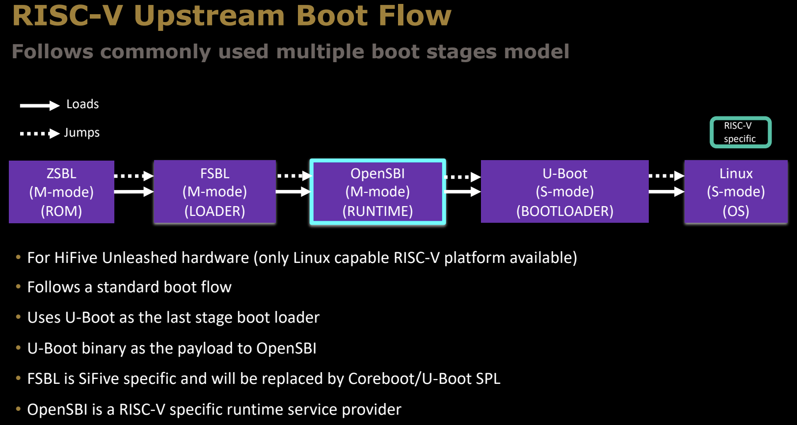
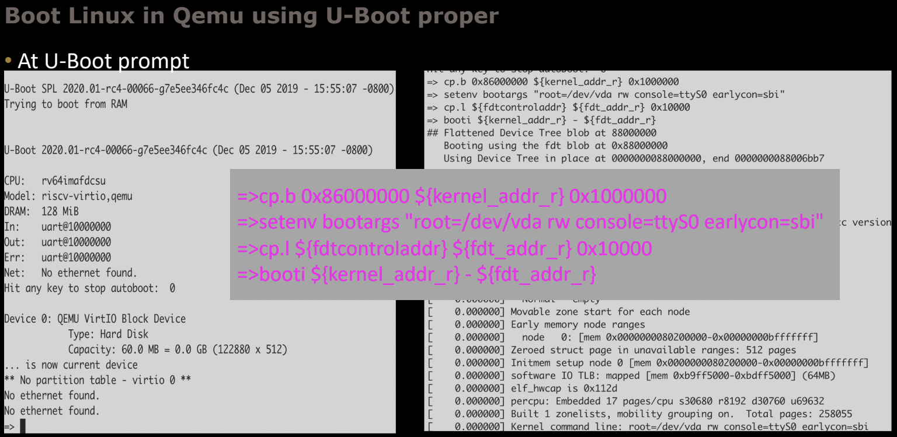

# An Introduction to RISC-V Boot Flow

[本讲座](https://riscv.org/wp-content/uploads/2019/12/Summit_bootflow.pdf)由Atish Patra和Anup Patel主讲，主要讲解了RISC-V体系结构的启动流程。RISC-V是一种开源指令集架构，其灵活性和模块化设计使其在嵌入式系统和高性能计算领域日益受到关注。此文档针对RISC-V启动流程，介绍了它在嵌入式系统中的应用、与传统体系的对比、当前发展状态，以及未来可能的工作方向。

> **原始内容来源**：
>
> *幻灯片标题*：*An Introduction to RISC-V Boot Flow*
>
> *原作者*：Atish Patra, Anup Patel
>
> *出处*：Western Digital
>
> *原始发布日期*：2019年12月19日
>
> *版权声明*：该幻灯片及其内容的版权归Western Digital公司所有。翻译与讲解仅供学习和参考，更多详细信息请参见[原文链接](https://riscv.org/wp-content/uploads/2019/12/Summit_bootflow.pdf)。

> 本文是2019年12月的一个讲座内容，虽然其中的部分技术进展和版本信息已经有些过时，但本文的学习重点在于了解**RISC-V启动流程**（RISC-V Boot Flow）的基本原理和结构。随着RISC-V生态系统的快速发展，某些工具和固件可能已经更新，因此不必对具体的版本和实现细节深究。阅读本文的目的在于掌握启动流程的整体框架和概念，了解RISC-V如何从上电到操作系统启动的过程，这对未来进一步研究和开发仍然有重要的参考价值。
>
> 简单看看即可，重点在于理解基本原理。

## Outline

本次介绍的内容包括以下几个方面：

- **Common embedded boot flow**：介绍常见的嵌入式系统启动流程，帮助读者了解嵌入式系统在启动过程中涉及的关键步骤和组件。
- **Current RISC-V boot flow**：对RISC-V目前的启动流程进行详细解释，特别是在RISC-V架构上如何实现启动流程，区别于其他常见架构的启动过程。
- **OpenSBI Project**：深入讲解OpenSBI项目，作为RISC-V系统启动的一个关键组件，它的工作原理及如何在RISC-V启动过程中发挥作用。
- **Tutorials**：为读者提供关于RISC-V启动的实际操作教程，帮助其在真实环境中应用所学内容。
- **Current Status**：讲述RISC-V启动流程的当前状态，包括目前的进展、已解决的问题和仍存在的挑战。
- **Future work**：展望RISC-V启动流程未来的发展方向，探讨可能的改进和新的技术发展。
- **Tutorials**：再次提供相关的教程链接，帮助用户更深入理解和实践。

## Prerequisite

在进行本次学习之前，需要做一些准备工作：

- **下载演示文稿**：用户可以通过提供的短链接（shorturl.at/clITU）下载完整的演示文档。

- **操作系统要求**：需要一台运行Linux操作系统的设备，任何发行版均可接受。这是因为RISC-V相关的开发环境多基于Linux。

- **可选的内核源代码构建环境**：可以选择设置Linux内核源代码的构建环境，这对深入研究和开发RISC-V启动流程非常有帮助。

- **Ubuntu用户的具体指令**：对于使用Ubuntu操作系统的用户，提供了安装相关开发环境的软件包命令：

  ```bash
  sudo apt-get install git build-essential kernel-package fakeroot libncurses5-dev libssl-dev bison flex
  ```

  这条命令会安装一系列工具，包括构建工具链、内核打包工具、SSL库开发包等，这些都是在构建、调试和运行RISC-V启动流程时可能需要的依赖项。

## Getting started

开始RISC-V的启动流程实验，需要完成以下几步准备工作：

1. **创建工作目录**  
   使用以下命令创建一个新的目录，并进入该目录：

   ```bash
   mkdir summit_demo; cd summit_demo
   ```

2. **下载交叉编译工具链**  
   RISC-V的开发通常需要使用交叉编译工具链来编译代码，工具链可从以下链接下载：

   [https://toolchains.bootlin.com/releases_riscv64.html](https://toolchains.bootlin.com/releases_riscv64.html)

3. **下载预构建的镜像**  
   预先构建好的RISC-V镜像文件可以从以下链接获取：

   [https://wdc.box.com/s/ihywc2xap5m4mflyingjtndf0sy62zha3](https://wdc.box.com/s/ihywc2xap5m4mflyingjtndf0sy62zha3)

4. **克隆OpenSBI项目**  
   使用Git将OpenSBI项目克隆到本地，OpenSBI是RISC-V启动流程中重要的部分：

   ```bash
   git clone https://github.com/riscv/opensbi.git
   ```

5. **克隆U-Boot项目**  
   同样，使用Git克隆U-Boot项目并切换到指定版本（v2019.10）。U-Boot是一个通用的引导加载程序，广泛用于嵌入式系统中：

   ```bash
   git clone https://github.com/u-boot/u-boot.git; git checkout v2019.10
   ```

这些步骤将为RISC-V启动实验设置好基础的开发环境和工具链，确保可以顺利运行后续的启动过程。

## Common boot flow


在嵌入式系统中，启动过程通常分为多个阶段，每个阶段的功能和执行环境不同。常见的启动流程包括以下几个阶段：

1. **ROM阶段**  
   - **运行环境**：从片上ROM（Read-Only Memory）中执行。  
   - **功能**：负责系统上电和时钟设置，SOC（系统级芯片）的启动。  
   - 该阶段的软件直接存储在芯片中，执行非常基础的启动任务，为后续阶段的运行做准备。

2. **LOADER阶段**  
   - **运行环境**：通常从片上SRAM（Static RAM）中运行，有时也会初始化DDR内存。  
   - **功能**：加载运行时环境（RUNTIME）和引导加载程序（BOOTLOADER）。  
   - **示例**：BIOS/UEFI、U-Boot SPL、Coreboot。  
   在这一阶段，系统开始对内存进行初始化，加载更复杂的启动代码，准备进入运行时阶段。

3. **RUNTIME阶段**  
   - **运行环境**：可以从片上SRAM或已初始化的DDR内存中执行。  
   - **功能**：处理SOC的安全设置，提供符合规格的运行时服务。  
   - **示例**：ATF（Arm Trusted Firmware）、BIOS/UEFI。  
   该阶段开始执行系统的安全设置，并确保系统的关键资源按照设计规格被正确管理。

4. **BOOTLOADER阶段**  
   - **运行环境**：从DDR内存中运行，通常为开源软件。  
   - **功能**：文件系统支持、网络启动、引导配置等。  
   - **示例**：U-Boot、GRUB、LinuxBoot。  
   引导加载程序负责加载操作系统内核，提供网络启动等功能，并引导进入最终的操作系统。

5. **OS阶段**  
   在引导加载程序的引导下，操作系统（OS）被加载并开始执行，系统正式进入工作状态。

整个流程通过不同阶段的加载和跳转，逐步引导系统从最初的硬件上电状态进入功能完善的操作系统，确保了启动过程的安全性和稳定性。

## Common boot flow in ARM64


在ARM64架构中，启动流程也分为多个阶段，常见的启动模型如下：

1. **ROM阶段**
   - **功能**：从片上ROM中运行，负责启动系统最初的硬件初始化。通常，它会加载下一个阶段的启动加载程序，例如Coreboot或U-Boot SPL（Secondary Program Loader）。

2. **Coreboot/U-Boot SPL / ATF BL2阶段**
   - **功能**：从ROM加载，负责初始化系统内存（如DDR）和其他关键硬件资源。对于某些系统，还会加载ATF（Arm Trusted Firmware）BL2，它处理一些系统安全和电源管理任务。

3. **ATF BL31阶段**
   - **功能**：这是ATF的一个关键部分，负责处理安全性问题，例如设置安全世界与非安全世界之间的隔离。它在系统进入U-Boot或操作系统之前，确保所有的安全配置和硬件初始化已经完成。

4. **U-Boot阶段**
   - **功能**：U-Boot作为引导加载程序，负责加载操作系统内核。它可能会使用"Falcon模式"来直接加载操作系统，跳过某些额外的初始化步骤，以加快启动速度。

5. **OS阶段**
   - **功能**：操作系统加载并开始运行。ARM64平台通常使用Linux等操作系统。

这个启动流程中，ATF（Arm Trusted Firmware）是ARM64平台的一个重要部分，负责处理安全模式的切换和运行时的硬件管理。整个流程从硬件初始化开始，经过多次加载和跳转，最终将系统引导至操作系统。

## RISC-V Upstream Boot Flow



与ARM64相似，RISC-V的启动流程也遵循多个阶段的模型，以下是RISC-V的启动流程：

1. **ZSBL阶段 (M-mode, ROM)**
   - **功能**：ZSBL（Zero Stage Boot Loader）是启动的第一个阶段，从片上ROM运行，负责最基础的硬件初始化任务。它会加载FSBL（First Stage Boot Loader）。

2. **FSBL阶段 (M-mode, LOADER)**
   - **功能**：FSBL从ZSBL加载，进一步初始化内存和其他外设资源。对于SiFive开发的RISC-V平台，FSBL是特定的加载程序，不过在其他平台上可能会被Coreboot或U-Boot SPL取代。

3. **OpenSBI阶段 (M-mode, RUNTIME)**
   - **功能**：OpenSBI（Open Source Supervisor Binary Interface）是RISC-V架构中的一个关键组件，它为上层软件提供RISC-V特定的运行时服务。OpenSBI运行在机器模式（M-mode）下，直接控制硬件，并提供标准化的接口给下一阶段的引导加载程序或操作系统。

4. **U-Boot阶段 (S-mode, BOOTLOADER)**
   - **功能**：U-Boot在S-mode（Supervisor Mode）下运行，作为引导加载程序，负责加载操作系统内核。U-Boot在此阶段的作用与其他架构相似，处理网络启动、存储设备管理和文件系统加载。

5. **Linux阶段 (S-mode, OS)**
   - **功能**：最终操作系统被加载并进入运行。RISC-V目前主要支持Linux等开源操作系统。

### 关键说明

- **适用平台**：这个流程主要适用于HiFive Unleashed硬件平台，这是目前 (2019.12) 唯一支持Linux的RISC-V开发板。
- **使用U-Boot作为最后阶段的引导加载程序**：U-Boot是一个通用的引导加载程序，处理操作系统的加载。
- **OpenSBI**：这是RISC-V的特定组件，负责为引导加载程序和操作系统提供运行时服务。

与ARM64的启动流程相比，RISC-V的启动流程同样分为多个阶段，但其中的OpenSBI是RISC-V独有的一个关键部分。它提供了机器模式（M-mode）下的关键服务，使得引导加载程序和操作系统可以在RISC-V平台上顺利运行。

## RISC-V boot flow development timeline


RISC-V启动流程的发展历程 (-2019.12) 展现了该架构的逐步成熟和演变。每个重要的里程碑标志着RISC-V启动流程支持的新功能和特性：

1. **Legacy（Feb 18）**  
   在2018年2月之前，RISC-V启动流程仍处于早期阶段，很多现代启动组件尚未完善。

2. **Grub support（Nov 18）**  
   2018年11月，RISC-V得到了Grub（Grand Unified Bootloader）的支持。Grub是一个常用的开源引导加载程序，它为RISC-V引入了更通用的启动加载选项，支持多种操作系统。

3. **OpenSBI v0.1 release（Jan 19）**  
   2019年1月，OpenSBI v0.1版本发布。OpenSBI是RISC-V启动流程中的关键组件，为操作系统提供运行时服务并管理硬件资源。

4. **U-Boot support for Unleashed（Feb 19）**  
   2019年2月，U-Boot引入了对HiFive Unleashed开发板的支持。这是RISC-V平台上首个支持Linux的开发板，U-Boot的支持使得该平台能够顺利引导操作系统。

5. **U-Boot SMP support（Mar 19）**  
   2019年3月，U-Boot增加了SMP（对称多处理）支持，允许多核处理器在RISC-V平台上进行并行处理，提升系统的性能和灵活性。

6. **U-Boot MMC support（July 19）**  
   2019年7月，U-Boot引入了对MMC（多媒体卡）的支持，允许RISC-V设备通过MMC卡存储和加载操作系统。

7. **U-Boot SPL（July 19）**  
   同样在2019年7月，U-Boot SPL（Secondary Program Loader）支持引入。SPL是一种轻量级引导程序，专门用于初始化内存和加载完整的引导程序。

8. **Coreboot（Aug 19）**  
   2019年8月，Coreboot支持被引入RISC-V启动流程。Coreboot是一个快速、灵活的开源固件平台，旨在替代传统的BIOS/UEFI。

9. **EDK2（Oct 19）**  
   2019年10月，EDK2的支持被加入。EDK2是UEFI固件的开源实现，它为RISC-V提供了标准化的固件接口，使其能够与更广泛的软件生态系统兼容。

这条时间线展示了RISC-V启动流程逐步从基础的启动支持走向复杂的多处理器支持、高级存储设备支持和开源固件的集成，最终形成一个功能完善、模块化的启动系统。

## What is SBI?

SBI（Supervisor Binary Interface）是RISC-V架构中的**管理模式二进制接口**，其作用类似于系统调用接口，允许超级模式（S-mode）的操作系统与机器模式（M-mode）的执行环境（SEE, Supervisor Execution Environment）进行通信。它定义了一组标准化的接口，使得不同的操作系统和平台可以在不重复编写硬件相关代码的情况下，访问底层硬件资源。


### SEE的定义

- **M-mode下的运行时固件**：为运行在HS-mode（Hypervisor Supervisor Mode）的操作系统或虚拟机管理器提供运行时服务。
- **HS-mode下的虚拟机管理器**：为运行在VS-mode（Virtual Supervisor Mode）的客户操作系统提供管理功能。

### SBI的作用

- **减少平台代码的重复**：通过统一的接口，减少Linux、FreeBSD等操作系统中的平台特定代码，简化操作系统在不同硬件平台上的移植和维护工作。
- **提供共享驱动程序**：使多个平台可以共享驱动程序，避免为每个平台单独编写。
- **提供硬件资源访问接口**：SBI允许操作系统直接访问机器模式下（M-mode）的硬件资源。

### 规范和开发进展

SBI的规范由Unix平台规范工作组制定，当前的版本包括：

- **SBI v0.1**：目前 (2019.12) 广泛使用。
- **SBI v0.2**：正在草案阶段，旨在提供更多功能和更好的性能。

SBI的详细文档和规范可以通过[RISC-V的SBI GitHub项目](https://github.com/riscv/riscv-sbi-doc)获取。

## What is OpenSBI?

OpenSBI是RISC-V体系结构中**Supervisor Binary Interface (SBI)** 规范的开源实现。它为机器模式（M-mode）提供运行时服务，是RISC-V启动流程中的关键组件，通常在ROM/LOADER阶段之后使用。OpenSBI通过提供标准化接口，使得上层操作系统可以与硬件进行交互，从而避免了SBI实现的碎片化。

### OpenSBI的主要特性

- **开源实现**：OpenSBI遵循BSD-2条款许可证，由社区维护和开发。它确保SBI的实现一致性，并避免不同平台上SBI实现的差异。
- **提供运行时服务**：OpenSBI在机器模式（M-mode）下运行，负责为操作系统（通常是在超级模式S-mode下运行）提供必要的服务。
- **支持参考平台**：OpenSBI为不同平台提供了参考驱动程序，包括PLIC（平台级中断控制器）、CLINT（核心本地中断器）和UART 8250驱动程序等。其他平台可以基于这些通用代码添加自己的平台驱动程序。
- **社区维护的开源项目**：用户可以通过[OpenSBI的GitHub](https://github.com/riscv/opensbi)获取源代码、文档以及最新的更新。

### OpenSBI的作用

OpenSBI主要为RISC-V平台提供一个标准化的接口，使操作系统可以高效、安全地与硬件交互。它被设计为可移植和模块化的，使得不同硬件平台可以复用它的核心功能，同时添加各自平台特定的驱动程序。

## Key Features

OpenSBI具备以下几个重要的功能特性，确保其能够在广泛的硬件环境中高效运行，并适应不同的使用场景：

### 分层结构以适应多种用例

- **通用SBI库与平台抽象层**：  
  通用的SBI库实现了平台抽象，通常与外部固件和引导加载程序（如EDK2、Secure Boot工作组实现的UEFI）一起使用。它提供了标准的SBI接口，使得外部引导加载程序可以在不同的平台上稳定运行。
  
- **平台特定的库**：  
  与核心库类似，但包含特定平台的驱动程序。它允许硬件厂商根据自身硬件的特点进行定制，而不影响SBI核心功能的通用性。

- **平台特定的参考固件**：  
  提供三种不同类型的运行时固件，供开发人员参考和使用。它们涵盖了从最基本的引导流程到高级的硬件初始化需求。


### 广泛支持的硬件特性

OpenSBI支持多种硬件特性，确保它能够在各种不同的RISC-V系统中运行，包括：

- **支持RV32和RV64**：既支持32位的RISC-V架构，也支持64位架构，使其在不同的硬件平台上都可以使用。
- **虚拟化支持**：支持Hypervisor模式，允许虚拟机管理程序在硬件上运行多个操作系统实例。
- **未对齐的加载/存储处理**：处理未对齐的内存访问操作，确保在所有情况下都能正确处理数据。
- **CSR（控制状态寄存器）仿真**：为某些平台提供CSR仿真，确保它们能够顺利运行RISC-V的通用指令集。
- **使用PMP（物理内存保护）保护固件**：通过PMP确保固件在运行时免受非法内存访问的威胁，增强系统的安全性。

OpenSBI的层次结构设计和其支持的硬件特性使其能够适应从简单到复杂的各种RISC-V平台，成为RISC-V生态系统中不可或缺的一部分。通过提供标准化的接口和驱动支持，OpenSBI确保了RISC-V平台的可移植性和扩展性。

## Platform support

OpenSBI支持多种RISC-V平台，包括以下几种：

- **SiFive HiFive Unleashed**：这是RISC-V开发板中最为著名的硬件平台之一，支持Linux操作系统运行。
- **Andes AE350**：由Andes Technology开发的RISC-V处理器平台，适用于嵌入式系统和IoT应用。
- **Ariane FPGA SoC**：基于Ariane RISC-V内核的可编程逻辑器件（FPGA）系统芯片，适合硬件验证和研究。
- **Kendryte K210**：一个专为物联网和AI应用设计的RISC-V芯片，内置AI加速器和神经网络处理器。
- **QEMU虚拟机（32位/64位）**：QEMU是一款开源虚拟机仿真器，可以通过模拟RISC-V架构的虚拟机进行开发和测试，支持32位和64位系统。
- **OmniXtend**：一个支持RISC-V的开源互连协议，用于高性能计算和数据中心应用。

这些平台覆盖了从硬件开发板到虚拟机环境的广泛应用场景，能够帮助开发者在不同的硬件和虚拟化环境中进行RISC-V软件开发和测试。

## Tutorial

### Setup details

为了成功设置RISC-V开发环境，以下步骤详细说明了如何配置工具链、QEMU仿真器以及环境变量。

1. **查看当前工作目录的设置**  
   运行以下命令查看当前目录下的文件和设置：

   ```bash
   ls -l
   ```

   

   输出结果展示了几个关键文件：

   - `linux_Image`：Linux内核镜像文件。
   - `linux_rootfs.img`：根文件系统镜像，用于仿真系统的文件结构和内容。
   - `opensbi`：OpenSBI的二进制文件，提供运行时服务。
   - `qemu-system-riscv64`：QEMU的RISC-V 64位二进制文件，用于虚拟机仿真。
   - `riscv64--glibc--bleeding-edge-2018.11-1`：RISC-V的交叉编译工具链。
   - `u-boot`：U-Boot引导加载程序，用于启动系统。

2. **解压工具链并将其添加到环境路径**  
   下载并解压RISC-V工具链后，需要将其路径添加到系统环境变量中：

   ```bash
   tar -xvf riscv64--glibc--bleeding-edge-2018.11-1.tar.bz2
   export PATH=$PATH:riscv64--glibc--bleeding-edge-2018.11-1/bin/
   ```

   这将确保可以在命令行中直接调用交叉编译工具链进行开发和构建。

3. **更改QEMU二进制文件的权限**  
   为了能够运行QEMU仿真器，需要为其二进制文件设置执行权限：

   ```bash
   chmod a+x qemu-system-riscv64
   ```

   这一步确保QEMU仿真器可以被正确执行，用于模拟RISC-V系统。

4. **设置环境变量CROSS_COMPILE和ARCH**  
   设置交叉编译工具链的相关环境变量，以确保编译过程中可以正确识别目标架构：

   ```bash
   export ARCH=riscv
   export CROSS_COMPILE=riscv64-linux-
   ```

   这里的`ARCH`变量指定了目标架构为RISC-V，而`CROSS_COMPILE`则设置了用于交叉编译的前缀，使得编译器知道要为RISC-V平台生成代码。

通过上述步骤，可以成功配置一个完整的RISC-V开发和仿真环境。这些步骤尤其适合那些希望在虚拟化环境中运行RISC-V操作系统或开发软件的开发者。

## Tutorial-I: Boot Linux in Qemu as a payload to OpenSBI

这部分指导如何通过OpenSBI在Qemu中启动Linux系统。Qemu是一个强大的虚拟化工具，支持RISC-V等多种架构，允许用户在虚拟环境中运行完整的操作系统。本教程将详细介绍如何将Linux内核作为OpenSBI的payload，在Qemu中运行RISC-V Linux系统。

### 1. 编译OpenSBI

首先，进入OpenSBI的源代码目录，并编译适用于Qemu虚拟机的OpenSBI固件。这里的`PLATFORM`参数指定了编译目标为Qemu的虚拟机平台，`FW_PAYLOAD_PATH`参数指定了将Linux内核作为OpenSBI的payload（负载）。

```bash
cd opensbi; make PLATFORM=qemu/virt FW_PAYLOAD_PATH=../linux_Image; cd ..
```

这一过程会生成适用于Qemu虚拟机的OpenSBI镜像，之后可以用作引导加载程序，将Linux内核作为payload。

### 2. 在Qemu中运行OpenSBI和Linux

接下来，通过Qemu运行OpenSBI，并将Linux根文件系统和内核加载到虚拟机中。以下是用于启动Qemu的命令，其中包括各个参数的具体含义：

```bash
qemu-system-riscv64 -M virt -m 256M -nographic \
-kernel opensbi/build/platform/qemu/virt/firmware/fw_payload.elf \
-drive file=linux_rootfs.img,format=raw,id=hd0 \
-device virtio-blk-device,drive=hd0 \
-append "root=/dev/vda rw console=ttyS0"
```

- `-M virt`：指定Qemu使用的虚拟硬件平台，这里选择的是虚拟机平台。
- `-m 256M`：分配给虚拟机的内存大小，设定为256MB。
- `-nographic`：以无图形界面的方式运行虚拟机，所有输出将通过命令行显示。
- `-kernel`：指定OpenSBI固件的路径，OpenSBI的固件负责引导系统并加载Linux内核。
- `-drive`：指定根文件系统镜像的路径，这里使用的是`linux_rootfs.img`，格式为原始镜像。
- `-device virtio-blk-device`：使用virtio块设备驱动，为Qemu虚拟机提供存储设备支持。
- `-append`：向Linux内核传递命令行参数，指定根文件系统位于`/dev/vda`，并设置控制台为`ttyS0`。

通过上述命令，Qemu将启动虚拟的RISC-V系统，加载OpenSBI并运行Linux内核。

## Adding Support for New Platforms

在开发过程中，可能需要为OpenSBI添加对新平台的支持。以下是为新平台添加支持的步骤：

1. **在`/platform`目录下创建新的平台目录**  
   为新平台创建一个名为`<xyz>`的目录，用于存放与该平台相关的配置文件和源码。

2. **创建平台配置文件`<xyz>/config.mk`**  
   该文件将包含平台的配置选项、常用驱动程序的标志以及固件选项。可以参考模板`platform/template/config.mk`创建该文件。

3. **创建平台对象文件`<xyz>/objects.mk`**  
   在此文件中列出需要编译的与平台相关的特定对象文件。可以参考`platform/template/objects.mk`创建该文件。

4. **创建平台源码文件`<xyz>/platform.c`**  
   该文件实现与平台相关的具体功能，并提供`struct sbi_platform`实例。可以参考`platform/template/platform.c`创建该文件。

### 额外说明

- 新平台的支持目录`<xyz>`可以放置在OpenSBI源代码外部，但需要确保其路径在编译时正确指定。
  
通过这些步骤，开发者可以为OpenSBI添加对新硬件平台的支持，确保其能够在不同的硬件环境中正常运行。

## Reference Firmwares

OpenSBI提供了几种类型的参考固件，每种固件都针对特定的平台需求。不同类型的固件适用于RISC-V启动流程中的不同阶段和使用场景。

### 1. **FW_PAYLOAD**

- **功能**：该固件将下一阶段的引导程序作为负载（payload）进行加载。这是适用于Linux等操作系统的RISC-V硬件上最常用的固件类型。
- **默认使用**：在可运行Linux的RISC-V硬件中，FW_PAYLOAD是最常用的参考固件。

### 2. **FW_JUMP**

- **功能**：该固件带有一个固定的跳转地址，用于跳转到下一个引导阶段。这种方式适用于需要手动指定引导地址的场景。
- **默认使用**：这是QEMU仿真环境中的默认引导方法。

### 3. **FW_DYNAMIC**

- **功能**：该固件通过动态信息来确定下一个引导阶段。这种方式通常用于U-Boot SPL或Coreboot等加载程序，能够根据运行时信息灵活调整引导流程。
- **使用场景**：U-Boot SPL和Coreboot等平台使用FW_DYNAMIC来管理引导流程。

### SOC厂商的选择

SOC厂商可以根据自身需求选择适合的固件类型：

- 使用OpenSBI的参考固件作为M-mode的运行时固件。
- 使用OpenSBI作为库，完全从头构建M-mode运行时固件。
- 扩展现有的M-mode固件（如U-Boot_M_mode或EDK2），并将OpenSBI作为库来增强功能。

通过这些选项，硬件厂商能够根据平台的实际需求，灵活地选择和定制适合的固件解决方案。

## U-Boot: An universal boot loader

U-Boot（Universal Boot Loader）是嵌入式系统中最常用的通用引导加载程序，广泛用于多个架构和平台。它作为最后阶段的引导加载器，负责加载操作系统并管理底层硬件资源。

### U-Boot的支持范围

- **支持多种指令集架构（ISA）**：包括x86、ARM、AARCH64、RISC-V、ARC等，使其在不同架构的硬件上都能使用。
- **支持多种外设接口**：如UART、SPI、I2C、以太网、SD卡、USB等，涵盖了几乎所有常见的嵌入式外设。
- **支持多种文件系统**：能够从不同的文件系统中加载镜像，包括常见的文件系统格式。
- **支持多种网络协议**：如TFTP等网络协议，允许从网络中加载操作系统镜像或数据。

### U-Boot的功能

- **加载镜像**：可以从网络、文件系统、可移动设备等多种介质中加载操作系统镜像。
- **命令行管理界面**：U-Boot提供了一个简便的命令行接口，用于执行引导命令、配置启动参数以及调试系统。

### 高度的可定制性

U-Boot具备丰富的定制选项，能够根据实际需求进行裁剪和优化：

- **U-Boot SPL**：这是U-Boot的精简版本，通常作为启动的第一级引导加载器，用于最小化引导时间并加载完整的U-Boot程序。
- **Falcon模式**：该模式用于加速启动流程，直接加载操作系统，跳过某些不必要的初始化步骤。

U-Boot凭借其广泛的支持、灵活的定制性以及强大的功能，成为嵌入式系统中几乎标准的引导解决方案。它可以适应从开发板到生产环境的多种场景，使得系统启动流程更加高效和灵活。

## Tutorial-II: Boot Linux in Qemu using U-Boot proper

这部分介绍如何在Qemu中通过完整的U-Boot（U-Boot proper）引导Linux系统。与之前的教程不同，这里使用的是U-Boot作为最后阶段的引导加载程序，而不是直接将Linux作为OpenSBI的payload。通过此方法，用户可以充分利用U-Boot的灵活性和强大的引导功能。

### 1. 编译U-Boot

首先，进入U-Boot的源代码目录，并为RISC-V平台的Qemu环境进行配置和编译。这里使用了`qemu-riscv64_smode_defconfig`配置文件，它为RISC-V 64位的Qemu虚拟机环境生成适合的U-Boot配置。

```bash
cd u-boot; make qemu-riscv64_smode_defconfig; make; cd ..
```

### 2. 编译OpenSBI

接下来，进入OpenSBI的源代码目录，并编译适用于Qemu的OpenSBI固件。与之前不同，这次没有指定payload，意味着OpenSBI的职责仅仅是作为U-Boot的引导器。

```bash
cd opensbi; make PLATFORM=qemu/virt; cd ..
```

这里使用`fw_jump`固件类型，允许U-Boot来加载Linux内核。

### 3. 在Qemu中运行U-Boot和OpenSBI

编译完成后，可以通过Qemu运行U-Boot和OpenSBI，同时加载Linux内核和根文件系统。运行以下命令：

```bash
./qemu-system-riscv64 -M virt -smp 4 -m 256M -nographic \
-bios opensbi/build/platform/qemu/virt/firmware/fw_jump.elf \
-kernel u-boot/u-boot.bin -device loader,file=linux_Image,addr=0x84000000 \
-drive file=linux_rootfs.img,format=raw,id=hd0 \
-device virtio-blk-device,drive=hd0
```

- `-M virt`：指定使用Qemu的虚拟机平台。
- `-smp 4`：为虚拟机分配4个CPU核心，模拟多核环境。
- `-m 256M`：分配256MB内存。
- `-nographic`：以无图形界面的方式运行。
- `-bios`：指定OpenSBI固件路径，此处使用的是`fw_jump.elf`。
- `-kernel`：指定U-Boot二进制文件作为引导加载程序。
- `-device loader`：加载Linux内核，并指定其地址为`0x84000000`，这是U-Boot期望的内核加载地址。
- `-drive`：指定根文件系统镜像，格式为原始格式。
- `-device virtio-blk-device`：使用virtio块设备模拟存储设备。

通过该命令，Qemu将启动虚拟机，加载OpenSBI和U-Boot，并进入U-Boot的命令行界面。

### 4. 在U-Boot命令行引导Linux


启动后，你将进入U-Boot的命令行提示符。在这里，可以通过以下命令引导Linux内核：

```bash
=> setenv bootargs "root=/dev/vda rw console=ttyS0 earlycon=sbi"
=> cp.l ${fdtcontroladdr} ${fdt_addr_r} 0x10000
=> booti ${kernel_addr_r} - ${fdt_addr_r}
```

- `setenv bootargs`：设置内核引导参数，这里指定根文件系统为`/dev/vda`，并配置控制台输出。
- `cp.l`：复制设备树控制块（`fdtcontroladdr`）到设备树地址寄存器（`fdt_addr_r`）。
- `booti`：引导Linux内核，`kernel_addr_r`是内核的加载地址，`fdt_addr_r`是设备树的地址。

执行这些命令后，U-Boot将加载Linux内核并启动系统。

## Boot flow using OpenSBI dynamic firmware

在使用OpenSBI动态固件的启动流程中，固件通过动态信息来确定下一个引导阶段。这种方式比固定地址跳转更加灵活，适用于复杂的启动场景。以下是使用OpenSBI动态固件的典型启动流程：

1. **ZSBL (M-mode, ROM)**  
   第一个阶段是从机器模式（M-mode）执行的片上ROM固件，负责最基本的硬件初始化。

2. **U-Boot SPL/Coreboot (M-mode)**  
   第二阶段使用U-Boot SPL或Coreboot，它们在M-mode下运行，并负责加载下一阶段的启动固件。

3. **OpenSBI (M-mode, RUNTIME)**  
   OpenSBI在M-mode下提供运行时服务，使用动态固件（`fw_dynamic`），通过寄存器`a2`传递关于下一引导阶段的信息。

4. **U-Boot (S-mode, BOOTLOADER)**  
   OpenSBI引导进入U-Boot，U-Boot运行在超级模式（S-mode）下，负责加载Linux内核。

5. **Linux (S-mode, OS)**  
   最终，U-Boot加载并引导Linux操作系统，进入正式的工作环境。


### 核心要点

- OpenSBI动态固件通过`a2`寄存器传递下一引导阶段的地址。
- 支持Coreboot和U-Boot SPL在硬件和QEMU中运行。
- 目前HiFive Unleashed板上尚不支持U-Boot SPL。

## Tutorial-III: Boot Linux in Qemu using U-Boot SPL

这部分介绍如何在Qemu中使用U-Boot SPL作为第一阶段的引导加载程序来引导Linux操作系统。U-Boot SPL是U-Boot的简化版本，通常用于初始化系统硬件并加载完整的U-Boot或操作系统。

### 1. 编译OpenSBI

首先，编译OpenSBI固件，生成适用于Qemu虚拟机的动态固件。与之前不同，这次不指定payload，OpenSBI的职责是加载U-Boot SPL。

```bash
cd opensbi; make PLATFORM=qemu/virt; cd ..
```

这里生成的`fw_dynamic.bin`固件将用于引导U-Boot SPL。

### 2. 编译U-Boot SPL

接下来，编译U-Boot SPL。在这个过程中，需要设置`CROSS_COMPILE`环境变量并指定OpenSBI动态固件的路径。

```bash
cd u-boot; export OPENSBI=../opensbi/build/platform/qemu/virt/firmware/fw_dynamic.bin; \
ARCH=riscv CROSS_COMPILE=riscv64-linux- make qemu-riscv64_spl_defconfig; \
ARCH=riscv CROSS_COMPILE=riscv64-linux- make; cd ..
```

这里使用`qemu-riscv64_spl_defconfig`配置文件为Qemu生成U-Boot SPL的配置。

### 3. 在Qemu中运行U-Boot SPL和Linux

使用以下命令在Qemu中运行U-Boot SPL和Linux镜像：

```bash
./qemu-system-riscv64 -nographic -machine virt -m 2G -bios u-boot/spl/u-boot-spl \
-kernel u-boot/u-boot.itb -device loader,file=linux_Image,addr=0x86000000 \
-drive file=linux_rootfs.img,format=raw,id=hd0 \
-device virtio-blk-device,drive=hd0
```

- `-machine virt`：指定Qemu虚拟机硬件平台。
- `-m 2G`：为虚拟机分配2GB内存。
- `-bios u-boot/spl/u-boot-spl`：指定U-Boot SPL的二进制文件路径。
- `-kernel u-boot/u-boot.itb`：使用FIT镜像（包含U-Boot和设备树）。
- `-device loader`：加载Linux内核，并指定其地址为`0x86000000`。
- `-drive`：指定根文件系统镜像。
- `-device virtio-blk-device`：使用virtio块设备模拟存储。

通过该命令，Qemu将启动U-Boot SPL，加载U-Boot并引导Linux内核。

### 4. 在U-Boot命令行引导Linux



当Qemu成功运行后，您将进入U-Boot的命令行界面。在这里，您需要设置引导参数并引导Linux内核：

```bash
=> cp.l 0x86000000 ${kernel_addr_r} 0x100000
=> setenv bootargs "root=/dev/vda rw console=ttyS0 earlycon=sbi"
=> cp.l ${fdtcontroladdr} ${fdt_addr_r} 0x10000
=> booti ${kernel_addr_r} - ${fdt_addr_r}
```

- **`cp.l 0x86000000 ${kernel_addr_r} 0x100000`**：将Linux内核从加载地址`0x86000000`复制到内存中的U-Boot地址空间。
- **`setenv bootargs`**：设置内核引导参数，这里指定根文件系统为`/dev/vda`，并配置控制台输出为`ttyS0`。
- **`cp.l ${fdtcontroladdr} ${fdt_addr_r} 0x10000`**：复制设备树控制块到设备树地址寄存器。
- **`booti`**：引导Linux内核，指定内核地址和设备树地址。

执行这些命令后，U-Boot将加载Linux内核并启动系统。

## Boot flow using OpenSBI as a library

当OpenSBI作为库使用时，它被集成到外部固件的源代码中。通过这种方式，外部固件可以调用OpenSBI的功能，并作为其启动流程的一部分来执行。在这种模式下，必须确保正确的配置和编译环境，使得OpenSBI能够与外部固件无缝集成。

### 核心要点

- **OpenSBI作为外部固件源代码的一部分**：OpenSBI与外部固件紧密集成，外部固件需要调用OpenSBI的API。
- **必须配置程序堆栈和scratch空间**：为了确保每个HART（硬件线程）的独立运行，外部固件必须为每个HART配置专属的堆栈和scratch空间。
- **相同的GCC目标选项**：外部固件和OpenSBI的源代码必须使用相同的GCC编译选项，例如`-march`、`-mabi`和`-mcmodel`，以保证兼容性。
- **EDK2与OpenSBI的集成**：目前 (2019.12)，HPE公司正在推动OpenSBI与EDK2的集成。该集成已经适用于U540和Xilinx VC707 FPGA平台，OpenSBI在EDK2的Pre-EFI Initialization (PEI)阶段作为库来使用。

### EDK2集成的详细说明

- **EDK2 mailing list**上已有集成的OpenSBI内容可供参考。
- OpenSBI与EDK2构建环境兼容，并作为PEI阶段的一部分使用。这种集成极大增强了OpenSBI与EDK2固件的合作，尤其在高性能嵌入式系统中使用RISC-V的环境下。

## Constraints on using OpenSBI as a Library

当OpenSBI作为外部固件的库使用时，存在一些必须遵守的限制条件和技术要求，以确保正确的运行。

### 编译选项要求

- **相同的GCC目标选项**：必须为外部固件和OpenSBI使用相同的GCC目标编译选项，包括：
  - `-march`：指定RISC-V指令集架构的版本和扩展。
  - `-mabi`：定义应用二进制接口（ABI），确保外部固件与OpenSBI之间的函数调用兼容。
  - `-mcmodel`：指定内存模型，控制生成代码时的内存寻址方式。

### 外部固件必须为每个HART创建独立的堆栈和scratch空间

- **程序堆栈（Program Stack）**：外部固件需要为每个HART配置一个独立的堆栈，避免不同HART之间的堆栈冲突。
- **OpenSBI scratch空间**：外部固件必须为每个HART设置OpenSBI的scratch空间，通常是通过`struct sbi_scratch`结构体来实现。

### 使用OpenSBI函数的约束

调用OpenSBI的函数时，外部固件需要遵守以下限制：

1. **MSCRATCH寄存器**：必须为每个调用HART将其MSCRATCH寄存器设置为其专属的OpenSBI scratch空间。
2. **SP寄存器**：调用HART的栈指针（SP）必须设置为该HART的独立堆栈空间，确保各HART之间不会干扰彼此的堆栈。

### 其他要求

外部固件还必须确保以下条件：

- **中断状态**：在调用`SBI`函数时，必须禁用MSTATUS和MIE寄存器中的中断位，以避免中断干扰函数执行。
- **sbi_init()的调用**：必须为每个HART在系统启动时或HART热插拔事件中调用`sbi_init()`，以正确初始化。
- **sbi_trap_handler()的调用**：当发生机器模式（M-mode）中断或陷阱时，必须调用`sbi_trap_handler()`，以确保能够正确处理这些异常情况。

## Current Status

RISC-V启动生态系统正在快速发展，预计在 (2019) 年末之前将实现完整的传统启动流程支持。以下是当前的进展情况：

### OpenSBI

- **积极开发与维护**：OpenSBI作为RISC-V架构的关键组件之一，正在被持续开发和维护。
- **版本 0.5 已发布**：最新版本具备更完善的功能和优化。
- **默认使用**：在多种构建工具中，OpenSBI已经成为默认的BIOS接口，例如Buildroot、Yocto、OpenEmbedded和QEMU BIOS。
- **镜像可用**：Fedora和Debian的RISC-V系统镜像已经包含了OpenSBI的二进制文件。

### U-Boot

- **U-Boot-2019.10 发布**：该版本已经完全支持HiFive Unleashed S模式。
- **支持网络和MMC引导**：该版本支持通过网络和MMC卡引导操作系统。
- **FIT镜像支持**：U-Boot支持FIT镜像加载，它包含了内核、设备树、RAM盘等多个组件。
- **EFI支持**：为RISC-V架构提供了EFI支持，进一步增强了启动灵活性。

### Grub

- **上游支持RISC-V**：Grub已经在上游版本中提供了对RISC-V的支持，能够加载Linux内核。

### Linux Kernel

- **内核主线支持QEMU引导**：上游Linux内核可以在QEMU中正常启动。
- **设备树集成**：RISC-V的设备树已经集成在Linux内核中，支持多种硬件配置。
- **v5.3内核**：Linux 5.3版本可以与OpenSBI和U-Boot配合，在HiFive Unleashed板上正常工作。

## Future Boot Support

未来，RISC-V的启动支持将进一步扩展，目标是构建一个稳定、易用的启动生态系统。以下是未来的启动支持方向：

### EFI Stub支持

- **Linux内核中的EFI Stub支持**：正在开发中，目标是提供完整的UEFI支持。这将为RISC-V带来企业级的启动环境，确保兼容更多高级功能。

### U-Boot SPL 支持 HiFive Unleashed

- **HiFive Unleashed的U-Boot SPL支持**：正在开发中，未来可以通过SPL引导HiFive Unleashed板的操作系统。

### Coreboot中的SMP支持

- **多处理器支持**：Coreboot正在开发对SMP（对称多处理）支持，以便在多核系统中更好地管理硬件资源。

### EDK2项目上游集成

- **持续进行的EDK2集成**：OpenSBI与EDK2的集成正在逐步上游化，进一步扩展RISC-V的固件支持。

### Oreboot

- **基于Rust的Coreboot**：Oreboot项目是用Rust编写的Coreboot版本，目标是为RISC-V提供更加安全和可靠的固件解决方案。

### LinuxBoot和其他引导加载程序

- **LinuxBoot？**：未来可能会为RISC-V提供LinuxBoot的支持，使启动流程更加简化和灵活。
- **其他引导加载程序？**：随着RISC-V的生态系统不断发展，未来可能会出现更多的引导加载程序，进一步丰富启动选项。

通过这些即将到来的支持，RISC-V的启动流程将变得更加多样化和稳定，为开发者提供更灵活的工具链和启动选项，适应从嵌入式系统到高性能计算的广泛应用场景。

## Ongoing Work

为了构建一个稳定且易于使用的RISC-V启动生态系统，当前有多个方面的工作正在进行中。这些工作涵盖了SBI规范的更新、OpenSBI的改进、以及Linux内核的持续开发。

### SBI Specifications

- **SBI v0.2 规范**：新版SBI v0.2规范正在制定中，将带来更多改进和扩展。
- **Hart状态管理扩展**：在SBI v0.2中，将引入对Hart（硬件线程）状态管理的扩展，以便更好地控制和管理系统中的各个Hart。
- **替换旧版SBI扩展**：SBI的遗留扩展将被更现代的功能替代，进一步优化性能和兼容性。

### OpenSBI

- **通过CPU热插拔实现顺序CPU启动**：改进OpenSBI以支持CPU热插拔，允许系统在运行时动态启动或关闭CPU。
- **支持其他M-mode引导加载程序**：OpenSBI正在扩展以支持其他机器模式（M-mode）的引导加载程序，例如Coreboot和U-Boot SPL。
- **虚拟化支持**：当SBI规范发生变化时，OpenSBI将增加对虚拟机管理程序（Hypervisor）的支持。
- **更多平台支持**：OpenSBI计划扩展支持更多硬件平台，但这些扩展需要额外的硬件支持。

### Linux Kernel

- **SBI v0.2实现**：SBI v0.2规范的实现正在进行中，补丁正在审查过程中。
- **EFI stub的支持**：EFI stub正在内核中开发，旨在提供完整的UEFI支持，这对企业级应用至关重要。
- **替换旧版SBI扩展**：与OpenSBI一样，Linux内核也在逐步替换SBI的遗留扩展。
- **顺序启动**：内核将支持顺序启动功能，确保系统能够按需有序地启动。
- **CPU热插拔支持**：内核正在开发对CPU热插拔的支持，以实现更灵活的系统资源管理。

## Acknowledgements

在RISC-V启动生态系统的开发过程中，多个团队和个人做出了重要贡献。以下是对这些贡献者的感谢：

### U-Boot

- **Lukas Auler**
- **Bin Meng**
- **Anup Patel**

### Coreboot

- **Ron Minnich**
- **Jonathan Neuschäfer**
- **Patrick Rudolph**
- **Philip Hug**

### EDK2

- **Abner Chang**

### 其他贡献者

- 感谢所有为RISC-V启动流程做出贡献的开发者和社区成员，他们的努力推动了整个生态系统的前进。

这些开发者和团队通过持续的贡献，使得RISC-V启动流程更加成熟，进一步推动了开源硬件平台的普及和发展。

### Reference

- [SBI]( https://github.com/riscv/riscv-sbi-doc )
- [EDK2](https://edk2.groups.io/g/devel/message/46479?p=,,,20,0,0,0::Created,,riscv,20,2,0,33047245)

**© 2019 Western Digital Corporation or its affiliates. All rights reserved. 12/19/19**

---

## More

[The future of RISC-V Supervisor Binary Interface(SBI) - Atish Patra - Western Digital](https://www.slideshare.net/slideshow/the-future-of-riscv-supervisor-binary-interfacesbi/130689487)

[OpenSBI Deep Dive - Anup Patel - Western Digital](https://riscv.org/wp-content/uploads/2019/06/13.30-RISCV_OpenSBI_Deep_Dive_v5.pdf)

[An Introduction to RISC-V Boot flow: Overview, Blob vs Blobfree standards - Jagan Teki, Amarula Solutions - China RISC-V Forum - 2019, ShenZhen](https://crvf2019.github.io/pdf/43.pdf)
