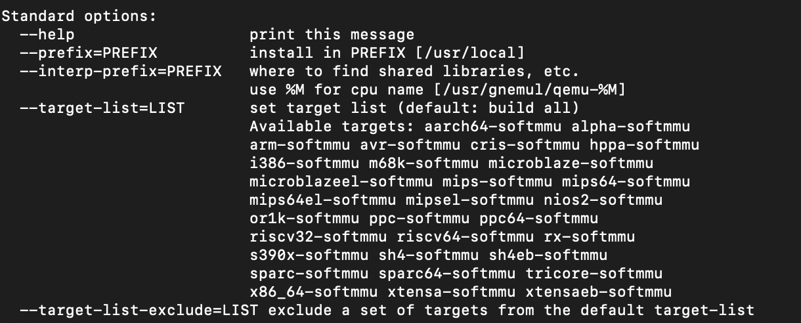
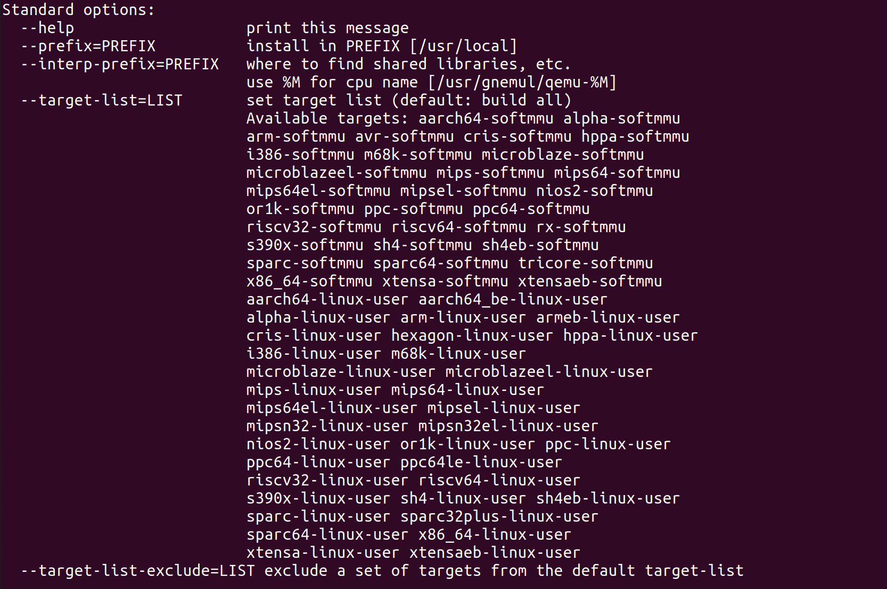
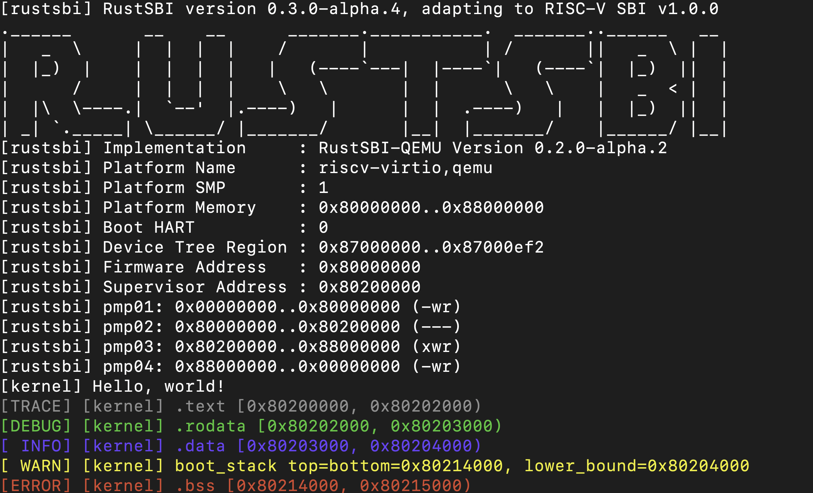

# lab0

# OS 环境配置教程

---

## 支持的操作系统

本实验主要支持 **Ubuntu 18.04/20.04** 操作系统。这是因为Ubuntu提供了稳定的更新和广泛的软件库，适合教学和开发使用。对于使用 **Windows** 和 **macOS** 的读者，建议安装Ubuntu 18.04/20.04虚拟机或使用Docker进行实验。

> 本站作者尝试了 Windows 下使用 Ubuntu 20.04 虚拟机和 Mac 下使用 macOS 以及 Arm 版 Ubuntu 20.04 虚拟机。Lab 0 ✅

## Windows 用户的配置

1. ### 使用虚拟机

安装虚拟机软件如 **VMware Workstation** 或 **Oracle VirtualBox**，并在其中安装Ubuntu操作系统。这为用户提供了一个接近真实Linux系统的环境，有助于更好地模拟生产环境。

- **虚拟机安装Ubuntu**：虚拟机提供了一个隔离的环境来运行其他操作系统，对系统配置或主操作系统影响较小。网络上有大量关于如何在VMware或VirtualBox中安装Ubuntu的教程，用户可以根据这些详细的指南进行操作。

2. ### 使用WSL2

通过系统内置的 **Windows Subsystem for Linux 2 (WSL2)** 来安装Ubuntu 18.04/20.04。WSL2提供了一个完整的Linux内核，与WSL1相比，它支持更多Linux特性和更好的性能。用户可以在微软的官方文档中找到安装和配置WSL2的详细指南。

- WSL2使用真实的Linux内核，而WSL1则是一个兼容层，WSL2在文件系统性能和系统调用支持方面有显著改进。

## Docker 开发环境

略

## macOS 用户的配置

> macOS用户可以在本地直接配置所需的开发环境。具体的配置步骤和教程可以参考以下文章：[在 macOS 14 (M1 Pro) 编译 QEMU 7.0.0 - Nelson's Note](https://note.bosswnx.xyz/compile-qemu-on-macos/)。
>
> - **M系列芯片的Mac用户**：如果是使用Apple的M系列芯片的Mac用户，并希望通过虚拟机安装Ubuntu，需要特别注意选择ARM架构的Ubuntu版本。[官网](http://old-releases.ubuntu.com/releases/focal/)主要提供的是ARM架构的Server版本 [ubuntu-20.04.4-live-server-arm64.iso](http://old-releases.ubuntu.com/releases/focal/ubuntu-20.04.4-live-server-arm64.iso)，用户如果有需求可以在此基础上安装桌面环境。具体的安装桌面环境步骤，可以参考下面的文章：[mac pro M1(ARM)安装：ubuntu虚拟机（四）](https://blog.csdn.net/qq_24950043/article/details/123764210)。
>
> ---
>
> ### QEMU 系统仿真（System Mode）
>
> - `xxx-softmmu`：编译生成 `qemu-system-xxx`，用于 xxx 架构的系统仿真。
>- **功能**：模拟一个完整的基于不同 CPU 的硬件系统，包括处理器、内存及其他外部设备，支持运行完整的操作系统。
>   - **应用场景**：适用于需要模拟整个操作系统的场景，例如开发和测试嵌入式系统、操作系统内核等。
> - Mac中
>
> ### QEMU 用户模式仿真（User Mode）
>
> - `xxx-linux-user`：编译生成 `qemu-xxx`，用于在 xxx 架构中运行用户应用程序。
>  - **功能**：在开发主机上运行为目标架构编译的用户态应用程序，而不需要模拟整个操作系统。
>   - **应用场景**：适用于需要在不同架构上运行用户态程序的场景，例如测试跨平台应用程序。
>   - Linux中
>
> ### 关联和独立性
>
> - **独立性**：`qemu-system-xxx` 和 `qemu-xxx` 是独立的二进制文件，分别用于系统仿真和用户模式仿真。你可以独立地使用它们中的任何一个，具体取决于你的需求。
> - **关联性**：两者都源自同一个 QEMU 项目，因此在某些情况下，二者可能共享部分内部代码和机制。但是，系统仿真和用户模式仿真有着不同的用途和实现细节，它们各自处理的环境和需求也不同。
>
> ### 适用场景
>
> - **系统仿真（`qemu-system-xxx`）**：
>   - 需要模拟完整操作系统的功能。
>   - 适用于内核开发、操作系统调试、嵌入式系统仿真等。
> - **用户模式仿真（`qemu-xxx`）**：
>   - 仅需要在不同架构上运行用户态程序，不需要模拟完整操作系统。
>   - 适用于跨平台应用程序开发和测试。

## Rust 开发环境配置

Rust是一种注重安全和性能的编程语言，广泛用于系统编程和应用开发。为了在本实验中使用Rust，需要安装Rust语言的版本管理器 **rustup** 和包管理器 **cargo**。

### 安装Rust和Cargo

- **安装命令**：
  ```bash
  curl https://sh.rustup.rs -sSf | sh
  ```
  这个命令使用`curl`下载rustup的安装脚本，并通过管道`|`将其传递给`sh` (shell) 执行。这种安装方式简单且跨平台，但要确保在可信的网络环境下操作以避免安全风险。

- rustup允许用户管理不同的Rust版本和相关工具链，这在处理不同项目或不同Rust版本的实验时非常有用。

- **安装后步骤**：
  安装完成后，您需要重启终端或运行 `source $HOME/.cargo/env` 来更新当前会话的环境变量，确保`rustc`和`cargo`命令可用。
  
- 推荐  Visual Studio Code 搭配 rust-analyzer 和 RISC-V Support 插件 进行代码阅读和开发。
  
  - ...
  - 当然，采用 VIM，Emacs 等传统的编辑器也是没有问题的。
  

### 优化下载速度

#### 1. 参考[官方文档配置Rust镜像源](https://learningos.cn/rCore-Tutorial-Guide-2024S/0setup-devel-env.html#rust)

> #### 2. 使用代理TUN模式
>
> 为了有效解决网络连接问题并加速Rust及其依赖的下载，推荐使用代理并开启TUN模式（在Mac上通常称为增强模式）。这种方式可以为整个系统提供透明代理，从而简化配置并提高效率。

### QEMU模拟器安装教程

#### 1. 安装编译所需的依赖包
首先，你需要确保所有必要的依赖包都已安装。这些包是编译QEMU所必需的。在Ubuntu系统上，可以通过以下命令安装（Mac还是参考之前提到的文章）：

```bash
sudo apt install autoconf automake autotools-dev curl libmpc-dev libmpfr-dev libgmp-dev \
              gawk build-essential bison flex texinfo gperf libtool patchutils bc \
              zlib1g-dev libexpat-dev pkg-config libglib2.0-dev libpixman-1-dev git tmux python3
```

#### 2. 下载源码包
下载QEMU 7.0.0的源码包。如果你位于中国大陆，由于网络问题，可以使用提供的百度网盘链接下载：

```plaintext
链接：https://pan.baidu.com/s/1z-iWIPjxjxbdFS2Qf-NKxQ
提取码：8woe
```

或者使用标准的wget命令从官方源下载：

```bash
wget https://download.qemu.org/qemu-7.0.0.tar.xz
```

#### 3. 解压源码包
使用tar命令解压下载的源码包：

```bash
tar xvJf qemu-7.0.0.tar.xz
```

#### 4. 编译安装并配置RISC-V支持
切换到解压后的目录，配置QEMU以支持RISC-V架构：

```bash
cd qemu-7.0.0
./configure --target-list=riscv64-softmmu,riscv64-linux-user
make -j$(nproc)
```

这里`$(nproc)`会利用所有可用的处理器核心来加速编译过程。

#### 5. 安装QEMU
一般推荐使用`sudo make install`安装QEMU，但这可能会与系统中已有的其他版本产生冲突。因此，一个更好的做法是将编译后的执行文件添加到你的用户路径中：

编辑你的`~/.bashrc`文件，添加以下行：

```bash
export PATH="$HOME/os-env/qemu-7.0.0/build/:$PATH"
export PATH="$HOME/os-env/qemu-7.0.0/build/riscv64-softmmu:$PATH"
export PATH="$HOME/os-env/qemu-7.0.0/build/riscv64-linux-user:$PATH"
```

这样做的好处是避免全局安装可能带来的问题，同时便于管理多个版本的QEMU。

#### 6. 使环境变量生效
更新环境变量以使改动生效：

```bash
source ~/.bashrc
```

或者，你可以重新启动终端。

#### 7. 确认QEMU版本
最后，验证安装的QEMU版本是否正确：

```bash
qemu-system-riscv64 --version
qemu-riscv64 --version
```

这一步骤确保你安装的是预期的版本，并且所有组件都已正确安装。

### 注意
- 如果在安装过程中遇到特定依赖包缺失的错误，应根据错误信息安装相应的包。
- 对于想使用QEMU 8或QEMU 6的用户，需要注意不同版本可能需要的额外步骤和潜在的不兼容问题。

> 将编译出来的程序添加到你的PATH环境变量中，意味着你可以在任何位置的终端里直接运行这些程序，无需指定完整路径。这样做提高了命令行工具的易用性。下面是在MacOS终端中添加路径到PATH的步骤：
>
> ### 1. 找到编译后的可执行文件位置
> 首先，确保你知道编译后的文件存放的具体路径。根据你的说明，文件位于`./build`文件夹下，你需要具体的绝对路径。在`qemu-7.0.0`目录下，你可以运行以下命令来获取当前目录的绝对路径：
>
> ```bash
> pwd
> ```
>
> 这将显示类似于`/Users/yourusername/path/to/qemu-7.0.0`的路径。因此，编译后的程序可能位于`/Users/yourusername/path/to/qemu-7.0.0/build`。
>
> ### 2. 编辑你的shell配置文件
> 在MacOS上，根据你使用的shell，通常是bash或zsh，你需要编辑相应的配置文件（`.bash_profile`, `.bashrc`, `.zshrc`等）来永久添加路径到PATH环境变量。
>
> 假设你使用的是zsh（MacOS的默认shell），你可以使用nano或任何其他文本编辑器打开配置文件：
>
> ```bash
> nano ~/.zshrc
> ```
>
> ### 3. 添加路径到PATH变量
> 在打开的文件中，添加以下行：
>
> ```bash
> export PATH=$PATH:/Users/yourusername/path/to/qemu-7.0.0/build
> ```
>
> 确保替换`/Users/yourusername/path/to/qemu-7.0.0/build`为实际的路径。这行命令的意思是将`build`目录添加到现有的PATH变量中。
>
> ### 4. 保存并关闭编辑器
> 如果你使用nano，可以通过按`Ctrl+O`保存修改，然后按`Ctrl+X`退出编辑器。
>
> ### 5. 使更改生效
> 更改保存后，你需要加载你刚才编辑的配置文件，使PATH变量的更改立即生效：
>
> ```bash
> source ~/.zshrc
> ```
>
> 或者，你可以简单地关闭并重新打开你的终端窗口。
>
> ### 6. 验证PATH变量
> 为了确认新路径已经被添加，你可以打印出PATH变量看看：
>
> ```bash
> echo $PATH
> ```
>
> 你应该能在输出中看到你添加的路径。
>
> 通过这些步骤，你就可以在任何位置通过终端运行QEMU了，无需指定完整的程序路径。

## 试运行 rCore-Tutorial

```bash
git clone https://github.com/LearningOS/rCore-Tutorial-Code-2024S
cd rCore-Tutorial-Code-2024S
```

我们先运行不需要处理用户代码的 ch1 分支：

```bash
git checkout ch1
cd os
LOG=DEBUG make run
```

如果你的环境配置正确，你应当会看到如下输出：



通常 rCore 会自动关闭 Qemu 。**如果在某些情况下需要强制结束，可以先按下 `Ctrl+A` ，再按下 `X` 来退出 Qemu。**

