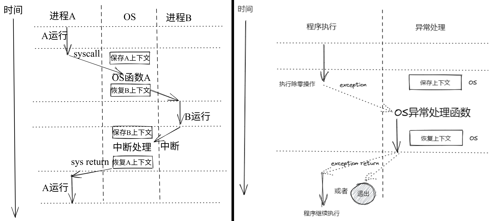

# 第三讲 基于特权级的隔离与批处理

# 第一节 从OS角度看计算机系统

- [一 OS与硬件的关系](#一-os与硬件的关系)
- [二 OS 与应用程序的关系](#二-os-与应用程序的关系)
- [三 隔离机制](#三-隔离机制)
	- [虚拟内存与特权级](#虚拟内存与特权级)

---

## 一 OS与硬件的关系

### 特权级隔离与批处理的基本概念

1. **硬件与软件的隔离**  
   - 计算机系统由硬件和软件共同构成。
   - 操作系统（OS）位于硬件与应用之间，为应用程序提供访问硬件资源的抽象接口。
   - 特权级的隔离确保用户应用与系统内核的安全界限，防止应用直接操作硬件或关键资源。

2. **隔离的重要性**  
   - 隔离是确保计算机系统安全性和稳定性的重要机制。
   - 确保用户应用不能直接访问硬件设备或其他应用的数据，避免潜在的恶意或错误行为。
   - 通过特权级别的划分和系统调用机制，提供安全的硬件访问和数据共享方式。

### 计算机系统与 RISC-V 指令集

1. **计算机系统结构层次**  
   - 从下到上，包括物理层设备、电路设计、门级/寄存器传输级、微架构、指令集架构、操作系统、编译器、程序设计和应用。
   - 微架构实现指令集架构，为操作系统和应用程序提供硬件抽象接口。

2. **RISC-V 指令集架构**  
   - RISC-V 提供多级特权机制，允许操作系统和用户程序之间实现严格的隔离。
   - `CSR`（Control and Status Register）寄存器用于管理特权级和控制硬件资源。

|                Level                |          层次           |
| :---------------------------------: | :---------------------: |
|             Application             |          应用           |
|              Algorithm              |          算法           |
|        Programming Language         |        编程语言         |
|  Operating System/Virtual Machines  |     操作系统/虚拟机     |
| Instruction Set Architecture (ISA)  |       指令集架构        |
|          Microarchitecture          |         微架构          |
| Gates/Register-Transfer Level (RTL) | 门级/寄存器传输级 (RTL) |
|              Circuits               |          电路           |
|               Devices               |          设备           |
|               Physics               |          物理           |

 

| 计算机系统抽象层次                                           |
| ------------------------------------------------------------ |
| 1. **Physics（物理）**: 这是基础层，涉及物理学原理，如量子力学和电磁学，它们是构造计算设备物理组件的基础。 |
| 2. **Devices（设备）**: 在物理层之上是设备层，这里的设备指的是实际构成计算机的物理组件，例如晶体管、二极管和电容器等。 |
| 3. **Circuits（电路）**: 设备层的上一层是电路层，这里设计将电子设备（例如晶体管）连接在一起形成电路，以实现特定的功能，如逻辑门电路。 |
| 4. **Gates/Register-Transfer Level (RTL)**: 在电路层之上是门级/寄存器传输级别，这里涉及逻辑门（如与门、或门和非门）的设计，以及如何将这些门组合成更复杂的电路来执行寄存器之间的数据传输和操作。 |
| 5. **Microarchitecture（微架构）**: 微架构层是在逻辑门和电路的基础上构建具体的处理器架构。它定义了处理器内部的数据路径、流水线结构、缓存和执行单元等。 |
| 6. **Instruction Set Architecture (ISA)**: 指令集架构是硬件（微架构）和软件之间的接口。它定义了处理器可以识别和执行的指令集合，包括数据类型、寄存器、指令格式、寻址模式等。 |
| 7. **Operating System/Virtual Machines（操作系统/虚拟机）**: 操作系统是管理计算机硬件资源和提供用户与应用程序接口的软件层。虚拟机为运行在物理硬件之上的软件提供了一个虚拟的平台。 |
| 8. **Programming Language（编程语言）**: 编程语言层提供了开发者用来编写软件的高级语言，这些语言通常更接近人类语言和抽象概念，使得软件开发更加高效。 |
| 9. **Algorithm（算法）**: 算法层指的是解决特定问题和执行任务的方法和流程。算法是在编程语言中实现的，但在概念上独立于具体的实现。 |
| 10. **Application（应用程序）**: 最顶层是应用程序层，它指的是最终用户直接使用的软件，例如文本编辑器、游戏或者企业软件等。这些应用程序使用底层所有层级提供的功能来执行用户需要的任务。 |
| 总的来说，这些层次从物理硬件到用户界面提供了一种分层的方式来理解和构建复杂的计算系统。每个层级抽象了底层的复杂性，提供了建立在其上的下一个层级所需的接口和功能。 |

### 特权级隔离与批处理系统

1. **特权级隔离**  
   - 操作系统在最高特权级别（通常称为内核模式）下运行，控制硬件资源。
   - 用户应用程序在较低的特权级别（用户模式）运行，通过系统调用访问操作系统提供的服务。

2. **批处理系统的实现**  
   - 批处理操作系统在任务调度和隔离方面有独特要求。
   - 每个批处理任务被隔离在独立的进程或容器中，以防止跨任务的数据泄露和干扰。

### 硬件与软件的边界

1. **指令集与寄存器**  
   - 硬件与软件之间的接口主要由指令集和寄存器构成。
   - 指令集提供应用程序访问硬件的控制指令，寄存器保存数据和控制状态。

2. **边界的重要性**  
   - 明确的硬件与软件边界确保两者各自负责的职责范围，避免越界引起的问题。
   - 软件负责高层逻辑控制，硬件实现底层指令执行与数据管理。

参见，[CS61C-notebook](https://lzzs.fun/CS61C-notebook/)

### 指令集与寄存器的隔离

1. **指令集与寄存器**  
   - 硬件与软件之间的接口不仅定义了硬件与操作系统的边界，同时也是硬件与编译器的边界。
   - 编译器只能生成符合指令集的指令，不能直接控制硬件的内部设计，如流水线或中间寄存器等细节。
   - 指令集提供了明确的硬件和软件分界线，有助于维护系统的稳定性和安全性。

2. **硬件抽象与应用隔离**  
   - 操作系统为应用程序提供抽象接口，如进程内存（地址空间）和文件系统。
   - 这些抽象帮助隔离不同的应用程序，使其无法直接操作硬件或其他进程的数据。
   - 操作系统通过指令和寄存器专门为系统调用（如文件操作）提供接口。

### RISC-V 架构与操作系统

1. **架构图与操作系统交互**  
   - RISC-V 架构的硬件设计包括 CPU 内核、寄存器和 I/O 设备等。
   - 操作系统的职责是利用这些硬件组件，提供一套标准的抽象接口，供上层应用程序调用。
   - 这些接口通常以系统调用的方式提供，包括进程管理、内存分配和设备访问等。

2. **硬件抽象层**  
   - 操作系统在硬件和应用程序之间提供硬件抽象层，封装并虚拟化底层硬件。
   - 这一层帮助操作系统屏蔽不同硬件架构的差异，为应用提供一致的接口。

**u/rCore 的框架结构** 

---

## 二 OS 与应用程序的关系

1. **服务与隔离**  
   - 操作系统的主要职责之一是为应用程序提供服务，确保应用能够正常运行。
   - 但同时操作系统必须保持自身的安全和稳定，防止应用程序通过系统调用或直接内存访问破坏系统。

2. **系统调用机制**  
   - 系统调用（syscall）是应用程序访问操作系统服务的主要接口。
   - 系统调用提供内核与用户空间的隔离，通过硬件特权级的支持，确保应用程序无法直接访问内核态资源。

3. **特权级与内核态**  
   - 操作系统利用硬件提供的特权级机制，将应用程序置于较低特权级的用户态。
   - 系统调用提供安全的切换方式，使应用程序能够以安全的方式访问内核态资源。
   - 内核态和用户态之间的转换在硬件支持下变得更为安全和有效。

### 系统调用举例：`read` 函数

### `read` 系统调用示例

- `read` 系统调用用于从文件中读取数据。
- 调用`ssize_t read(int fd, void *buf, size_t count);`会发生什么？
- 调用流程大致如下：
  1. 应用程序调用 `read` 函数。
  2. 通过系统调用的上下文切换机制，从用户态切换到内核态。
  3. 内核执行文件描述符检查、权限验证和读取数据操作。
  4. 将读取到的数据复制到应用程序的缓冲区。
  5. 切换回用户态，将读取到的字节数返回给应用程序。

### 操作系统与应用程序间的关系

1. **两个问题的回答**

   - 可以在应用程序中直接调用内核的函数吗？
   - 可以在内核中使用应用程序普通的函数调用吗？

   > 在某些操作系统或特殊情况下，确实可以在应用程序和内核之间直接调用函数，但这通常带来一些特殊的问题。
   >
   > 1. **在应用程序中直接调用内核函数**
   >    - **常规情况**：  
   >      - 在大多数现代操作系统中，直接调用内核函数是不允许的。
   >      - 这是因为内核和应用程序在不同的特权级别运行，需要系统调用或其他安全机制来确保隔离。
   >
   >    - **特殊情况：LibOS**  
   >      - 在特定的轻量级操作系统（如 LibOS）或嵌入式系统中，应用程序与操作系统可能没有明确的隔离。
   >      - 这种情况下，应用程序可以直接调用系统提供的库函数，如 `printf` 等，因为这些库和操作系统是捆绑在一起的。
   >
   >    - **问题与风险**：  
   >      - 这种直接调用会导致安全问题或内核崩溃，缺乏隔离可能让恶意或错误的应用程序影响整个系统。
   >
   > 2. **在内核中调用应用程序的函数**
   >
   >    - **常规情况**：  
   >      - 在现代操作系统中，内核通常不直接使用应用程序的代码。
   >      - 内核无法信任用户级函数，因为它们可能导致内核不稳定或带来安全隐患。
   >
   >    - **特殊情况：LibOS**  
   >      - 在轻量级的 LibOS 中，内核与应用程序共享部分代码或函数库。
   >      - 在这种情况下，内核可以使用共享库中的一些函数，因为它们被认为是受信任的。
   >
   >    - **问题与风险**：  
   >      - 共享代码可能带来安全问题。
   >      - 需要谨慎设计，确保共享部分的完整性和隔离性。

2. **系统调用与函数调用的对比**

   - **函数调用的优点与缺点**：  
     - 优点：函数调用速度快，因为没有额外的检查和上下文切换。
     - 缺点：没有安全检查，应用程序调用内核函数时可能破坏系统稳定性。

   - **系统调用的好处**：  
     - 提供额外的检查和隔离，防止应用程序直接访问系统资源或破坏内核。

3. **内存隔离的必要性**

   - **内存布局与隔离机制**：  
     - 在现代操作系统中，内存布局的隔离不仅由编译器控制，还需要操作系统的内存管理机制。
     - 内核通过虚拟内存机制和页表实现内核态与用户态的隔离，确保用户程序无法访问内核空间。

   - **多层特权级与内存隔离**：  
     - 使用硬件特权级（如内核态和用户态）与虚拟内存机制确保系统的安全性。
     - 当用户程序越权访问内核区域时，系统会触发异常终止该程序，避免影响内核。

---

## 三 隔离机制

### 为什么需要隔离

1. **隔离的目的**  
   - 防止应用程序破坏操作系统。
   - 避免应用程序之间相互干扰或破坏。
   - 提高系统的安全性，防止恶意程序和病毒的传播。

2. **常见问题**  
   - 不隔离的情况下，程序可能意外或故意地破坏系统或其他程序。
   - 安全漏洞、恶意程序和程序漏洞会使系统不稳定或瘫痪。

### 隔离的定义与本质

1. **定义**  
   - 在操作系统中，隔离指的是确保应用程序不会影响或破坏其他应用程序或操作系统的正常运行与信息安全。

2. **本质**  
   - 隔离的关键在于既要提供数据共享和资源共享的能力，同时要确保操作系统的稳定和安全。

3. **隔离的边界**  
   - 边界决定了各自的权限和范围，超出边界的行为可能带来风险。
   - 共享资源需要严格的权限控制和访问管理。

### 隔离的主要方法

1. **控制隔离**  
   - 使用特权级机制（用户态与内核态）限制应用程序执行的指令类型。
   - 用户态应用程序无法直接执行与系统相关的特权指令。

2. **数据隔离**  
   - 使用地址空间将应用程序和操作系统的数据分开，确保应用程序无法直接访问内核数据。
   - 使用页表机制划分用户地址空间和内核地址空间，一旦越界访问，则会触发异常处理。

3. **时间隔离**  
   - 使用时间片和中断机制限制每个应用程序的执行时间，防止单个应用程序无限制地占用 CPU。
   - 中断可随时打断当前应用程序的执行，确保调度机制合理地分配 CPU 资源。

### 异常处理与隔离维持

1. **异常与中断处理**  
   - 操作系统可以通过异常与中断机制，在应用程序破坏隔离时及时处理。
   - 一旦发生越权访问、无效操作或其他异常行为，操作系统可以立即终止相关进程，确保系统的稳定性。

2. **维持隔离**  
   - 硬件特权机制、虚拟内存管理和中断处理共同确保隔离的实现。
   - 操作系统通过特权级划分、地址空间和调度机制实现对控制、数据和时间的隔离管理。

## 虚拟内存与特权级

### 数据隔离：虚拟内存机制

1. **虚拟地址与物理地址映射**  
   - 虚拟内存通过页表将虚拟地址映射到物理地址，帮助操作系统隔离应用程序的内存空间。
   - 应用程序无法直接访问其他程序或操作系统的地址空间。

2. **地址空间的安全性**  
   - 如果访问的虚拟地址未在映射表中，则操作系统会报告访问异常。
   - 这种机制确保了不同程序之间的内存隔离，提升了系统的安全性。

3. **典型内存布局**  
   - 内存中的不同区域由操作系统分配给不同应用程序和系统组件。
   - 每个应用程序有其专属的虚拟内存空间，不允许越界访问。

### 特权级与隔离

1. **特权级的定义**  
   - 特权级决定了程序或进程可以执行的操作权限，能否控制和管理计算机系统。
   - 常见的特权操作包括关机、修改进程的地址空间等。

2. **特权级划分**  
   - 现代操作系统通常有两种特权级别：内核态和用户态。
   - 内核态执行操作系统代码，用户态执行应用程序代码。

3. **特权级与异常处理**  
   - 硬件应至少支持这两种特权级，以区分操作系统与应用程序的权限。
   - CPU 还需要能够及时响应中断和异常，将控制权交还给操作系统。
   - 操作系统的中断处理程序或异常处理程序会解决相关问题。

4. **中断与异常的区别**  
   - **中断**：来自外部设备或硬件计时器的异步信号，通常用于外设请求或时间片到期。
   - **异常**：同步事件，如非法操作、无效地址访问，通常由 CPU 或软件错误引发。

### 操作系统与硬件的关系

1. **不可信应用程序**  
   - 应用程序是不可信的，可能通过错误或恶意操作试图破坏系统。
   - 操作系统必须建立硬件、操作系统和应用程序之间的边界，以确保各自的稳定性。

2. **边界的重要性**  
   - 边界不仅用于隔离应用程序，还用于在操作系统和应用程序之间实现协作与共享。
   - 接口边界既要确保安全，也要提供高效的协同机制。

### 中断

- **异步性：** 中断是异步发生的，来自处理器外部 I/O 设备的信号
- **中断处理例程：**
  - I/O 设备向处理器芯片的一个引脚发信号并将异常号放到系统总线上，触发中断
  - 在当前指令执行完后，处理器读取异常号，保存现场，切换到内核态
  - 调用中断处理例程，完成后返回给下一条要执行的指令

### 时钟中断

- **Timer：** 定时产生中断，防止应用程序死占 CPU
- **中断处理例程：**
  - 触发中断，保存现场，切换到内核态运行
  - 完成后返回并恢复中断前的下一条指令

### 异常处理例程

- **异常处理：**
  - 根据异常编号查询处理程序，保存现场
  - 可能的操作：
    - 杀死产生异常的程序
    - 重新执行异常指令
  - 恢复现场

### 系统调用处理例程

- **系统调用处理：**
  - 查找系统调用程序
  - 切换用户态至内核态
  - 栈切换与上下文保存
  - 执行内核态操作后返回用户态

**中断 vs 异常 vs 系统调用**

|          | 中断           | 异常           | 系统调用   |
| -------- | -------------- | -------------- | ---------- |
| 发起者   | 外设、定时器   | 应用程序       | 应用程序   |
| 响应方式 | 异步           | 同步           | 同步、异步 |
| 触发机制 | 被动触发       | 内部异常、故障 | 自愿请求   |
| 处理机制 | 持续，用户透明 | 杀死或重新执行 | 等待和持续 |

**进程切换 vs 函数切换**

### 小结

- 了解计算机硬件与操作系统的关系：接口/边界
- 了解操作系统与应用程序的关系：接口/边界
- 了解操作系统如何隔离与限制应用程序

