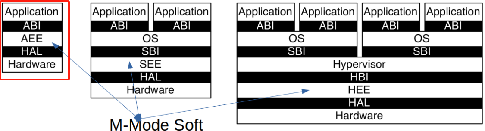
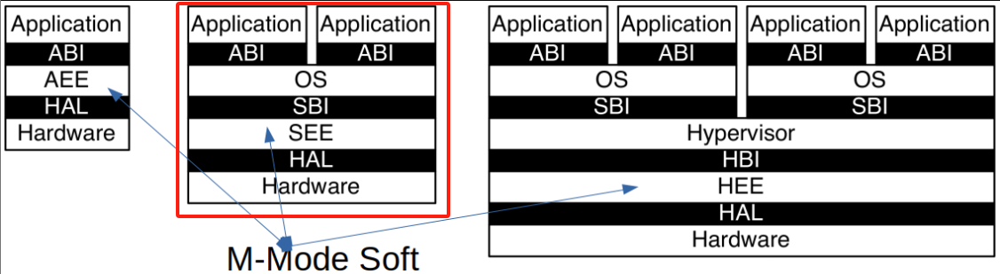

# 第三讲 基于特权级的隔离与批处理

# 第二节 从OS角度看RISC-V

- [一 主流 CPU 架构的比较](#一-主流-cpu-架构的比较)
- [二 RISC-V系统模式](#二-risc-v系统模式)
- [三 RISC-V系统编程：用户态编程](#三-risc-v系统编程用户态编程)
- [四 RISC-V系统编程：M-Mode编程](#四-risc-v系统编程m-mode编程)
- [五 RISC-V系统编程：内核编程](#五-risc-v系统编程内核编程)
- [补充总结](#补充总结)

---

# 一 主流 CPU 架构的比较

1. **复杂指令集（CISC） vs. 精简指令集（RISC）**
   - **x86 架构（CISC）**  
     - **优点**：具有强大的兼容性，广泛应用于各种计算领域。
     - **缺点**：体系结构复杂，指令集庞大，具有大量历史包袱。

   - **ARM 架构（RISC）**  
     - **优点**：能效比高，指令集较为简洁，广泛用于移动设备。
     - **缺点**：商业授权较复杂，体系结构同样具有复杂性。

   - **RISC-V 架构（RISC）**  
     - **优点**：开放的指令集，结构简洁，适合教学与研究。
     - **缺点**：尚未广泛普及，与 x86 和 ARM 生态系统相比较新。

2. **RISC-V 的教学价值**  
   - RISC-V 的架构精简明确，适合教学和理解系统编程的基本概念。
   - 虽然 MIPS 也具备类似特点，但 RISC-V 具备更现代化的设计。

### 常见术语

1. **ABI（Application Binary Interface）**：应用程序二进制接口，应用程序与操作系统之间的接口，允许应用程序以与平台无关的方式运行。

2. **AEE（Application Execution Environment）**：应用执行环境，提供一个可以在其上运行应用程序的抽象层。

3. **SBI（Supervisor Binary Interface）**：管理员二进制接口，操作系统与硬件抽象层之间的接口。

4. **SEE（Supervisor Execution Environment）**：管理员执行环境，提供硬件资源和操作系统服务的抽象层。

5. **HAL（Hardware Abstraction Layer）**：硬件抽象层，在硬件与操作系统之间创建一层抽象，使得软件能够以硬件无关的方式运行。

6. **Hypervisor（虚拟机监视器或 VMM）**：虚拟化软件，允许多个操作系统在同一硬件上并行运行。

7. **HBI（Hypervisor Binary Interface）**：虚拟机监视器二进制接口，虚拟机监视器与硬件抽象层之间的接口。

8. **HEE（Hypervisor Execution Environment）**：虚拟机监视器执行环境，虚拟机监视器运行的抽象层。

---

# 二 RISC-V系统模式

## 2.1 RISC-V 模式概述

1. **四种模式**  
   RISC-V 定义了四种特权模式，支持不同类型的应用与系统需求：
   - **M 模式（Machine Mode）**：  
     - **最高权限**：负责底层硬件控制和配置。
     - **固件功能**：包括启动、硬件初始化等，直接管理硬件资源。

   - **S 模式（Supervisor Mode）**：  
     - **操作系统运行模式**：运行现代操作系统，提供资源隔离和内存管理功能。
     - **直接访问硬件**：具备访问硬件资源和设置页表的能力。

   - **U 模式（User Mode）**：  
     - **用户程序运行模式**：受 S 模式的操作系统管理。
     - **安全隔离**：无法直接访问硬件资源，确保系统安全。

   - **H 模式（Hypervisor Mode）**：  
     - **虚拟化管理程序**：用于虚拟化管理，隔离多个虚拟机操作系统。
     - **硬件支持虚拟化**：目前该模式还未在硬件上完全实现。

2. **各模式的区别与联系**  
   - **灵活设计**：RISC-V 允许根据实际需求自由组合不同模式。  
     - 例如，仅设计 M 和 U 模式的嵌入式处理器，适合简单应用。  
     - 或者采用 M、S 和 U 模式的复杂系统，支持多进程、多任务应用。

   - **组合方式**  
     - **M 模式**：提供最基础的硬件管理功能，是其他模式的基础。  
     - **S 模式**：在 M 模式之上增加现代操作系统的内存管理和隔离。  
     - **H 模式**：为虚拟机提供专属管理功能。
3. **模式转换与隔离**
   - **特权模式转换**  
     - 操作系统通过上下文切换与模式转换，在不同特权级别之间切换。
     - 例如从 U 模式切换到 S 模式进行系统调用，再返回到 U 模式。

   - **隔离机制**  
     - **控制隔离**：使用特权指令和系统调用，防止非特权模式直接访问硬件。
     - **内存隔离**：通过页表等机制划分不同模式的内存区域，防止越权访问。
     - **时间隔离**：使用定时器和中断，实现多任务调度，防止单个应用程序独占 CPU。

### 系统编程与硬件隔离

1. **M 模式的作用**  
   - **硬件初始化**：在系统启动时初始化硬件资源，启动操作系统或应用程序。
   - **硬件配置**：管理所有硬件配置，包括外设、时钟、内存等。

2. **S 模式的作用**  
   - **操作系统管理**：控制应用程序的执行、隔离和内存管理。
   - **硬件资源访问**：通过页表等机制将硬件资源分配给应用程序。

3. **U 模式的作用**  
   - **应用程序执行**：在受限环境中执行应用程序。
   - **系统调用接口**：通过系统调用与 S 模式的操作系统交互。

### 系统编程概述

1. **系统编程定义**  
   系统编程涉及操作系统以及与硬件交互的底层软件开发。它不仅包括操作系统开发，还涵盖系统库、驱动程序、引导加载程序等。

2. **系统编程与用户编程的区别**  
   - **系统编程**：  
     - 与硬件直接交互。
     - 需要特殊的权限或特权指令。
     - 负责管理资源和提供服务。
   - **用户编程**：  
     - 使用系统库和 API 完成应用开发。
     - 无需直接访问硬件或底层功能。

### RISC-V 系统模式不同场景下的应用：

#### 1. 单应用场景

在单个应用场景中，只有一个应用程序运行在整个系统上。其设计特征如下：

- **ABI**：应用程序二进制接口（ABI）作为应用程序与用户级指令集架构（ISA）以及应用执行环境（AEE）之间的桥梁。
- **AEE**：为应用程序提供执行环境，使得 ABI 隐藏底层硬件的复杂性，并为应用程序的执行提供更大的灵活性。

#### 2. 操作系统场景

在操作系统场景中，有一个操作系统负责管理多个应用程序的执行：

- **ABI**：每个应用程序通过 ABI 与操作系统（OS）通信。
- **OS**：操作系统负责协调多个应用程序的执行。
- **SBI**：操作系统通过 SBI（管理员二进制接口）与管理员执行环境（SEE）进行通信，为操作系统提供硬件支持。

#### 3. 虚拟机场景

在虚拟机（Hypervisor）场景中，可以在一个硬件平台上运行多个操作系统：

- **Hypervisor**：虚拟机监视器（Hypervisor）管理操作系统的执行，提供虚拟化能力。
- **HBI**：Hypervisor 通过 HBI（虚拟机二进制接口）与 Hypervisor 执行环境（HEE）进行通信，为虚拟化操作系统提供硬件支持。

#### 4. 应用场景

根据硬件平台的规模和需求，RISC-V 系统模式可以在不同的设备中找到合适的应用：

- **M Mode（机器模式）**：用于小型设备，例如蓝牙耳机。
- **U + M Mode**：用于嵌入式设备，例如电视遥控器或刷卡机。
- **U + S + M Mode**：用于手机或其他复杂设备。
- **U + S + H + M Mode**：用于数据中心服务器，提供更高级的虚拟化功能。

#### 5. 硬件线程（Hart）与特权级

- **Hart**：硬件线程是 CPU 内的执行单元，负责在不同的特权级上运行。
- **特权级**：每个特权级提供不同的软件栈保护机制。当应用程序试图执行当前特权级不允许的操作时，将触发异常并进行自陷（trap）操作，切换到下层执行环境接管控制权。

---

## 2.2 RISC-V 特权级别与跨级别操作

### 特权级别和 CSR 寄存器

1. **特权级别**  
   - **用户模式（U Mode）**：应用程序的执行环境，无法访问特权寄存器。
   - **监视器模式（S Mode）**：操作系统执行环境，可以管理内存、设备等。
   - **机器模式（M Mode）**：最高特权级别，直接控制硬件。
   - **虚拟机模式（H Mode）**：尚未完全实现，为虚拟机管理程序提供支持。

2. **CSR 寄存器**  
   - **定义**：控制状态寄存器，管理和配置系统状态。
   - **权限**：仅在高级别模式下可访问，大部分对 U 模式应用程序不可用。
   - **功能**：提供特权级别信息、异常处理、设备状态等。

### 特权级别之间的隔离和跨越

1. **隔离**  
   - **硬件级隔离**：硬件直接阻止低级别模式访问高级别特权指令。
   - **CSR 寄存器保护**：防止用户模式访问重要的控制寄存器。
   - **系统调用**：通过 ecall 指令，从用户模式请求高级别模式服务。

2. **跨越特权级别**

   - **ecall 指令**  
     - **用户模式到 S 模式**：用户程序请求操作系统服务时使用 ecall 指令。
     - **用户模式到 M 模式**：在仅有 U 和 M 模式的处理器中，ecall 会直接进入 M 模式。
     - **S 模式到 M 模式**：操作系统需要访问更高级别的硬件特性时，使用 ecall 指令。

   - **跨越的限制**  
     - ecall 指令确保调用权限，但只能跨越到预定的更高特权级别。
     - 在有 U、S 和 M 模式的情况下，ecall 从用户模式只能进入 S 模式，无法直接进入 M 模式。

| 执行环境 | 编码 | 含义             | 跨越特权级     |
| -------- | ---- | ---------------- | -------------- |
| APP      | 00   | User/Application | `ecall`        |
| OS       | 01   | Supervisor       | `ecall` `sret` |
| VMM      | 10   | Hypervisor       | ---            |
| BIOS     | 11   | Machine          | `ecall` `mret` |

---

## 2.3 特权模式与 CSR 寄存器

### 控制状态寄存器（CSR）

1. **定义**  
   CSR 是控制状态寄存器，用于管理和配置系统的状态。
2. **数量**  
   RISC-V 定义了最多 4096 个 CSR 寄存器。由于 RISC-V 指令集中 CSR 的编码为 12 位，所以最多可以表示 4096 个寄存器。
3. **访问权限**  
   - **用户模式**：只能读取某些只读的 CSR，如时间信息等。
   - **内核态**：可以访问大部分 CSR，特别是与系统控制相关的寄存器。
4. **用途**  
   CSR 主要用于管理以下方面：
   - **特权级别隔离**：设定不同特权级别的操作权限，防止应用访问系统管控相关寄存器。
     - **地址空间配置**寄存器：mstatus/sstatus CSR(中断及状态)
   - **时间隔离**：通过定时器中断，实现时间隔离，防止应用长期使用 100％的 CPU。
     - **中断配置**寄存器：sstatus/stvec CSR（中断跳转地址）
   - **地址空间隔离**：通过页表管理实现地址空间隔离，防止应用破坏窃取数据。
     - **地址空间相关**寄存器：sstatus/stvec/satp CSR （分页系统）
5. **功能**
   - 信息类：主要用于获取当前芯片id和cpu核id等信息。
   - Trap设置：用于设置中断和异常相关寄存器。
   - Trap处理：用于处理中断和异常相关寄存器。
     - Risc-V中异常和中断统称Trap
   - 内存保护：有效保护内存资源

---

# 三 RISC-V系统编程：用户态编程

## 3.1 系统模式下的编程概述

1. **特权级别的编程**  
   - **用户模式（U Mode）**：编写应用程序，不能直接访问特权操作。
   - **内核态（S Mode）**：操作系统使用，需通过 CSR 管理进程调度、异常处理、内存管理等。

2. **系统调用机制**  
   - **用户态到内核态**：RISC-V 使用 ecall 指令让用户程序请求内核态的系统服务。
   - **系统调用流程**  
     - **用户态**：应用程序通过 ecall 指令发出请求。
     - **内核态**：操作系统捕获 ecall 异常，进入系统调用处理例程，对请求参数和权限进行检查。

### CSR 寄存器与系统编程

1. **系统编程中的 CSR 角色**  
   - **控制与配置**：通过 CSR 寄存器控制特权指令的执行、配置中断和内存管理等功能。
   - **特权指令**：某些特权指令只能在内核态或更高的特权模式下执行。
2. **硬件和软件的交互**  
   - **硬件**：提供必要的 CSR 寄存器和特权模式切换机制。
   - **软件**：通过系统编程，操作系统借助 CSR 实现特权级别切换、异常处理、资源分配等功能。

### 理解计算机系统的深度

在操作系统课程中，目标不仅是简单地构建一个小型操作系统 (比如 libOS)，更重要的是深入理解计算机系统的整体结构与软件硬件之间的协同工作。以下通过打印字符串的过程来解释整个调用路径和涉及的模式转换。

---

## 3.2 U-Mode编程示例：”hello world”

### 打印过程的路径

1. **应用程序层**
   - 应用程序中的打印函数，如 `printf` 或 `print`，通常调用一个库函数，这个库函数是系统调用的入口点。

2. **系统调用**
   - 库函数将生成一个系统调用 (syscall) 指令，通常在 RISC-V 上使用 `ecall` 指令，它触发用户态到内核态的切换。
   - `ecall` 会将控制权从用户态交给操作系统内核中的 `sys_write` 函数。

3. **内核态处理**
   - 内核态的 `sys_write` 函数将处理实际的输出操作。
   - 它可能需要访问外部硬件设备（如显示器、串口等），这时会通过 SBI（Supervisor Binary Interface）向更底层的引导程序发出请求。

4. **底层引导程序 (SBI)**
   - SBI 是操作系统与底层硬件之间的接口。
   - 通过 SBI，操作系统可以让硬件执行实际的 I/O 操作。

#### **第一个例子的启动执行**

[在用户态打印”hello world”的小例子](https://github.com/chyyuu/os_kernel_lab/blob/v4-kernel-sret-app-ecall-kernel/os/src/main.rs#L302) 启动执行流

**第二个例子：在用户态执行特权指令**

[在用户态执行特权指令的小例子](https://github.com/chyyuu/os_kernel_lab/blob/v4-illegal-priv-code-csr-in-u-mode-app-v2/os/src/main.rs#L306) 启动与执行流程

### 内核态与用户态的指令集差异

1. **特权指令**
   - 用户态不能执行特权指令。
   - 某些与硬件直接交互的指令只能在内核态执行，如内存管理、外设 I/O。

2. **模式切换指令**
   - 指令 `ecall` 能让用户态请求内核服务。
   - 指令 `sret` 让内核返回到用户态。

### 安全性与隔离

1. **特权检查**
   - `ecall` 指令触发了硬件的特权检查，确保只有合法的系统调用能被执行，防止应用程序直接访问底层硬件。

2. **隔离机制**
   - 操作系统通过系统调用的方式确保了用户程序和内核程序之间的隔离，避免用户程序直接访问内核的敏感区域。

通过库函数、系统调用、内核处理和底层接口，字符串输出体现了操作系统对硬件资源的管理和访问控制。理解这种分层和特权级别的切换有助于深入掌握计算机系统的整体架构和设计原则。

### 系统特权保护与页表机制

1. **系统调用与特权级别**
   - **系统调用保护**：应用程序可以直接调用系统函数，前提是这些函数不包含特权指令。然而，真正的保护来自于特权指令集的隔离。
   - **页表机制**：即使没有特权指令集，用户态还是不能访问操作系统的内核数据或代码。页表机制通过内存隔离将应用程序和操作系统的数据区域严格分离，一旦越界访问就会触发异常。

2. **判断当前特权级别**
   - 在操作系统编程中，我们通常假定当前代码处于某一特权模式。
   - **RISC-V 模式判断**：在 RISC-V 架构中，没有直接的寄存器来检查当前的执行模式。通常，我们在操作系统编程中无需直接知道当前模式，因为假设内核已经运行在 `S-mode` 或者 `M-mode`。
   - **灵活性与虚拟化**：
     - 这种设计的一个好处是，赋予了底层软件更大的灵活性。例如，可以让操作系统在用户态运行，从而模拟更高级别的模式（如在虚拟机中运行）。
     - 如果某个特权指令在用户态执行，会触发异常，然后通过异常处理机制交由更高级别的权限进行处理。
     - 这种灵活性在虚拟化场景中更有用，通过特权级别的陷阱机制，可以实现应用在虚拟机内运行时的平滑切换。

特权保护不仅仅依靠特权指令集，还依靠页表等硬件机制，进一步确保应用程序不能直接访问到操作系统的敏感区域。理解这些保护机制，能帮助开发者设计更可靠的系统和更安全的特权分离策略。

---

## 3.3 RISC-V 特权指令与系统控制寄存器 (CSR)

### 控制状态寄存器 (CSR)

- **用途与功能**：CSR用于系统配置和状态管理，不同的CSR负责不同的系统功能，如中断管理、性能监控、系统配置等。
- **访问限制**：用户模式 (U-mode) 通常不能访问大多数CSR，以防止非授权访问影响系统稳定性。内核模式 (S-mode 或 M-mode) 可以访问这些寄存器来执行系统级操作。

### 指令种类与功能

1. **mret（机器模式返回）**：
   - 从机器模式返回到上一个特权级别，并恢复执行。
   - 通常用于恢复陷入机器模式的操作，返回到之前的应用执行状态。

2. **sret（监管者模式返回）**：
   - 从监管者（Supervisory）模式返回到上一个特权级别并恢复执行。
   - 类似于 mret，但用于监管者模式（S-mode）。

3. **wfi（等待中断）**：
   - 用于使处理器在没有工作时进入等待中断状态，降低功耗。
   - 处理器将暂停执行，直到下一个中断或事件到来。

4. **sfence.vma（虚拟地址屏障）**：
   - 用于同步和无效化虚拟内存页表缓存。
   - 当页表发生更改时，确保虚拟内存的映射被及时更新。

### CSR 读写操作：

特权操作还涉及对控制状态寄存器（CSR）的读写，以执行系统管理功能。例如：

- **读取 CSR**：获取 CPU 当前特权级别或状态寄存器中的信息。
- **写入 CSR**：配置寄存器的值以改变系统行为，如启用或禁用中断、设置页表基址、修改特权级别等。

**注：fence.i**

- 用于 i-cache 和 d-cache 一致性。
- 它是一个非特权指令，属于 "Zifencei" 扩展规范，用于清空或同步指令缓存，以确保缓存内容与内存保持一致。

### 系统编程与中断处理

1. **系统模式编程**
   - **M-Mode (Machine Mode)**：处理器的最高权限模式，负责处理中断和异常，是处理器的核心控制层。
   - **M-Mode 功能**：主要处理中断和异常，控制低层硬件和系统初始化等。

2. **系统中断和异常管理**
   - **mstatus 和 mcause 寄存器**：用于追踪和响应系统状态和事件。`mstatus` 寄存器反映当前模式下的系统状态，如中断使能状态；`mcause` 寄存器记录异常或中断的原因。
   - **中断处理机制**：处理器使用定时器中断来防止单一程序长时间占用CPU，确保系统的公平性和响应性。这是多任务操作系统中的关键机制。

#### 系统编程的实践

- **从用户模式到系统模式的转换**：使用 `ecall` 指令从用户态跳转到系统态，这允许应用程序请求操作系统服务而不破坏系统的保护边界。
- **系统调用的处理**：操作系统在响应系统调用时进行安全检查和资源调度，保证系统的稳定性和安全性。

系统编程涉及深入理解和操作处理器的底层功能，特别是在处理中断、异常和系统调用时。RISC-V的设计通过提供清晰的特权级别和功能分离，使得系统编程既灵活又具有可控性。这些特点允许开发者根据应用需求调整硬件配置，优化系统性能和响应能力。

---

# 四 RISC-V系统编程：M-Mode编程

## 4.1 中断机制和异常机制

1. **同步的异常**：  
   - 在指令执行期间产生。  
   - 例如，访问无效的寄存器地址或执行无效操作码的指令。  

2. **异步的中断**：  
   - 异步发生于指令流之外的外部事件。  
   - 例如，时钟中断。  

3. **精确异常**：  
   - RISC-V 要求实现精确异常。  
   - 确保异常之前的所有指令均完整执行，异常后的指令未开始执行。  

### M-Mode编程

- **最高权限模式**：  

  - M-Mode 是 RISC-V 中 hart（hardware thread）的最高权限模式。  

  - 在此模式下，hart 对计算机系统的底层功能具有完全的使用权。  

  - M-Mode 最重要的特性是拦截和处理中断/异常。  

### mstatus CSR寄存器

- **mstatus（Machine Status）**：  
  - 保存全局中断以及其他状态信息。  
  - **SIE** 控制 S-Mode 下的全局中断。  
  - **MIE** 控制 M-Mode 下的全局中断。  
  - **SPIE**、**MPIE** 记录发生中断前的 **SIE** 和 **MIE** 值。  
  - **SPP** 表示变化之前的特权级别（S-Mode 或 U-Mode）。  
  - **MPP** 表示变化前的特权级别（M-Mode、S-Mode、U-Mode）。  
  - PP：Previous Privilege

### mcause CSR寄存器

- **mcause（Machine Cause）**：  
  - 当发生异常时，**mcause CSR** 中会写入指示异常事件的代码。  
  - 若事件由中断引起，则置上 **Interrupt** 位。  
  - **Exception Code** 字段包含指示最后一个异常的编码。  

### M-Mode时钟中断Timer

- **中断**：  
  - 是异步发生的。  
  - 由来自处理器外部的 I/O 设备信号触发。  

- **Timer**：  
  - 可以稳定地产生中断。  
  - 防止应用程序长时间独占 CPU，确保 OS Kernel 有执行权。  
  - 允许高特权模式的软件获得 CPU 控制权。  
  - 高特权模式的软件可授权低特权模式的软件处理中断。  

**RISC-V处理器FU540模块图**

------

## 4.2 中断/异常的硬件响应

1. **Mcause (中断与异常原因)**
   - 在 RISC-V 架构中，`mcause` 寄存器保存了当前异常或中断的原因。
   - 中断的种类有限，通过 `mcause` 可以知道中断类型及编号。
   - `mcause` 寄存器的最高位为 `1` 表示中断， `0` 表示异常。
   - 将 `mtval` 设置为出错的地址或者其它适用于**特定异常的信息字**

2. **Mepc (异常程序计数器)**
   - `mepc` 用于存储被中断或发生异常时的程序计数器 (PC) 地址，以便中断或异常处理完毕后恢复正常执行。

3. **Mtvec (陷阱向量)**
   - `mtvec` 是一个陷阱处理器寄存器，保存了异常或中断发生时处理函数的入口地址。
   - 处理器在发生中断或异常时会跳转到该寄存器中指定的处理函数执行。

4. **Mstatus (状态寄存器)**
   - `mstatus` 记录处理器当前的全局状态，包括中断允许 (IE) 位。
   - 当处理器接收到中断或异常时，硬件会自动将中断使能位 (IE) 清除，禁用后续中断，以防止当前处理中断时被新的中断打断。
   - 软件可以根据需要启用或禁用中断。

### M-Mode中断的硬件响应过程

**硬件响应**:

1. **保存和设置程序计数器（PC）**：
   - 异常或中断发生时，指令的 PC 被保存在 **mepc** 寄存器中。
   - PC 接着设置为 **mtvec**（trap vector base address）的值。
     - 对于同步异常：**mepc** 指向导致异常的指令。
     - 对于中断：**mepc** 指向中断处理完成后应继续执行的位置。

2. **设置mcause和mtval**：
   - **mcause** 寄存器设置为标识异常或中断源的编码。
     - 如果是中断，**mcause** 的最高位被置为1。
     - **Exception Code** 字段包含异常或中断的具体原因。
   - **mtval** 寄存器设置为出错的地址或其他与特定异常相关的信息字。

3. **禁用和保存中断使能**：
   - **mstatus** 寄存器的 **MIE** 位被置零，禁用进一步中断。
   - 先前的 **MIE** 值保存到 **MPIE** 中。
   - **SIE** 控制 S-Mode 下的全局中断，而 **MIE** 控制 M-Mode 下的全局中断。

4. **权限模式的保存和更改**：
   - 发生异常之前的权限模式被保存在 **mstatus** 的 **MPP** 域中。
   - 更改当前权限模式为 M-Mode。**MPP** 字段记录之前是 S-Mode、M-Mode 或 U-Mode。

**软件响应:**

- 软件读取 `mcause` 和 `mtval`，获取中断或异常的详细信息。
- 根据异常类型和中断原因，软件调用适当的中断处理程序或异常处理程序。
- 处理完成后，软件通过修改 `mstatus` 中的 IE 位，恢复中断使能状态，并使用 `mepc` 返回中断或异常发生时的地址继续执行。

通过这种硬件与软件协作的方式，RISC-V 架构能够有效管理中断和异常，确保操作系统和应用程序在受到外部干扰时能够安全、稳定地恢复执行。

### M-Mode中断分类

中断类型通过 **mcause** 寄存器的不同位来区分：

1. **软件中断**：
   - 通过写入特定内存映射寄存器来触发。
   - 用于处理器间通信（hart间中断）。

2. **时钟中断**：
   - 当 hart 的时间计数器寄存器 **mtime** 大于时间比较寄存器 **mtimecmp** 时发生。
   - 用于定时任务和防止某个程序过度占用 CPU。

3. **外部中断**：
   - 由外部中断控制器触发。
   - 大多数外设（如网络接口、磁盘控制器等）连接至中断控制器，并通过此控制器向 CPU 发送中断信号。

通过 mcause 寄存器的不同位来获取中断源的信息。 第一列1代表中断，第2列代表中断ID，第3列中断含义 

### 异常种类

1. **常见异常**
   - RISC-V 异常的种类较多，如地址错位、非法指令、系统调用 (`ecall`)、页面缺失等。
   - `mcause` 中最高位为 `0` 时表示当前为异常。

2. **系统调用异常**
   - `ecall` 指令通常由用户模式下的应用程序发出，以请求操作系统的服务。
   - 系统调用是应用程序和操作系统之间的重要接口，在 RISC-V 中被视作异常进行处理。

通过 mcause 寄存器的不同位来获取导致异常的信息。 第一列0代表异常，第2列代表异常ID，第3列异常含义 

---

## 4.3 中断/异常处理的控制权移交

### 1. 中断/异常委托机制概述

- **M-Mode 默认处理所有中断/异常**：默认情况下，所有中断和异常事件都交由 M-Mode 处理。M-Mode 的处理例程可以根据具体情况将某些中断或异常重新导向 S-Mode。

- **通过 mideleg 和 medeleg CSR (Machine Interrupt/Exception Delegation）**：`mideleg` 和 `medeleg` 是两个控制状态寄存器（CSR），用于指定哪些中断和异常可以直接交由 S-Mode 处理，而无需经过 M-Mode。
  - 中断委托寄存器 `mideleg` 中的每一位代表某个中断类型，如果相应位被置位，该类型的中断事件将直接交由 S-Mode 处理。
    - mideleg (Machine Interrupt Delegation）控制将哪些中断委托给 S 模式处理
    - mideleg 中的每个为对应一个中断/异常
      - mideleg[1]用于控制是否将**核间中断**交给s模式处理
      - mideleg[5]用于控制是否将**定时中断**交给s模式处理
      - mideleg[9]用于控制是否将**外部中断**交给s模式处理
  - 异常委托寄存器`medeleg` 的每一位代表某种异常类型，如果相应位被置位，则该类型的异常事件将直接交由 S-Mode 处理。
    - medeleg (Machine Exception Delegation）控制将哪些异常委托给 S 模式处理
    - medeleg 中的每个为对应一个中断/异常
      - medeleg[1]用于控制是否将**指令获取错误异常**交给s模式处理
      - medeleg[12]用于控制是否将**指令页异常**交给s模式处理
      - medeleg[9]用于控制是否将**数据页异常**交给s模式处理

- **提高效率，减少开销**：此种设计允许操作系统根据需要调整中断/异常的处理流程，避免每次中断或异常都经过 M-Mode，从而减少开销，提高中断和异常处理的效率。

### 2. 各种模式的中断/异常处理

- **M-Mode**：机器模式拥有最高权限，负责全局的中断管理和系统配置。因此，M-Mode 中断/异常处理器能够在 S-Mode 和 U-Mode 中发生严重问题时处理系统恢复、初始化或关闭。

- **S-Mode**：监督模式通常用于操作系统内核，负责管理硬件资源并控制用户进程。因此，直接将某些中断和异常交给 S-Mode 处理可以提高系统性能和效率，减少不必要的上下文切换。

- **U-Mode**：用户模式权限最低，不具备直接处理硬件中断和异常的能力。U-Mode 下的应用程序依赖操作系统来管理和处理所有的硬件异常和中断。

### 3. 为什么 U-Mode 不处理中断/异常

- **安全性**：用户程序处理硬件中断/异常可能会带来重大安全隐患。允许普通用户程序直接处理硬件资源，可能导致权限滥用和恶意行为。

- **复杂性**：硬件中断和异常处理非常复杂，需要充分了解底层硬件和系统状态。普通用户程序一般不具备这样的知识与权限，因此将中断/异常处理集中在更高权限的模式下可以确保系统的可靠性。

- **资源管理**：M-Mode 和 S-Mode 的处理程序可以通过内核全面管理系统资源。直接在 U-Mode 下处理中断/异常会破坏操作系统对资源的控制。

总之，RISC-V 中断/异常处理的控制权移交机制旨在确保系统的安全性、可靠性和效率。通过 `mideleg` 和 `medeleg` 的灵活配置，操作系统可以优化处理过程，以适应不同系统和应用的需求。

---

## 4.4 调试功能

1. **断点调试**
   - 在调试器设置断点时，会在目标代码中插入 `ebreak` 指令。
   - 当处理器执行到 `ebreak` 指令时，会产生一个断点异常，硬件将跳转到异常处理例程。
   - 操作系统捕获这个异常后可以调用调试器，使其控制执行流。

2. **单步调试**
   - 单步调试是一种让处理器逐条执行代码的调试模式。
   - 通过软件设置特定的中断或异常（如时钟中断），使得每条指令执行后都会产生一个中断。
   - 操作系统捕获到中断并移交给调试器，从而实现逐条执行的效果。

---

# 五 RISC-V系统编程：内核编程

## 5.1 中断/异常机制

### 编程概述

**目标与角色：**
S-mode（supervisor mode）是 RISC-V 架构中操作系统运行的权限模式，它的主要目标是：

1. 保护 U-mode（用户模式）应用程序免于越权操作。
2. 防止非法访问内存地址。
3. 防止 U-mode 应用长期占用处理器资源。
4. 提供系统服务给 U-mode 应用程序，实现交互。

S-mode 必须依靠软硬件协同来完成以上目标。具体功能包括处理中断和异常、特权级别的切换等。

### S-Mode 寄存器概述

#### 1. `stvec` (Supervisor Trap Vector)

- **功能**：`stvec` 寄存器保存了当 S-Mode 发生中断或异常时需要跳转的地址，即陷入（trap）处理程序的基地址。
- **结构**：
  - `BASE` 域：表示中断/异常处理程序的基地址，应按 4 字节对齐。
  - `MODE` 域：定义陷入处理的模式：
    - `0`：直接模式，将所有中断/异常都引导至基地址指向的一个处理程序。
    - `1`：向量模式，每个中断或异常都有单独的处理程序，基地址指向一个表格，包含所有中断或异常的处理程序地址。

#### 2. `sepc` (Supervisor Exception PC)

- **功能**：`sepc` 寄存器存储了触发中断或异常的指令地址。它记录了当前 PC，当中断或异常处理完成后恢复执行时会使用此值继续执行。

#### 3. `scause` (Supervisor Exception Cause)

- **功能**：`scause` 寄存器保存了导致当前中断或异常的事件编号，并指示其来源是中断还是异常。
- **结构**：
  - `Exception Code` 域：存储中断或异常的具体编号，用于识别事件类型。
  - `Interrupt` 位：如果事件是中断而非异常，该位设置为 1，否则设置为 0。

#### 4. `sie` (Supervisor Interrupt Enable) 和 `sip` (Supervisor Interrupt Pending)

- **功能**：
  - `sie`：该寄存器控制 S-Mode 中的各个中断源是否启用。通过设置或清除其中的位，可以使能或禁用某个中断。
  - `sip`：该寄存器指示当前等待处理的中断。中断硬件可以直接将中断请求置入该寄存器，以便中断处理例程进行相应的响应。

#### 5. `stval` (Supervisor Trap Value)

- **功能**：`stval` 寄存器记录了与中断或异常相关的附加信息。在地址相关的异常（如页面错误）中，它保存相关地址。对其他类型的异常，该寄存器的值可能没有特殊意义。

#### 6. `sscratch` (Supervisor Scratch)

- **功能**：`sscratch` 寄存器提供了一个数据交换的中转站，通常用于在中断或异常处理期间存储临时信息或切换上下文。它在不同模式间提供数据交换的便利。

#### 7. `sstatus` (Supervisor Status)

- **功能**：`sstatus` 寄存器保存了 S-Mode 中全局中断和其他状态信息。
- **结构**：
  - `SIE`：当前中断使能状态，如果设置为 1，允许处理器处理中断。
  - `SPIE`：记录中断发生前的中断使能状态，用于恢复到中断发生前的状态。

#### 8. `mtvec` & `stvec` 寄存器

- **功能**：`mtvec` 和 `stvec` 分别用于 M-Mode 和 S-Mode 中配置陷入处理程序的基地址和模式。它们的功能和结构类似：
  - `BASE` 域：基地址，表示陷入处理程序的地址基准。
  - `MODE` 域：决定陷入的处理模式，和 `stvec` 相同。

通过这些寄存器，S-Mode 能够有效地控制、管理和响应各类中断和异常事件，确保系统资源得以充分利用，并保持系统的稳定性和安全性。

---

## 5.2 中断/异常的处理

在 RISC-V S-Mode 中，硬件和软件协作处理中断和异常时的关键步骤如下：

#### 硬件行为：

1. **保存被中断指令的地址**：异常或中断发生时，当前的程序计数器（PC）被保存在 `sepc` 寄存器，以便稍后恢复到这个位置继续执行。

2. **设置陷阱处理程序地址**：处理器根据 `stvec` 寄存器中的值，将 PC 设置为陷阱处理程序的入口地址。

3. **记录原因**：`scause` 寄存器记录异常或中断的原因编号，方便陷阱处理程序根据具体原因采取相应的操作。stval被设置为出错的地址/异常**相关信息**。

4. **禁用中断**：为了防止陷阱处理程序处理过程中被打断，把 sstatus中的 SIE 位置零， **SIE位之前的值**被保存在 SPIE 位中。

5. **发生例外前的特权模式**被保存在 sstatus 的 SPP（previous privilege） 域，然后设置当前特权模式为S-Mode

6. **跳转**到stvec CSR设置的地址继续执行

#### 软件行为：

硬件所记录的状态信息是不完整的，软件必须进一步保存状态，以确保陷阱处理程序可以正确恢复上下文。典型的陷阱处理程序包括以下流程：

1. **初始化陷阱处理程序**：
   - 为所有中断和异常设置统一或分离的入口地址，通常在操作系统启动时完成。
   - 编写中断/异常的处理例程（如trap_handler）
   - 将 `stvec` 配置为合适的陷阱处理程序（如trap_handler）的入口地址。

2. **保存通用寄存器**：
   - 陷阱处理程序开始时，保存当前状态，包括通用寄存器和栈帧，以便在陷阱处理完毕后能正确恢复执行。

3. **分析中断或异常的原因**：
   - 处理器跳转到**trap_handler**。检查 `scause` 和相关寄存器，以确定发生的异常类型或中断编号。

4. **处理特定中断或异常**：
   - trap_handler 处理中断/异常/系统调用等
   - 对于中断，通常根据中断类型或编号采取特定的动作。
   - 对于异常，可能需要检查内存权限、地址有效性等，并采取适当措施，如终止出错的进程或处理页面错误。

5. **恢复上下文**：
   - 陷阱处理完毕后，将先前保存的寄存器和状态恢复，以确保程序能够继续从被中断的地方执行。

#### 硬件和软件的设计理念：

RISC-V 的设计理念是让硬件只执行最小限度的工作，将更多的灵活性留给软件去实现。与 X86 不同，RISC-V 更注重软件和硬件的协作。

---

## 5.3 虚存机制（Virtual Memory Mechanism）

在 RISC-V 中，S-Mode 使用虚拟内存系统管理进程的内存资源，并提供内存保护与地址转换功能。它使用页表将虚拟地址映射到物理地址，从而实现了虚拟内存。以下是对 S-Mode 虚拟内存系统及其工作原理的深入解释：

### 1. 虚拟地址划分与页表概念

- **虚拟地址的页划分**：虚拟地址空间划分为固定大小的页。每个页的大小通常为 4 KB，但可以根据系统配置不同有所变化。页表负责管理这些页的映射关系，将虚拟地址映射到实际的物理地址。

- **页表的层级结构**：在 RISC-V 中，页表通常分为多级结构。每一级页表负责解析虚拟地址的一部分，最终找到指向物理地址的页表项。每个页表项保存指向下一页表的地址，或者是实际数据页的地址。

### 2. `satp`（Supervisor Address Translation and Protection）

- **功能**：`satp` 寄存器是 S-Mode 中控制地址转换和保护的关键寄存器。

- **结构**：
  - **`MODE`**：确定分页机制的类型。常见的值为：
    - `0`：关闭分页机制。
    - `8`：使用 Sv39（39 位虚拟地址）。
    - `9`：使用 Sv48（48 位虚拟地址）。
  - **`ASID`**：地址空间标识符。它是一个可选字段，用于标识不同进程的地址空间。通过在页表查询时匹配 `ASID`，可以减少 TLB 缓存刷新操作，提高上下文切换的效率。
  - **`PPN`**：物理页号。它保存了根页表的基地址，通过将其乘以页大小（通常为 4 KB）可以得到根页表的起始物理地址。

### 3. 页表建立与 OS/APP 页表管理

- **OS 页表**：操作系统负责创建、维护和管理页表。根页表通常由操作系统在初始化阶段或加载新程序时创建，并由 `satp` 寄存器指向根页表的物理地址。

- **APP 页表**：每个应用程序在运行时，都会使用其专属的页表。操作系统需要在应用程序上下文切换时切换到应用程序对应的页表，同时通过 `satp` 的 `ASID` 来标识不同应用程序的地址空间。

### 4. 虚拟地址到物理地址的转换

在 S-Mode 或 U-Mode 中，虚拟地址通过遍历页表转换为物理地址，以下是 Sv39 模式下的详细步骤：

- **一级页表**：
  - 根页表的基地址由 `satp.PPN` 指定。
  - 虚拟地址的高 10 位（`VA[31:22]`）用于索引一级页表项。
  - CPU 读取一级页表项的地址是 `(satp.PPN * 4096 + VA[31:22] * 8)`。

- **二级页表**：
  - 一级页表项（PTE）包含了二级页表的基地址。
  - 虚拟地址的中间 10 位（`VA[21:12]`）用于索引二级页表项。
  - CPU 读取二级页表项的地址是 `(PTE.PPN * 4096 + VA[21:12] * 8)`。

- **叶节点页表**：
  - 二级页表项包含了实际数据页的基地址（叶节点页表）。
  - 虚拟地址的低 12 位（`VA[11:0]`）表示页内偏移。
  - 物理地址由叶节点页表项（`LeafPTE.PPN`）和页内偏移组合而成，即 `(LeafPTE.PPN * 4096 + VA[11:0])`。

### 5. 内存访问异常处理

- **内存访问异常**：如果在遍历页表的过程中未找到合适的页表项，或者找到的页表项表明当前访问不被允许，则会触发异常。操作系统可以通过中断处理程序来处理这些异常，如页面错误或访问权限错误。

通过这种分级页表结构和地址转换机制，S-Mode 实现了虚拟内存，确保操作系统和应用程序可以灵活、安全地使用内存资源。

---

# 总结

在这部分内容中，我们重点讨论了 RISC-V 架构中不同特权级别的机制和它们与虚存、异常、系统调用之间的相互作用，进一步了解了操作系统与硬件之间的协作关系。

#### 特权级别与隔离机制

1. **M 模式（Machine Mode）**：
   - 最高权限级别，直接控制硬件。
   - 负责初始化系统、设置中断和异常处理程序，并将部分任务委托给 S 模式（Supervisor Mode）。
   - 具备控制 CSR（控制状态寄存器）和 TLB（地址转换缓存）的能力。

2. **S 模式（Supervisor Mode）**：
   - 作为操作系统的主要工作模式，管理虚拟内存、进程间隔离和系统调用。
   - 通过页表机制，实现用户进程与操作系统之间的隔离，并控制硬件资源的分配。
   - 配置中断和异常处理程序，以确保在应用程序引发系统调用或异常时进行有效的响应。

3. **U 模式（User Mode）**：
   - 用于运行用户应用程序，权限最小。
   - 无法直接访问系统级别资源，必须通过系统调用与操作系统通信。
   - 借助 ECall 指令，将控制权转交给 S 模式。

#### 中断与异常处理

- **硬件响应**：
  - RISC-V 硬件在检测到中断或异常时，会保存当前指令状态（如 PC 寄存器）至对应的 CSR，更新状态信息，并跳转到特定的中断或异常处理程序入口。

- **软件响应**：
  - 操作系统中的异常处理程序读取相关寄存器，确定异常或中断的原因，执行相应的处理逻辑。
  - 中断处理程序负责恢复上下文，确保程序正常继续执行。

#### 虚拟内存与页表

- **多级页表结构**：
  - RISC-V 使用三级页表，将虚拟地址分为多个部分，通过逐级查询页表进行地址转换。
  - 页表中的映射项由操作系统设置，确保各应用程序仅访问分配给它们的物理内存。

- **虚实地址转换**：
  - TLB 缓存最近的地址映射，提升内存访问性能。
  - 操作系统通过设置页表基址寄存器（`satp`）和页表内容，为应用程序提供隔离的地址空间。

---

# 补充总结

> 以下是一些简单的补充和总结
>
> > 可能有不准确的地方

---

## 使用场景和比喻来加深理解

理解RISC-V的中断、异常处理和虚存机制需要把握很多概念和细节。让我们尝试通过一些具体的场景和比喻来加深理解。

### 中断/异常处理

想象你在一个大型公司工作，每个员工（程序）都在各自的办公室（内存空间）里忙碌。突然，火警（中断）响起，大家需要按照既定的紧急疏散程序（中断服务例程）迅速撤离。这个疏散计划就像是`mtvec`或`stvec`寄存器，它告诉大家在紧急情况下应该去哪里集合。

- **M-Mode中断处理**：想象公司的保安部门（M-Mode）负责处理所有紧急情况。他们有权利决定是自己处理还是指派给各楼层的安全代表（S-Mode）。
- **S-Mode中断处理**：楼层的安全代表只负责自己楼层的紧急情况。如果有更大的紧急情况，他们会联系保安部门。

### 中断/异常的控制权移交

当保安部门决定让楼层的安全代表处理某些类型的紧急情况时，这就像是通过`mideleg`和`medeleg`寄存器将中断和异常处理的控制权委托给S-Mode。

### 虚拟内存系统

虚拟内存系统可以比作一家大型图书馆，每本书（数据/指令）都有一个特定的位置（物理地址）。但是，图书馆为了方便访问和管理，使用了一个索引系统（页表），让读者（程序）通过索引号（虚拟地址）就能找到书籍的实际位置。`satp`寄存器就是这个索引系统的入口，告诉你如何通过虚拟地址找到数据的物理地址。

- **地址转换**：当你查找一本书时，你只需知道它的索引号。图书馆的管理系统（MMU）会自动通过索引号查找到书的实际位置，这个过程就像虚拟地址被转换为物理地址。

### 实际应用

- **开发调试**：使用断点和单步执行来调试程序，就像是在图书馆里找书时偶尔需要停下来检查你是否走在正确的路径上。
- **操作系统设计**：操作系统的设计者就像图书馆的管理员，需要规划索引系统，决定哪些书籍（数据/程序）应该放在哪里，以及如何高效地管理这些资源。

通过这些场景和比喻，希望能帮你更直观地理解RISC-V的这些概念。在实践中，通过编写和运行一些简单的RISC-V程序，尤其是那些涉及中断处理和内存管理的程序，将进一步加深你对这些概念的理解。

---

### 中断/异常处理寄存器

1. **PC (Program Counter)**: 程序计数器，保存着处理器当前执行指令的地址。
2. **mepc (Machine Exception Program Counter)**: 机器异常程序计数器，保存发生异常时指令的地址。在M-Mode中用于记录中断或异常发生前的PC值。
3. **sepc (Supervisor Exception Program Counter)**: 监管者异常程序计数器，与mepc相似，但用于S-Mode。记录发生异常或中断时的PC值。
4. **mtvec (Machine Trap-Vector Base-Address Register)**: 机器陷阱向量基址寄存器，存储M-Mode中断处理程序的入口地址。
5. **stvec (Supervisor Trap-Vector Base-Address Register)**: 监管者陷阱向量基址寄存器，存储S-Mode中断处理程序的入口地址。
6. **mcause (Machine Cause Register)**: 机器原因寄存器，记录最近一次异常或中断的原因。
7. **scause (Supervisor Cause Register)**: 监管者原因寄存器，与mcause类似，但用于S-Mode。
8. **mie (Machine Interrupt Enable)**: 机器中断使能寄存器，M-Mode中断使能寄存器，用于控制是否允许中断发生。
9. **sie (Supervisor Interrupt Enable)**: 监管者中断使能寄存器，S-Mode中断使能寄存器，与mie相似，但用于S-Mode。
10. **mideleg (Machine Interrupt Delegation Register)**: 机器中断委托寄存器，控制哪些中断可以被委托给S-Mode处理的M-Mode寄存器。
11. **medeleg (Machine Exception Delegation Register)**: 机器异常委托寄存器，控制哪些异常可以被委托给S-Mode处理的M-Mode寄存器。

### 虚拟内存系统寄存器

1. **satp (Supervisor Address Translation and Protection)**: S-Mode下控制页表的寄存器，包括启用分页机制、页表的物理地址和地址空间标识符。

---

| 寄存器缩写 | 英文全称                                     | 中文全称                 | 功能描述                                                     |
| ---------- | -------------------------------------------- | ------------------------ | ------------------------------------------------------------ |
| PC         | Program Counter                              | 程序计数器               | 保存着处理器当前执行指令的地址。                             |
| mepc       | Machine Exception Program Counter            | 机器异常程序计数器       | 保存发生异常时指令的地址，在M-Mode中用于记录中断或异常发生前的PC值。 |
| sepc       | Supervisor Exception Program Counter         | 监管者异常程序计数器     | 与mepc相似，但用于S-Mode，记录发生异常或中断时的PC值。       |
| mtvec      | Machine Trap-Vector Base-Address Register    | 机器陷阱向量基址寄存器   | 存储M-Mode中断处理程序的入口地址。                           |
| stvec      | Supervisor Trap-Vector Base-Address Register | 监管者陷阱向量基址寄存器 | 存储S-Mode中断处理程序的入口地址。                           |
| mcause     | Machine Cause Register                       | 机器原因寄存器           | 记录最近一次异常或中断的原因。                               |
| scause     | Supervisor Cause Register                    | 监管者原因寄存器         | 与mcause类似，但用于S-Mode。                                 |
| mie        | Machine Interrupt Enable                     | 机器中断使能寄存器       | M-Mode中断使能寄存器，用于控制是否允许中断发生。             |
| sie        | Supervisor Interrupt Enable                  | 监管者中断使能寄存器     | S-Mode中断使能寄存器，与mie相似，但用于S-Mode。              |
| mideleg    | Machine Interrupt Delegation Register        | 机器中断委托寄存器       | 控制哪些中断可以被委托给S-Mode处理的M-Mode寄存器。           |
| medeleg    | Machine Exception Delegation Register        | 机器异常委托寄存器       | 控制哪些异常可以被委托给S-Mode处理的M-Mode寄存器。           |

---

### 工作流程示例

以下是一个简化的中断处理流程：

1. **中断触发**：首先，中断信号由硬件（如定时器、I/O设备）发出。
2. **中断识别**：处理器检测到中断信号，并根据当前的中断使能状态（通过`mie`或`sie`寄存器控制）和优先级决定是否接受中断。
3. **保存当前状态**：
   - **保存PC**：处理器自动将当前的程序计数器（PC）保存到`mepc`（如果在M-Mode）或`sepc`（如果中断被委托给S-Mode）寄存器中。
   - **设置`mcause`/`scause`**：`mcause`（在M-Mode）或`scause`（在S-Mode）寄存器被设置为描述中断原因的值。
4. **中断处理程序入口**：
   - **跳转执行**：处理器读取`mtvec`（在M-Mode）或`stvec`（在S-Mode）寄存器的值，并跳转到相应的中断处理程序入口地址执行。
5. **执行中断处理程序**：执行中断服务例程（ISR），完成必要的处理任务，如读取数据、更新状态、清除中断标志等。
6. **恢复现场并返回**：
   - 通过执行`mret`（在M-Mode）或`sret`（在S-Mode）指令，处理器从`mepc`/`sepc`寄存器恢复之前保存的PC值，返回到中断发生前的执行点继续执行。

在虚拟内存系统中的地址转换过程：

1. **程序访问虚拟地址**：用户程序试图访问一个虚拟地址。
2. 地址转换：
   - CPU使用`satp`寄存器中的信息找到根页表。
   - 根据虚拟地址中的页号和偏移量，通过一系列页表项遍历找到最终的物理地址。
3. **访问物理内存**：CPU根据转换后的物理地址访问实际的内存数据或指令。

通过这些寄存器和工作流程，RISC-V能够有效地处理中断和异常，同时提供灵活的内存管理机制。

---

RISC-V的启动流程中，不同的模式（U-Mode、S-Mode、M-Mode）以及它们之间的交互反映了一个层级结构和控制流程。这个流程确保了系统在启动和运行时的安全和稳定性。

### 从下到上（启动和初始化流程）

1. **启动（Boot-ROM）**：
   - 系统电源开启或重置后，首先执行的是ROM中的启动代码，它初始化硬件，并跳转到更高级别的程序或者引导加载器。
2. **机器模式（M-Mode）**：
   - 接下来，控制权传递到机器模式，这是最低级别的权限模式。在这里，通常执行的是固件代码，如RustSBI（Supervisor Binary Interface的一个实现），负责初始化系统的基础设施，包括设置中断和异常处理程序。
3. **监管模式（S-Mode）**：
   - 一旦机器模式的初始化完成，通过`mret`指令将控制权交给监管模式。监管模式负责启动操作系统，设置虚拟内存、进程和用户模式的隔离。
4. **用户模式（U-Mode）**：
   - 操作系统创建用户空间环境，并通过`sret`指令跳转到用户模式运行用户程序。用户模式程序可以通过系统调用与操作系统交互，请求服务。

### 从上到下（系统调用和响应流程）

1. **用户模式（U-Mode）**：
   - 当用户程序需要操作系统服务时（比如写文件、网络通信等），它会通过系统调用（syscall）请求操作系统介入。
2. **监管模式（S-Mode）**：
   - 系统调用触发中断，将控制权从用户模式转交给监管模式。操作系统在监管模式中响应系统调用，执行必要的服务。
3. **机器模式（M-Mode）**：
   - 若需要执行更低级别的操作，如控制台输入输出，操作系统可能会通过SBI调用（sbicall），请求机器模式下的SBI固件提供支持。

### 从下到上（执行SBI调用并从M-Mode返回到U-Mode）

1. **M-Mode执行SBI调用**:
   - 在机器模式下，RustSBI等固件执行一个特权级操作，如`sbicall`进行系统级别的服务请求。
2. **M-Mode完成操作**:
   - SBI服务完成后，例如完成了控制台字符输出或硬件设备的控制。
3. **返回到S-Mode**:
   - 使用`mret`指令，RustSBI将控制权从M-Mode返回到S-Mode。此时，处理器状态恢复到S-Mode执行`sbicall`之前的状态。
4. **S-Mode处理结果**:
   - 操作系统在S-Mode处理`sbicall`的结果，可能是更新操作系统状态、记录日志或者准备返回到用户模式。
5. **准备返回到U-Mode**:
   - 操作系统完成所有必要的处理后，准备将控制权返回给用户程序。
6. **返回到U-Mode**:
   - 操作系统使用`sret`指令，将控制权返回到用户模式，继续用户程序的执行。
7. **U-Mode继续执行**:
   - 用户程序继续执行，可能是处理SBI调用的结果，或者执行下一步操作。
8. **用户程序运行结束**:
   - 用户程序完成其任务后，可能是自然结束，或者因为需要再次服务而触发另一次系统调用。

在整个流程中，`mret`和`sret`指令用于返回到之前的权限模式，它们分别用在机器模式和监管模式的退出操作。这样的层级结构和控制流程允许RISC-V系统在保证安全性的同时，实现复杂的操作系统功能，包括用户与硬件之间的交互。

### 从上到下（关机流程）

1. **用户模式（U-Mode）**:
   - 用户程序决定关机，发起系统调用（syscall）通知操作系统进行关机。
2. **监管模式（S-Mode）**:
   - 操作系统接收到来自用户程序的关机系统调用，并开始执行关机准备工作，如关闭文件、通知其他进程等。
3. **机器模式（M-Mode）**:
   - 操作系统执行完所有准备工作后，通过SBI调用（sbicall）请求M-Mode的固件执行关机操作。
4. **执行SBI关机调用**:
   - 固件（如RustSBI）接收到关机请求，执行必要的硬件关闭程序，包括停止时钟、关闭I/O设备等。
5. **电源关闭（Power Down）**:
   - 完成所有硬件关闭程序后，固件执行最终的电源关闭操作。

---

### 用户程序执行“Hello World”

1. **执行用户程序**:
   - 用户程序（在U-Mode中）开始执行，当需要打印输出时，会执行如`uprint`这样的打印函数。
2. **系统调用**:
   - 执行`uprint`函数时，用户程序会进行系统调用（通过`ecall`指令），请求操作系统提供打印服务。
3. **S-Mode响应系统调用**:
   - 系统调用将控制权从U-Mode转交给S-Mode，操作系统的`sys_write`函数响应系统调用，处理打印请求。
4. **调用SBI服务**:
   - 如果打印需要低级访问，如向控制台输出字符，操作系统可能会调用SBI服务（通过SBI调用）。
5. **M-Mode SBI执行打印**:
   - SBI的`sbi.console_putchar`函数在M-Mode中被调用，将字符输出到控制台。

### 返回监管模式（S-Mode）

1. **SBI to OS**:
   - 打印操作完成后，SBI固件通过`mret`指令返回到监管模式，准备返回控制权给操作系统。
2. **OS处理完成**:
   - 操作系统接收来自SBI的返回，并完成任何后续的清理或状态更新操作。

### 返回用户模式（U-Mode）

1. **返回到系统调用点**:
   - 操作系统通过`sret`指令将控制权返回到发起系统调用的用户程序的位置。
2. **用户程序继续执行**:
   - 用户程序继续执行打印“Hello World”后的下一条指令。
3. **程序执行完毕**:
   - “Hello World”打印请求执行完毕后，用户程序可能会继续执行其他任务或者终止。

### 系统返回到正常状态

1. **任务调度（可选）**:

   - 如果有多任务调度，操作系统可能在此时进行上下文切换，调度另一个进程或线程运行。

2. **系统空闲或等待**:

   - 如果用户程序是最后一个任务或系统处于空闲状态，操作系统可能会进入等待状态，等待下一个中断或系统调用。

---

在RISC-V架构中，用户态（U-Mode）是不允许直接执行特权指令的。如果用户程序尝试执行特权指令，这将触发一个异常，进而由更高权限模式的异常处理程序来响应。以下是在用户态执行特权指令时的流程：

1. **用户模式（U-Mode）执行特权指令**:
   - 用户程序试图执行特权指令（例如：`uprint`内部尝试直接执行硬件操作）。
2. **异常被触发**:
   - 由于用户程序无权执行特权指令，处理器将触发异常。
3. **转到监管模式（S-Mode）**:
   - 异常使处理器从U-Mode跳转到S-Mode，控制权转交给操作系统的异常处理程序（trap handler）。
4. **操作系统处理异常**:
   - 操作系统的异常处理程序确定异常原因（通过`scause`寄存器）并决定如何处理（比如记录错误、终止程序等）。
5. **可选的SBI调用**:
   - 如果需要，操作系统可以选择调用SBI接口（例如：`sbi_exit`），请求M-Mode下的SBI来执行某些操作（比如关闭硬件设备或重启）。
6. **恢复或终止**:
   - 根据异常的性质和严重性，操作系统可能会决定继续执行应用程序、重新启动应用程序或完全终止应用程序。
7. **返回用户模式（U-Mode）**:
   - 如果操作系统决定让应用程序继续运行，它将通过执行`sret`指令返回到用户模式。
8. **处理完成**:
   - 用户程序根据操作系统的处理结果决定下一步操作，可能是继续执行、尝试其他操作或正常退出。

在这个流程中，异常处理程序为系统的稳定性提供了关键保障，确保即使在不当操作尝试时，系统也能保持响应性和可靠性。这也显示了RISC-V架构对权限控制的严格性，防止了非授权的特权操作。

---

RISC-V架构中的中断处理和权限模式为系统设计提供了一系列的优点，这些优点在上述的“Hello World”程序执行流程和关机流程中表现得尤为明显：

1. **层级安全性**：通过层级化的权限模式（U-Mode, S-Mode, M-Mode），RISC-V确保了每个层级只能执行它被授权的操作。这防止了低权限代码对系统的潜在破坏，提高了系统的整体安全性。
2. **细粒度控制**：通过各种模式特定的寄存器和指令（如`mepc`, `sepc`, `mcause`, `scause`, `mret`, `sret`），系统可以精确控制执行流程和资源管理，从而在需要时提供灵活性。
3. **异常处理**：当用户态程序尝试执行非法操作时（如特权指令），RISC-V能够优雅地捕获并处理异常，而不是让整个系统崩溃。
4. **中断效率**：通过委托机制（`mideleg` 和 `medeleg`），RISC-V允许中断直接被S-Mode处理，而无需每次都经过M-Mode，这减少了中断响应时间，提高了效率。
5. **模块化设计**：RISC-V的设计鼓励模块化，这意味着不同的组件（比如SBI）可以独立于处理器核心进行开发和优化。
6. **简化的上下文切换**：在中断处理和系统调用过程中，通过寄存器保存和恢复现场，RISC-V简化了上下文切换，减少了切换开销。
7. **可预测的行为**：每个级别的行为都是可预测的，这对于系统的可靠性和可维护性至关重要。在关机流程中，这一点尤其显著，因为系统需要按照严格的顺序逐步关闭资源。
8. **支持虚拟化**：通过`satp`寄存器和虚存机制的支持，RISC-V允许操作系统实现强大的内存管理策略，为虚拟化和容器化技术提供了基础。
9. **底层支持**：底层的SBI提供了一个通用的接口，让上层操作系统能够与硬件进行互动，而不需要关心硬件的具体实现细节，促进了软硬件之间的解耦。

总的来说，通过这些设计，RISC-V架构提供了一个强大、安全和高效的平台，适用于从简单的嵌入式系统到复杂的操作系统和应用程序。它的设计允许系统开发者在确保核心功能安全性的同时，为最终用户提供灵活、快速响应的体验。
