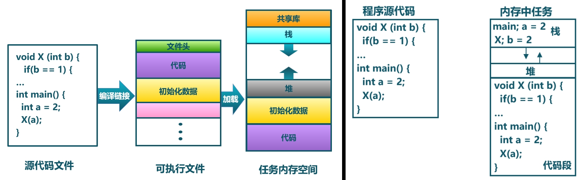
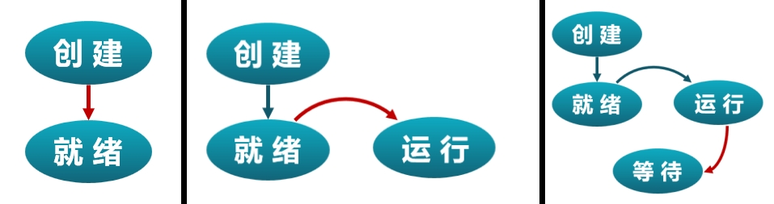
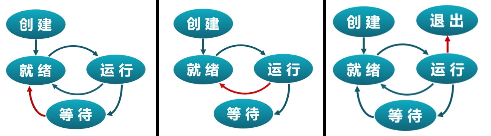

# 第四讲 多道程序与分时多任务

# 第一节 进程和进程模型

- [一 多道程序与协作式调度](#一-多道程序与协作式调度)
  - [任务与进程的概念](#任务与进程的概念)
- [二 分时多任务与抢占式调度](#二-分时多任务与抢占式调度)
- [三 进程的概念](#三-进程任务的概念)
- [四 进程模型](#四-进程模型)

---

# 一 多道程序与协作式调度

## 背景

1. **硬件发展**：随着硬件技术的发展，内存容量不断增大，CPU的速度不断提升。此时，软件应尽可能让CPU保持忙碌，以充分利用其性能。一个重要的转变在于大型机OS/360中引入的多道批处理模式。随着内存容量的提升，系统可以同时在内存中容纳多个程序，从而提高CPU的利用率。

2. **计算机类型变化**：大型机逐渐向小型机过渡，计算机应用的范围越来越广泛。用户希望与计算机实现更好的交互，批处理模式难以满足这种需求，因此分时系统逐渐普及，使用户能够更好地进行程序调试和开发。

3. **术语的多样性**：多道程序分时多任务系统的讨论中会出现大量术语，如“job”、“task”、“process”等。这些词汇在不同阶段和场景中有细微的差异，但总体上都描述了应用程序的执行过程。IBM的调度算法中明确提到“job”一词，而没有直接提到“process”。这些术语的细微差异无需纠结，但需要理解其背后的概念。

## 多道程序带来的问题

1. **CPU调度**：在多道程序中，如何分配CPU资源成为一个关键问题。最初，系统采取非抢占式的方式，由应用程序自行决定何时放弃CPU。然而，为防止程序陷入死循环导致资源浪费，现代操作系统普遍使用抢占式调度，使操作系统能够控制CPU的分配。

2. **分时系统的实现**：MIT研发的多种计算机系统中都具备抢占机制，以实现分时任务的处理，保障多用户和多任务的需求。

## Task与Process

在多道程序分时多任务系统中，我们常提到“task”和“process”两个概念。它们都描述了应用程序的执行过程，任务被分割成多个时间片。每个时间片在不同任务间切换，形成完整的任务执行过程。

---

# 二 分时多任务与抢占式调度

在操作系统的发展过程中，任务和进程的定义和使用逐渐清晰化。以下是对任务和进程概念以及相关机制的深入总结。

## 任务的定义

任务被定义为具有独立功能的程序在一个数据集合上动态执行的过程，它是进程的前身。任务不管理太多资源，而进程则更加复杂，负责管理资源。任务的执行过程由时间片组成，在每个时间片中执行任务或保持空闲状态。

- **计算任务片**：在时间片上执行某一计算任务的时间段。
- **空闲任务片**：时间片处于空闲状态，不执行计算任务。

时间片用于分配CPU的执行时间，在不同任务之间切换。任务切换的频率过高会影响系统效率，但为了充分利用CPU资源，操作系统必须定期在任务之间切换。

## 抢占式调度

抢占式调度机制由操作系统控制，应用程序无需自行管理CPU的释放。操作系统通过时间片机制确保在某个时间片执行任务，在下一个时间片暂停执行。应用程序对这一切换过程完全透明，并未感知到任务切换。

- **操作系统的假象**：应用程序会误认为自己占用整个处理器，尽管其他程序正在“偷偷”使用时间片。由于切换速度极快，应用程序难以察觉。

## 任务与进程的概念

术语“任务”和“进程”在不同环境下的使用可能会引起争议。虽然“进程”更常见，但历史上“任务”先出现，其合理性也受到操作系统实际应用的支持。

- **Windows任务管理器**：在Windows系统中，任务管理器用于查看和管理任务，而非称为“进程管理器”。
- **Linux Top命令**：在Linux系统中，Top命令显示系统任务的数量与状态，同样称为任务而非进程。

虽然操作系统教材多使用“进程”一词，但在实践中“任务”仍有广泛使用。历史上，任务管理是先于进程概念而存在的，体现出操作系统发展中的合理性与连续性。

> 22年的视频里主要使用“任务”，新的（2024年）幻灯片里还是改成主要使用“进程”了，当成一个东西吧。
>
> 另外下面是一些参考的解释：
>
> 在 Windows 操作系统中，任务管理器是一种监控和管理计算机上运行的任务、进程和资源的工具。以下是一些常用概念的解释，以及“任务”和“进程”的区别：
>
> 1. **任务（Task）**：  
>    - 任务通常指的是计算机执行的**某个特定操作或活动**，比如打开某个应用程序、处理一个文件等。
>    - 任务可以包含多个子任务，这些子任务可能由一个或多个进程来执行。
>
> 2. **进程（Process）**：  
>    - 进程是系统中运行的一个**程序的实例**。它代表程序代码和相关的资源（如内存、文件句柄、设备）在系统中的执行状态。
>    - 一个进程通常包含一个或多个线程，线程是一个进程内部的执行路径。
>    - 每个进程在 Windows 中都有一个唯一的标识符（PID），任务管理器可以显示每个进程的 PID、使用的资源和运行状态。
>
> 3. **进程树（Process Tree）**：  
>    - 进程树展示了某个进程及其所有子进程的层次结构。
>    - 可以帮助你理解哪些进程是由其他进程启动的，从而跟踪进程的父子关系。
>
> 4. **运行新任务（Run New Task）**：  
>    - 允许你启动一个新的程序或任务，可以输入可执行文件名称或者选择文件以启动。
>
> 5. **结束任务（End Task）**：  
>    - 可以终止一个正在运行的任务或进程。
>    - 注意，强行结束某个任务或进程可能会导致数据丢失或文件损坏，尤其是如果程序正处于写入数据的过程中。
>
> 6. **结束进程树（End Process Tree）**：  
>    - 结束整个进程树，意味着将会终止某个进程及其所有子进程。
>
> 在 Windows 操作系统中，任务往往表示用户在界面上看到的活动（如应用程序窗口），而进程则是操作系统管理的一个执行实体。在 Windows 中，将任务与进程相比，可以理解为：
>
> 1. **任务（Task）**：  
>    - 更像一个抽象概念，通常表示一个用户从界面或系统角度所感知的活动，例如一个应用程序的运行状态。  
>    - 从任务管理器的角度，任务可能显示为活动窗口或应用程序。
>
> 2. **进程（Process）**：  
>    - 是系统中实际运行的对象。它由操作系统进行管理，包含了可执行文件、内存空间、文件句柄和其他资源。  
>    - 进程是系统内的执行单位，每个进程都有一个唯一的进程 ID（PID）和一组资源。  
>    - 一个进程通常可以包含多个线程，这些线程共同完成该进程的工作。
>
> 所以，任务与进程的关系可以比作用户感知的活动（抽象概念）与系统中实际存在的对象（具体实例）。从技术角度看，任务通常依赖于一个或多个进程来执行实际的工作。
>
> ---
>
> 在一些系统中，“任务”和“进程”可以在某些上下文中被认为是相互替换的。但需要注意具体的概念定义：
>
> 1. **Linux**：  
>    - 在 Linux 和其他类 Unix 系统中，进程（process）和任务（task）有更明确的含义。
>    - 进程通常指一个正在运行的程序实例，它有自己的地址空间、系统资源、文件描述符等。
>    - 在 Linux 内核中，术语 “task” 通常用来指代内核中的一个进程结构（`task_struct`）。因此，“task” 和“process” 在技术上可以互换使用。
>    - 线程也可以被视为进程的一部分，但线程共享父进程的地址空间。
>
> 2. **嵌入式系统**：  
>    - 在嵌入式系统中，任务通常表示的是独立的执行单元，通常使用实时操作系统（RTOS）调度和管理。
>    - 进程概念在某些较小的嵌入式系统中并不常用，因为这些系统往往不提供进程隔离或多任务能力，或者它们直接使用任务的概念来描述调度的执行单元。
>
> 总的来说，在无图形界面的系统或嵌入式系统中，“任务”和“进程”有时是可以互换的，但在技术和上下文上仍可能存在细微的差异，**具体取决于操作系统和开发人员的定义**。
>
> ---
>
> 下面的内容我们还是**也改成进程**吧，因为：
>
> 使用“任务”会同时使用“任务控制块（TCB，Task Control Block）”，而 TCB 也代表 **Thread Control Block，线程控制块**，可能造成混淆。
>
> > 1. **TCB（Thread Control Block，线程控制块）**：
> >    - TCB 是一个数据结构，存储了线程的相关信息，比如线程 ID、寄存器状态、优先级和栈指针等。
> >    - 它用于保存和恢复线程的状态，以支持线程的调度和管理。
> >    - TCB 通常作为线程管理的主要结构，在多线程系统中，线程是调度的最小单位。
>
> 同样对于抽象和使用场景还有:
>
> > 在操作系统教学中，“进程”比“任务”作为抽象概念更加明确和合适。原因包括：
> >
> > 1. **明确的定义**：
> >    - “进程”在计算机科学中有一个明确的定义，表示一个程序的执行实例。
> >    - 进程包括程序代码、数据、内存空间、文件句柄等资源，由操作系统管理。
> > 2. **实例化的抽象**：
> >    - 进程是一个实例化的概念，作为操作系统管理和调度的独立实体存在。
> >    - 操作系统中的进程控制块（PCB）表示了每个进程的状态和相关资源，具象地体现了进程的抽象。
> > 3. **调度与资源分配**：
> >    - 进程是调度的独立单位，操作系统可以根据优先级、调度算法等对其进行管理。
> >    - 进程抽象涵盖了资源分配和进程切换的机制。
> > 4. **多任务环境**：
> >    - 在多任务操作系统中，进程的概念与调度策略和资源分配密切相关。
> >
> > 相对而言，“任务”则更多是用户或开发者角度的术语，指代一种活动或需要完成的目标，在某些情况下没有明确的定义。操作系统中直接使用“进程”更能帮助理解和区分相关概念。
>
> > **Task Control Block（TCB）** 和 **Process Control Block（PCB）** 都是操作系统中的关键数据结构，但它们常在不同的场景下使用：
> >
> > 1. **Task Control Block（TCB）**：
> >    - TCB 用于实时操作系统（RTOS）或嵌入式系统中，表示任务的信息。
> >    - 它记录任务的状态、堆栈指针、优先级、时间片、调度状态等信息。
> >    - TCB 通常用于较小规模的系统，帮助实时操作系统管理任务和进行任务调度。
> > 2. **Process Control Block（PCB）**：
> >    - PCB 是操作系统中代表进程状态和信息的结构体。
> >    - 它包含进程的 PID（进程 ID）、内存分配、文件句柄、寄存器内容、调度信息等。
> >    - PCB 适用于多任务和多用户的复杂操作系统，确保进程管理和调度。
> >
> > TCB 在 RTOS 中常用于描述“任务”，这在实时系统和嵌入式环境中很常见。
> >
> > PCB 在通用操作系统中描述“进程”，更适用于复杂的计算机系统。
>
> | 如果我没仔细看后面可能出现进程和任务混用或用混的情况。

#### 从用户的视角看分时多任务

分时多任务（Time sharing multitask）：从用户的视角看

- 在内存中存在多个可执行程序
- 各个可执行程序**分时共享处理器**
- 操作系统按**时间片**来给各个可执行程序分配CPU使用时间
- **进程(Process)** ：应用的一次执行过程

#### 从OS的视角看分时多任务（Time sharing multitask）

- **进程(Process)** ：一个具有一定**独立功能**的程序在一个**数据集合**上的一次动态**执行过程**。也称为**任务(Task)**。
- 从一个应用程序对应的进程切换到另外一个应用程序对应的进程，称为**进程切换**。

#### 作业（Job）、任务（Task）和进程（Process）

历史上出现过的术语：Job、Task、Process

- Task、Process是Multics和UNIX等用于分时多任务提出的概念
- 进程是一个应用程序的一次执行过程。**在操作系统语境下，任务和进程是同义词**。
- 作业（目标）是围绕一个**共同目标**由一组**相互关联的程序**执行过程（进程、任务）形成的一个**整体**

参考：[Difference between Job, Task and Process](https://www.geeksforgeeks.org/difference-between-job-task-and-process/)

#### 抢占式调度（Preemptive scheduling）

- 进程**被动**地放弃处理器使用
- 进程按**时间片**轮流使用处理器，是一种“**暂停-继续**”组合的执行过程
- 基于**时钟硬件中断**机制，操作系统可随时打断正在执行的程序
- 操作系统**选择下一个执行程序**使用处理器

---

# 三 进程的概念

## 进程的特点与进程和程序的关系

## 进程的特点

1. **切换性**：进程能够在不同进程之间切换，每个进程拥有自己独立的执行控制流。

2. **动态性**：进程的执行过程是动态的，在执行时可能会中断或暂停。

3. **并发性**：在一段时间内，多个进程可以同时运行，形成并发的执行环境。

4. **有限度的独立性**：进程之间并不感知彼此的存在，而操作系统需要管理和感知所有进程的状态。

## 进程与程序的关系

1. **程序的定义**：程序是静态的代码，无论是源代码还是可执行文件，都是一种静态的文件。

2. **进程的定义**：进程是程序在内存中的动态执行过程，操作系统会将程序加载到内存中，并执行其中的代码。

3. **执行状态**：执行状态指的是进程在执行过程中对内存、寄存器等资源的修改。由于进程的执行状态不断变化，因此同一个程序的不同执行过程可能呈现出不同的进程执行状态。

4. **资源需求**：进程的执行主要需要两种资源：CPU和内存。

5. **程序与进程的区别**：
   - 程序是静态的，而进程是动态的。
   - 程序是永久的文件，而进程是暂时的执行过程。
   - 程序和进程的组成不同，进程在执行过程中具有自己的内存空间和控制流。

总之，进程是程序的执行过程，在执行中具有动态性、并发性和独立性。程序作为静态文件提供了执行的基础，而进程通过加载程序代码并运行在内存中，将程序的静态代码转化为动态的执行状态。尽管进程是暂时的，但它体现了程序的真正功能，进一步明确了进程与程序的区别与联系。

#### 进程与程序的组成

在操作系统中，进程的管理需要确保系统能够在执行过程中有效切换进程，并保持执行的一致性。为此，进程的组成和状态信息管理显得尤为重要。

## 进程状态

进程在执行过程中包含一些状态信息，这些信息在特定时刻被系统记录下来，以实现进程切换。具体而言，进程状态包括：

1. **控制流**：控制流指示进程当前执行的具体位置。通过程序计数器（PC），系统能够跟踪进程代码执行的具体位置，以便在恢复进程时继续从中断点执行。

2. **数据状态**：进程访问的数据包括内存和寄存器。其中，内存可进一步划分为堆、栈、数据段等部分。寄存器则保存了进程执行的各种临时数据。

在进程被中断或暂停时，操作系统需要保存进程的上下文，包括控制流、寄存器状态等，以便在进程切换时正确恢复。这种上下文保存被称为进程上下文切换，需包括：

- **程序计数器**：记录进程执行的具体代码位置。
- **栈地址**：保存进程当前的栈指针位置。
- **通用寄存器**：保存进程执行中需要恢复的各种寄存器数据。
- **其他资源**：......

## 进程控制块（PCB）

操作系统需要有效管理每个进程的状态和信息，这依赖于一种数据结构，称为进程控制块（Process Control Block，PCB）。PCB用于记录进程的状态和其他管理信息，并在进程切换时提供完整的进程上下文。

- **进程标识信息**：为每个进程分配唯一的标识符（如PID，进程ID）。
- **处理器现场信息**：保存进程执行状态的寄存器、程序计数器等信息。
- **进程控制信息**：管理进程状态，如正在运行（running）、就绪（ready）或休眠（sleep）等。

通过PCB，操作系统能够在进程间进行有效的上下文切换，确保不同进程在各自的状态下继续执行。

进程的组成和管理需要依赖于状态信息的保存和切换。通过进程控制块，操作系统能够跟踪和管理进程的执行状态，实现有效的进程上下文切换，并在进程执行时保持执行过程的一致性。

---

# 四 进程模型

## 进程状态与切换过程

进程在执行过程中会经历不同的状态，这些状态与进程的执行相关，并在操作系统中被清晰地管理。以下是进程状态及其切换过程的简要总结：

## 进程状态

1. **创建状态**：进程在被创建时，进程控制块（PCB）和相关资源尚未准备好。操作系统为进程创建初始的栈、寄存器和代码空间，设置初始状态，使其具备执行条件。此时，进程处于“创建状态”。

2. **就绪状态**：创建完成后，进程进入就绪状态（Ready），意味着它已准备好执行。就绪进程在等待操作系统的调度，直到系统选择该进程执行时，它才会从就绪状态进入运行状态。

3. **运行状态**：就绪进程被操作系统调度后，将从就绪状态切换到运行状态（Running）。操作系统通过上下文切换，让当前运行的进程让出CPU，并将其分配给新调度的进程。操作系统需要将状态从内核态切换到用户态，使进程代码能够执行。

4. **等待状态**：运行中的进程可能会进入等待状态（Waiting），例如当进程需要等待外部资源时。常见的等待场景包括：
   - **Sleep**：进程主动请求休眠，例如调用“sleep 5秒”。
   - **I/O等待**：等待文件读写或其他外部设备操作完成。由于I/O速度较慢，进程会主动放弃CPU，进入等待状态，使其他进程可以使用CPU。

5. **终止状态**：进程完成其功能或因某种原因被终止，将进入终止状态（Terminated）。此时，进程的资源将被操作系统回收，以供其他进程使用。

## 状态切换过程

### 进程状态及状态转换详解

1. **创建（Creation）到就绪（Ready）**：  
   - **何时创建**：进程在系统启动、用户请求或其他进程的要求下被创建。
   - **如何创建**：操作系统通过进程创建机制，为新进程分配唯一的进程 ID（PID）、内存空间、文件描述符及其他资源，并在进程控制块（PCB）中存储其状态信息。
   - **转换到就绪**：创建完成的进程具备执行条件，并进入就绪队列，等待 CPU 调度。

2. **就绪（Ready）到运行（Running）**：  
   - **内核选择任务**：调度程序从就绪队列中选择一个合适的进程，将其分配到 CPU 上执行，进程状态从就绪切换为运行。
   - **如何执行**：执行开始时，操作系统恢复进程的寄存器状态，并开始执行该进程的指令。

3. **运行（Running）到等待（Waiting/Blocked）**：  
   - **任务进入等待的原因**：
     - **自身**：进程主动等待某个事件（例如 I/O 操作或休眠）并主动让出 CPU。
     - **外界**：其他事件导致进程暂停执行（例如系统调用或同步操作）。
   - **状态切换**：进程让出 CPU 后，其状态切换为等待，并等待事件的完成或被唤醒。
4. **等待（Waiting/Blocked）到就绪（Ready）**：  
   - **被唤醒的原因**：
     - **自身**：进程设置的等待时间结束，自行唤醒进入就绪状态。
     - **外界**：等待的事件完成，或进程被操作系统或其他进程唤醒，恢复到就绪状态。

5. **运行（Running）到抢占（Preempted）**：  
   - **任务被抢占的原因**：  
     - 系统调度器基于优先级、时间片等策略，从 CPU 上中断当前执行的进程，将其状态切换为就绪，并调度另一个进程执行。

6. **运行（Running）到退出（Terminated/Exited）**：  
   - **任务退出的原因**：
     - **自愿**：进程正常执行完成，或通过特定系统调用（如 `exit`）自愿退出。
     - **被迫**：由于外部因素导致进程终止，如错误、异常或被其他进程强制结束。

在进程的生命周期中，不同状态的转换由调度程序根据系统需求和任务特性控制，确保多任务系统在有限的资源下高效运作。通过这种状态切换机制，操作系统能够有效管理和调度进程，使其在合适的时机获取资源并执行其功能。

---

在多任务操作系统中，进程的状态会不断变化，有时可能会被抢占。以下是进程的抢占、状态转换以及系统调用之间的关系。

## 抢占

抢占是指操作系统强制停止当前正在运行的进程，让它从运行状态转换到就绪状态，以便给其他进程提供运行的机会。抢占通常由时钟中断触发，操作系统在中断发生时将当前进程置于就绪状态，为其他进程的调度和执行腾出资源。

- **时钟中断**：时钟中断是一种周期性中断，用于触发抢占。在时钟中断发生时，操作系统暂停当前进程的执行，将其从运行状态置为就绪状态，然后选择其他进程执行。

## 进程退出

进程退出可以是自愿的或被迫的：

1. **自愿退出**：进程主动调用退出指令（如`exit`系统调用），结束自身的执行。这通常发生在进程完成预定工作后主动请求退出。

2. **被迫退出**：
   - **非法操作**：进程尝试执行非法操作或触发严重错误，操作系统会终止该进程的执行。
   - **外部强制**：更高级别的管理程序或系统管理员可能会强制终止进程的执行。

## 进程模型

进程在执行过程中主要存在以下三种状态：

1. **就绪**：进程已具备执行条件，等待操作系统的调度以获得CPU时间。
2. **运行**：进程正在CPU上执行。
3. **等待**：进程由于需要等待资源（如I/O操作）或休眠等原因而暂停执行。

此外，还有两个额外的过程：

1. **创建**：创建进程时，操作系统分配并初始化进程控制块（PCB）等资源。
2. **退出**：进程结束执行后，操作系统回收资源，将进程控制块和其他资源释放。

这形成了进程状态的五个基本过程：创建、就绪、运行、等待和退出。

## 系统调用与状态转换

系统调用是用户程序与操作系统交互的主要方式，会导致进程状态发生变化：

- **运行到退出**：进程主动调用`exit`系统调用，退出并释放资源。
- **运行到等待**：进程可能通过系统调用进入等待状态，如调用`sleep`使进程休眠一段时间。
- **运行到就绪**：通常由中断触发的抢占或高优先级进程到来，使当前进程暂停并进入就绪状态。

进程在操作系统中会经历多种状态转换，包括抢占、系统调用或异常等原因导致的状态变化。了解进程状态及转换的原因，有助于掌握操作系统中进程管理的核心逻辑和实现机制。

---

# 进程切换的时机与过程

进程在操作系统中进行切换是不可避免的，确保了多进程的并发执行和资源的合理分配。以下是进程何时会进行切换的时机及其过程。

## 进程切换的时机

进程切换是指操作系统暂停当前运行的进程，并在合适的时机切换到其他进程继续执行。主要有以下几个时机：

1. **主动进入等待状态**：当进程调用`sleep`或其他系统调用以进入等待状态（如等待I/O操作），操作系统将进程状态置为等待，进而切换到下一个就绪进程执行。

2. **时间片用尽**：在多任务操作系统中，每个进程被分配一个固定时间片（time slice）。当进程用完时间片，时钟中断触发抢占，操作系统将当前进程置为就绪状态，然后切换到下一个就绪进程执行。

3. **进程退出**：进程执行完毕或被迫退出后，操作系统将当前进程状态置为终止，并切换到下一个就绪进程执行。

## 进程切换的过程

进程切换涉及暂停当前进程并恢复新进程的执行环境，确保进程状态的一致性。进程切换的步骤如下：

1. **保存当前进程的现场**：操作系统在中断或系统调用发生时将当前进程的上下文（context）信息保存至进程控制块（PCB），包括程序计数器、通用寄存器、栈指针等。

2. **选择下一个进程**：操作系统根据调度算法选择下一个就绪进程进行执行。

3. **恢复新进程的现场**：从新进程的进程控制块中恢复其上下文信息，包括程序计数器、寄存器、栈等。

4. **切换到新进程**：操作系统将控制权交给新进程，恢复用户态并开始执行进程的代码。

## 进程切换的简单结构

可以将进程切换的过程形象化为一个结构图：

1. **程序A与程序B**：假设有两个程序在执行进程。进程A主动调用`sleep`系统调用进入等待状态，触发进程切换过程。

2. **进入内核态**：操作系统将通过中断或系统调用进入内核态，保存进程A的上下文信息。

3. **选择下一个进程**：操作系统根据调度算法选择进程B执行，并恢复其上下文。

4. **返回用户态**：操作系统将控制权交给进程B，使其从用户态开始执行。

这种进程切换的结构图展示了进程的上下文保存和恢复过程，以及多进程之间的交替执行机制。

---

**下一节**

# 实践：多道程序与分时多任务操作系统

分时多任务操作系统通过多阶段的改进，实现了更高效的进程切换和资源利用。以下是各个阶段的变化与进程切换的实践方法。

## 第一阶段：引入进程管理

1. **应用程序管理模块的拆分**：内核中的应用程序管理模块被拆分为不同的子模块，其中引入了程序加载器（loader），负责查找和加载程序。进程切换模块（task manager）则用于管理进程控制块（PCB），独立处理进程切换逻辑。

2. **多进程支持**：引入进程管理后，操作系统可以同时在内存中运行多个应用程序，并实现进程间的切换。这是最早期的多进程系统设计，其中引入了基本的进程结构和管理概念。

## 第二阶段：主动进程切换

1. **系统调用支持主动切换**：在这个阶段，系统调用被扩展，增加了进程放弃与切换的功能。进程可以通过系统调用主动放弃对CPU的占用，切换到其他进程执行。

2. **上下文保存与恢复**：在进程主动放弃CPU时，操作系统保存当前进程的上下文信息（包括寄存器、栈、程序计数器等），并恢复下一个被调度的进程的上下文。

3. **进程调度**：此阶段的操作系统在系统调用中主动管理进程的上下文，并通过进程管理模块实现多进程的调度与切换。

## 第三阶段：中断与时间片管理

1. **引入时钟中断**：操作系统在此阶段引入了时钟中断机制。通过时钟中断，系统可以准确追踪进程的执行时间，为进程分配固定的时间片（time slice）。

2. **时间片切换**：一旦时钟中断指示某个进程的时间片已用尽，操作系统将保存当前进程的上下文，并切换到下一个就绪进程。

3. **统一异常、系统调用与中断处理**：系统调用、中断和异常在本质上都是从用户态切换到内核态的过程。在这个阶段，操作系统统一了它们的处理流程，使它们共用相同的机制来保存和恢复上下文信息。

4. **进程执行时间追踪**：操作系统通过时钟中断追踪每个进程的执行时间，确保进程不会长期独占CPU，保证进程之间的公平调度。

通过这三个阶段的逐步改进，操作系统在管理进程时具备更强的灵活性和效率，实现了真正意义上的多道程序与分时多任务操作系统。
