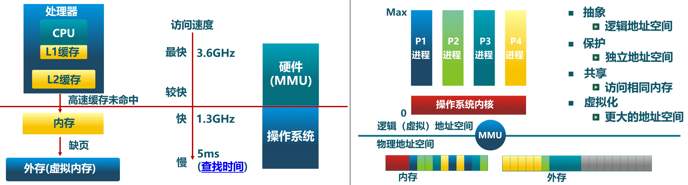

# 第五讲 物理内存管理

# 第一节 地址空间

---

# 0 地址空间简介

**地址空间**是操作系统中的一个重要概念，它指的是一个进程可以使用的所有内存地址的集合。地址空间分为物理地址空间和虚拟地址空间：

1. **物理地址空间**：直接对应计算机硬件的物理内存（RAM）。物理地址空间的大小受到物理内存容量的限制。

2. **虚拟地址空间**：由操作系统提供给进程使用的地址空间。每个进程都有自己的虚拟地址空间，可以认为是一个抽象层，帮助简化内存管理。虚拟地址空间可以大于物理内存，通过分页（paging）或分段（segmentation）技术来管理。

### 物理内存管理

物理内存管理是操作系统内核的重要功能之一，它负责管理计算机的物理内存。常见的物理内存管理方法包括：

1. **分页（Paging）**：
    - 将物理内存划分为固定大小的块，称为“页框”（page frames）。
    - 将虚拟内存划分为相同大小的块，称为“页”（pages）。
    - 使用页表（page table）将虚拟页映射到物理页框。
    - 当进程需要访问某个虚拟地址时，操作系统通过页表找到对应的物理地址。
    - 页表通常存放在内存中，使用硬件支持的TLB（Translation Lookaside Buffer）进行加速。

2. **分段（Segmentation）**：
    - 将内存划分为不同大小的块，称为“段”（segments），每个段可以代表代码段、数据段、堆栈段等。
    - 使用段表（segment table）将虚拟段映射到物理内存区域。
    - 段表记录了每个段的起始地址和长度。

### 地址转换

地址转换是从虚拟地址到物理地址的映射过程。主要分为以下几个步骤：

1. **段式转换**：如果使用分段机制，首先通过段表查找段基址（base address）和段偏移量（offset），将虚拟地址转换为线性地址。

2. **分页转换**：线性地址通过页表转换为物理地址。虚拟地址分为页号（page number）和页内偏移量（offset within page）。页号通过页表查找页框号（frame number），页框号加上页内偏移量得到物理地址。

### 内存分配

内存分配策略主要包括：

1. **固定分区分配**：
    - 将内存划分为若干固定大小的分区，每个分区只能分配给一个进程。
    - 优点是管理简单，但容易造成内存碎片和资源浪费。

2. **动态分区分配**：
    - 根据进程需要动态分配内存块。
    - 常用方法包括首次适配（First Fit）、最佳适配（Best Fit）和最差适配（Worst Fit）。
    - 动态分区分配易于灵活使用内存，但也会产生外部碎片。

3. **伙伴系统（Buddy System）**：
    - 将内存划分为大小为2的幂的块，块可以合并和分割。
    - 伙伴系统易于管理和合并碎片，但可能导致内部碎片。

### 内存保护

操作系统通过以下技术保护内存不被非法访问：

1. **基址寄存器（Base Register）和界限寄存器（Limit Register）**：
    - 设置进程可以访问的内存范围，防止越界访问。
    
2. **页表和段表**：
    - 控制进程访问特定的页或段，通过页表和段表实现内存保护。

3. **硬件支持**：
    - 现代处理器提供内存管理单元（MMU）和TLB支持高效的地址转换和内存保护。

地址空间和物理内存管理是操作系统中至关重要的部分，通过虚拟内存技术实现进程隔离和内存保护。理解这些概念有助于更好地掌握操作系统的运行机制，设计高效的内存管理方案。

---

# 1. 计算机的存储层次

我们前面讨论了物理地址空间，接下来我们要深入探讨一种更高级的技术——虚拟地址空间。这涉及到地址空间管理的重要概念，有助于我们更深入地理解计算机内存管理的工作原理。

## 1.1 什么是地址空间

在讨论地址空间之前，我们需要重新理解和回顾与内存相关的一些概念，包括物理地址、逻辑地址、线性地址和虚拟地址。

### 物理地址
物理地址是指直接对应于内存芯片的地址，是硬件层面上实际存在的地址。当我们访问内存时，读取的地址就是物理地址。

### 逻辑地址
逻辑地址是程序在编写和编译时使用的地址。程序员在写程序时并不直接操作物理地址，而是操作逻辑地址。编译器将这些逻辑地址转换成具体的地址。在Intel的x86处理器中，逻辑地址是指编程时看到的地址。

### 线性地址
线性地址是经过段机制转换后的地址。对于x86架构，逻辑地址通过段机制转换成线性地址，线性地址再通过页机制转换成物理地址。

### 虚拟地址
虚拟地址是操作系统提供给进程的地址空间，进程使用虚拟地址进行内存访问。操作系统和硬件通过映射机制将虚拟地址转换成物理地址。对于RISC-V架构，没有段机制，虚拟地址等同于线性地址。

## 1.2 地址转换过程

在x86架构中，地址转换分为以下几个步骤：
1. **逻辑地址到线性地址**：逻辑地址通过段机制转换成线性地址。
2. **线性地址到物理地址**：线性地址通过页机制转换成物理地址。

由于RISC-V架构没有段机制，逻辑地址直接等于虚拟地址，通过页机制转换成物理地址。逻辑地址 -> 线性地址(虚拟地址) -> 物理地址

## 1.3 存储层次结构

计算机的存储层次结构从快到慢依次为：
1. **寄存器**：速度最快，但数量有限。
2. **高速缓存（Cache）**：稍慢于寄存器，但比内存快。
3. **内存（RAM）**：主要存储运行时的数据。
4. **I/O设备（例如磁盘）**：速度最慢，但容量大。

操作系统需要屏蔽这些存储细节，给应用程序提供统一的内存视图。应用程序看到的是一块大的虚拟内存空间，不需要关心底层是磁盘、内存还是缓存。

### 操作系统的作用

操作系统的一个重要职责是管理地址空间和物理内存，为应用程序提供一个统一的虚拟内存环境。这个虚拟内存环境通过地址映射技术，将应用程序的逻辑地址映射到物理地址，使应用程序可以在不关心底层存储细节的情况下运行。

## 1.4 虚拟内存关键概念和技术

在深入探讨操作系统中的虚拟内存时，我们需要了解一些关键概念和技术，包括虚拟地址空间的连续性、地址空间的保护、数据共享和隔离、以及虚拟存储技术。以下是对这些内容的详细总结：

### 虚拟地址空间的连续性

虚拟内存的一个重要特点是逻辑地址空间是连续的。这意味着每个运行的程序（即进程或任务）在其视角下有一个连续的地址空间，便于编程和管理。然而，物理上，这些地址可能是离散分布的。

### 虚拟地址与物理地址的映射
- **逻辑地址空间的连续性**：每个程序在运行时认为其地址空间是连续的，简化了编程和内存管理。
- **物理地址的离散性**：实际的物理内存分布是离散的。操作系统通过页表或段表将虚拟地址映射到物理地址，从而提供一个连续的虚拟地址空间。

## 1.5 地址空间的保护

虚拟内存不仅提供了更大的地址空间，还实现了内存保护，确保进程之间互不干扰。

### 地址空间保护机制
- **边界保护**：每个地址空间有边界，超出边界会产生异常，从而防止进程越界访问。
- **异常处理**：当进程尝试访问越界地址时，操作系统会触发异常处理机制，并可能终止该进程。

### 数据共享与隔离

虚拟内存允许多个进程共享相同的物理内存区域，同时保证各自的独立性和数据隔离。

#### 共享内存
- **共享机制**：操作系统可以让多个进程映射到同一块物理内存，从而实现数据共享。每个进程看到的地址空间虽然不同，但实际上访问的是相同的数据。
- **隔离机制**：尽管进程可以共享内存，但它们的地址空间是隔离的，防止彼此干扰。

## 1.6 虚拟存储技术

实现虚拟内存需要多种技术的支持，包括重定位、分段、分页以及硬件支持。

### 关键技术
- **重定位**：动态调整进程的地址空间，使其适应物理内存的分布。
- **分段**：将内存划分为大小不等的段，每个段代表不同类型的数据或代码。
- **分页**：将内存划分为固定大小的页，通过页表管理虚拟地址和物理地址的映射。
- **虚拟存储技术**：综合运用重定位、分段和分页技术，提供一个统一的虚拟内存空间。

## 1.7 硬件支持

实现虚拟内存需要硬件的支持，主要包括异常中断处理、优先级管理以及分页机制。

### 硬件特性
- **异常中断**：处理越界访问、缺页等异常情况，保证系统稳定运行。
- **优先级管理**：确保重要进程优先得到处理资源。
- **分页机制**：通过页表和TLB（Translation Lookaside Buffer）实现高效的地址转换和内存管理。

虚拟内存是操作系统的一个重要功能，它通过提供连续的逻辑地址空间、内存保护、数据共享与隔离，以及虚拟存储技术，为应用程序提供了一个统一且高效的内存管理环境。这些技术的综合应用，使得操作系统能够抽象出一个大而快的虚拟内存空间，极大地提高了系统的灵活性和性能。

---

# 2. 地址和地址空间

在操作系统中，地址空间的生成和管理是一个复杂而重要的过程。物理地址、逻辑地址和虚拟地址的生成和使用各不相同，它们由硬件、操作系统（OS）和编译器共同决定。

## 物理地址与逻辑地址的区别

物理地址和逻辑地址是两个不同的概念，出发点和使用场景也不同。

### 物理地址
- **定义**：物理地址是直接对应于内存芯片的地址，是硬件层面上实际存在的地址。
- **生成**：物理地址由硬件（内存管理单元MMU）生成，受硬件设计和配置的限制。

### 逻辑地址
- **定义**：逻辑地址是程序在编写和编译时使用的地址。
- **生成**：逻辑地址由编译器生成，取决于编译器的设定和操作系统提供的地址范围。

## 虚拟地址空间

虚拟地址空间是操作系统提供给应用程序使用的地址范围。虚拟地址空间的大小和范围由操作系统和硬件共同决定。

### 虚拟地址的范围
- **OS决定**：操作系统决定虚拟地址空间的范围，并为每个进程分配独立的虚拟地址空间。
- **编译器决定**：编译器根据操作系统提供的虚拟地址范围生成逻辑地址。
- **硬件决定**：硬件（如CPU和MMU）通过页表等机制将虚拟地址转换为物理地址。

## 地址空间的紧耦合

操作系统、编译器和硬件之间需要紧密合作，才能有效管理地址空间并确保应用程序的正确运行。

### 紧耦合的实现
- **操作系统与硬件**：操作系统利用硬件提供的地址转换和内存管理功能（如页表和TLB）来实现虚拟内存。
- **操作系统与编译器**：操作系统向编译器提供虚拟地址范围，编译器生成相应的逻辑地址。
- **硬件与编译器**：编译器生成的逻辑地址通过硬件转换为物理地址。

## 地址生成的过程

地址生成过程包括编译时、加载时和执行时三个阶段，每个阶段生成的地址形式不同。

### 编译时
- **逻辑地址生成**：编译器将高级语言代码转换为逻辑地址，生成目标文件和可执行文件。

### 加载时
- **重定位**：加载器将逻辑地址转换为内存中的实际地址（重定位），确保程序正确运行。
- **动态链接库**：动态链接库在加载时也需要进行重定位，以适应内存中的实际地址。

### 执行时
- **地址转换**：操作系统和硬件共同管理虚拟地址到物理地址的转换，确保程序的正确执行。
- **安全检查**：在执行过程中，硬件通过MMU和页表机制进行地址转换和安全检查，确保不同类型的内存区域具有正确的访问权限。

## 内存区域的特征与保护

不同类型的内存区域（如代码段和数据段）具有不同的访问权限和特征。

#### 代码段
- **特征**：只读、可执行。
- **保护**：防止修改和非法访问。

#### 数据段
- **特征**：可读、可写、不可执行。
- **保护**：防止代码注入和非法执行。

### 地址空间管理的硬件支持

地址空间管理依赖于硬件的支持，特别是内存管理单元（MMU）和页表机制。

#### 内存管理单元（MMU）
- **作用**：负责地址转换和内存保护，确保虚拟地址正确映射到物理地址。
- **功能**：通过页表和TLB实现高效的地址转换和内存保护。

#### 页表机制
- **作用**：存储虚拟地址到物理地址的映射关系。
- **功能**：页表项包含物理地址和访问权限信息，硬件通过页表进行地址转换和安全检查。

## 操作系统中的地址转换与管理

在操作系统中，地址转换与管理是一个复杂且至关重要的任务。这个过程涉及硬件组件如内存管理单元（MMU）和中央处理单元（CPU）的协作，以及操作系统的有效管理。

### 地址转换过程

地址转换是从逻辑地址（虚拟地址）到物理地址的映射过程，这个过程主要依赖于MMU和页表机制。

#### 0. 逻辑地址和虚拟地址
- **逻辑地址**：由编译器生成，是程序中使用的地址。
- **虚拟地址**：由操作系统提供给进程使用的地址空间，可以看作是逻辑地址的一种。

#### 1. 地址转换的过程
- **第一步**：当CPU需要访问内存时，它首先产生一个虚拟地址。
  - CPU将这个虚拟地址发送给MMU进行转换。

### MMU和地址转换缓存（TLB）

MMU是处理器中的一个组件，负责将虚拟地址转换为物理地址。TLB（Translation Lookaside Buffer）是MMU中的一个高速缓存，用于加速地址转换。

#### 2. TLB查找
- **步骤2.1**：MMU首先在TLB中查找虚拟地址的映射。如果命中，直接得到对应的物理地址。
- **步骤2.2**：如果TLB未命中，MMU将查找页表。

#### 3. 页表查找
- **步骤3.1**：如果TLB未命中，MMU会查找页表。页表由操作系统维护，记录了虚拟地址到物理地址的映射关系。
- **步骤3.2**：如果页表中存在对应的映射关系，MMU得到物理地址并返回给CPU。

#### 4. 异常处理
- **步骤4**：如果页表中没有对应的映射关系，MMU将触发一个页表异常（page fault）。此时操作系统介入处理。

### 页表异常处理

页表异常是指在页表中找不到对应的虚拟地址到物理地址的映射关系，操作系统需要进行异常处理。

#### 5. 异常处理的步骤/读取到数据
- **步骤5.1**：操作系统检查虚拟地址是否有效。如果虚拟地址有效，操作系统将为其分配物理内存，并更新页表。
- **步骤5.2**：如果虚拟地址无效，操作系统将终止相应的进程。
- **步骤5.3**：如果虚拟地址对应的页面在硬盘上，操作系统将从硬盘读取页面到内存中，更新页表，然后重新执行导致异常的指令。

地址转换与管理是操作系统、硬件和编译器之间复杂且紧密合作的结果。通过虚拟地址空间、页表和异常处理机制，操作系统能够提供一个安全、高效、统一的内存管理环境，确保应用程序的正确运行。理解这些机制有助于深入掌握操作系统的工作原理和内存管理技术。

---

# 3. 虚拟存储的作用

虚拟内存是操作系统中的一项关键技术，它通过将内存和外存结合在一起，提供了一个更大的地址空间，并提高了内存管理的效率。

## 虚拟内存的好处

虚拟内存带来了多个好处，包括扩展地址空间、简化编程和执行、提高安全性和共享数据的方便性。

### 扩展内存空间
- **扩展地址空间**：通过将物理内存和外存结合，虚拟内存提供了一个更大的可用地址空间。
- **提高性能**：常用数据保存在内存中，不常用数据保存在外存中，提高了内存使用效率和系统性能。

### 简化编程和执行
- **独立地址空间**：每个应用程序拥有独立的地址空间，简化了编程过程，避免了地址冲突。
- **简化编译和链接过程**：编译器可以为每个程序分配相同的逻辑地址，而操作系统负责将这些逻辑地址映射到不同的物理地址。
- **简化加载过程**：程序在加载时基于虚拟地址进行，而不需要考虑具体的物理地址位置。

### 数据共享与内存分配
- **简化数据共享**：通过虚拟内存，不同进程可以方便地共享数据，同时保持各自的独立性。
- **简化内存分配**：虚拟内存管理简化了内存分配的过程，操作系统可以更灵活地分配和回收内存。

## 虚拟内存的安全性

虚拟内存提供了多种内存保护机制，确保程序的安全性和稳定性。

### 内存隔离与保护
- **内存隔离**：虚拟内存为每个进程提供独立的地址空间，防止进程间的内存干扰。
- **访问权限控制**：操作系统可以设置内存区域的访问权限，如代码段只可执行不可写、数据段可读可写不可执行等。
- **内核与用户空间的隔离**：操作系统可以将内核空间与用户空间隔离，防止用户程序访问内核数据。

## 虚拟内存的实现

实现虚拟内存需要多种技术和硬件支持，包括页表、TLB、页面置换算法等。

#### 页表与TLB
- **页表**：存储虚拟地址到物理地址的映射关系。
- **TLB**：加速地址转换的缓存，通过快速查找虚拟地址到物理地址的映射，提高系统性能。

#### 页面置换算法
- **页面置换**：当内存不足时，操作系统需要将一些页面交换到外存中，以腾出内存空间。
- **置换算法**：常用的页面置换算法包括FIFO（先进先出）、LRU（最近最少使用）等，用于决定哪些页面需要被交换出去。

## 虚拟内存的应用

虚拟内存在现代操作系统中广泛应用，为各种应用程序提供高效、灵活、安全的内存管理。

### 应用程序的独立性
- **独立地址空间**：每个应用程序拥有独立的虚拟地址空间，简化了开发和调试过程。
- **动态内存分配**：虚拟内存支持动态内存分配，允许程序在运行时分配和释放内存。

### 系统资源管理
- **资源隔离**：虚拟内存实现了系统资源的隔离，防止进程间的资源争用和冲突。
- **高效利用内存**：通过页面置换和内存管理算法，操作系统可以高效利用物理内存和外存资源。

虚拟内存是操作系统中的一项重要技术，通过扩展地址空间、简化编程和执行、提高安全性和共享数据的方便性，为应用程序提供了一个高效、灵活、安全的内存管理环境。理解虚拟内存的工作原理和实现技术，有助于深入掌握操作系统的核心概念和内存管理方法。
